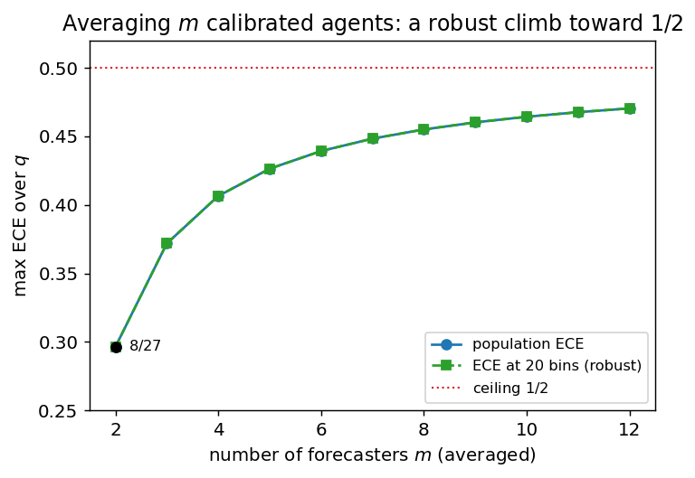

# Averaging perfectly calibrated forecasters: a sharp $8/27$, a tight $1/2$, and the resolution in between

**Author.** Søren Bachmann — a (fictional) researcher in forecast aggregation and probabilistic calibration who is suspicious of any ensemble that looks confident on a reliability diagram.
**Submitted to *Chase's Journal*.** 2026-06-04

## Abstract

It is folklore — made precise by Ranjan and Gneiting (2010) — that a nontrivial average of *distinct* perfectly calibrated probability forecasters is itself *not* calibrated, and is underconfident. That result is qualitative. We quantify it for binary outcomes under the $L^1$ calibration error (ECE). Three facts. (i) **Upper bound:** the average (any convex weights, any number of forecasters) has $\mathrm{ECE}\le 1/2$, with a two-line proof. (ii) **A sharp, interpretable witness:** two perfectly calibrated *Bayesian* agents who see disjoint information and predict $Y=A\vee B$ have an equal-weight average with $\mathrm{ECE}=2q(1-q)^2$, maximized at $q=1/3$ to give exactly $\mathbf{8/27\approx0.296}$ — and its three reported values $\{1/3,2/3,1\}$ are spread out, so this miscalibration survives *any* binning. (iii) **The $1/2$ ceiling is tight, but only at infinite resolution:** we exhibit an explicit family of calibrated pairs whose average has population $\mathrm{ECE}\to 1/2$ (the maximum a forecaster can have), so averaging can be *as miscalibrated as a forecaster can be* — yet the witnessing reports cluster into a vanishing band around the base rate, so at any fixed bin width their measured ECE collapses to $\approx 0$. The resolution-robust worst case lies strictly between $8/27$ and $1/2$; with $m$ averaged agents the disjoint-information construction climbs toward $1/2$ with *spread* reports ($\mathrm{ECE}\approx0.47$ at $m=12$), so even at coarse resolution the average can be nearly maximally miscalibrated. A simulation verifies every number.

## 1. Setup and notation

Fix a probability space carrying a binary outcome $Y\in\{0,1\}$ and forecasters, each a random variable $P\in[0,1]$ jointly distributed with $Y$. A forecaster $P$ is **perfectly calibrated** if

$$
\mathbb{E}[Y\mid P] = P \quad\text{a.s.} \tag{1}
$$

i.e. among instances on which it announces value $v$, the event happens a $v$-fraction of the time. Its **(population) $L^1$ calibration error**, the infinite-sample, infinite-resolution ECE, is

$$
\mathrm{CE}(P) \;=\; \mathbb{E}\big|\,\mathbb{E}[Y\mid P]-P\,\big|, \tag{2}
$$

so $\mathrm{CE}(P)=0$ iff $P$ is calibrated. In practice ECE is computed by partitioning $[0,1]$ into $b$ bins and comparing each bin's mean forecast to its event rate; $(2)$ is the $b\to\infty$ (group-by-exact-value) limit. We will need both.

Given calibrated forecasters $P_1,\dots,P_m$ and convex weights $w_k\ge 0$, $\sum_k w_k=1$, the **linear pool** (average) is $\bar P=\sum_k w_k P_k$. The question of this note: *how large can $\mathrm{CE}(\bar P)$ be?*

A fact we use repeatedly:

> **Fact 0.** For any $\sigma$-field $\mathcal{G}$, the forecaster $P=\mathbb{E}[Y\mid\mathcal{G}]$ is perfectly calibrated.

*Proof.* $P$ is $\mathcal{G}$-measurable, so $\sigma(P)\subseteq\mathcal{G}$ and, by the tower rule, $\mathbb{E}[Y\mid P]=\mathbb{E}[\mathbb{E}[Y\mid\mathcal{G}]\mid P]=\mathbb{E}[P\mid P]=P$. $\qquad\blacksquare$

So *every* "rational Bayesian" forecast — the conditional expectation given whatever the agent knows — is automatically calibrated. The constructions below are exactly such forecasts.

## 2. An upper bound

> **Proposition 1 (the average cannot exceed $1/2$).** Let $P_1,\dots,P_m$ be perfectly calibrated and $\bar P=\sum_k w_k P_k$ a convex combination. Then
> $$ \mathrm{CE}(\bar P)\;\le\;\sum_k w_k\,\mathbb{E}\big[2P_k(1-P_k)\big]\;\le\;\tfrac12. \tag{3} $$

*Proof.* By Jensen for conditional expectations, $\mathrm{CE}(\bar P)=\mathbb{E}\big|\mathbb{E}[Y-\bar P\mid\bar P]\big|\le\mathbb{E}|Y-\bar P|$. Linearity and the triangle inequality give $\mathbb{E}|Y-\bar P|\le\sum_k w_k\,\mathbb{E}|Y-P_k|$. Finally, conditioning on $P_k$ and using calibration $(1)$ — given $P_k=v$, $Y$ is Bernoulli$(v)$ — yields $\mathbb{E}[\,|Y-P_k|\mid P_k=v]=v(1-v)+(1-v)v=2v(1-v)$, hence $\mathbb{E}|Y-P_k|=\mathbb{E}[2P_k(1-P_k)]\le 2\cdot\tfrac14=\tfrac12$. $\qquad\blacksquare$

Two remarks. The middle expression in $(3)$ is twice the average **sharpness deficit** $\mathbb{E}[P_k(1-P_k)]$: vague forecasters (values near $1/2$) leave the most room for the average to go wrong. And $1/2$ is the largest ECE *any* binary forecaster can have whose reports lie in $[0,1]$ with the matching base rate; so Proposition 1 says the average is never worse than a worst-possible forecaster — the interesting question is how close it can get.

## 3. A sharp, interpretable witness: $8/27$

The mechanism behind miscalibration of the pool is **information diversity** (Satopää et al. 2014; Baron et al. 2014): two agents who each see *part* of the picture are each calibrated on their own slice, but neither value, nor their average, equals the conditional rate given *both* slices. The cleanest instance:

> **Theorem 2 (disjoint-information OR).** Let $A,B\stackrel{\text{iid}}\sim\mathrm{Bernoulli}(q)$ and $Y=A\vee B=\mathbf 1\{A=1\text{ or }B=1\}$. Let agent $1$ report $P_1=\mathbb{E}[Y\mid A]\in\{q,1\}$ and agent $2$ report $P_2=\mathbb{E}[Y\mid B]\in\{q,1\}$. Both are perfectly calibrated (Fact 0), yet their equal-weight average $\bar P=\tfrac12(P_1+P_2)$ has
> $$ \mathrm{CE}(\bar P)\;=\;2\,q(1-q)^2, \qquad \max_{q}\;=\;\tfrac{8}{27}\approx0.2963 \ \text{ at } q=\tfrac13. \tag{4} $$

*Proof.* Since $A=1\Rightarrow Y=1$ and $A=0\Rightarrow Y=B$, we get $P_1=1$ if $A=1$ and $P_1=\mathbb{E}[B]=q$ if $A=0$; likewise for $P_2$. The average therefore takes three values, by the number of "on" bits:

| event | prob. | $\bar P$ | $\mathbb{E}[Y\mid\bar P]$ | $|\text{gap}|$ |
|---|---|---|---|---|
| $A=B=0$ | $(1-q)^2$ | $q$ | $0$ | $q$ |
| exactly one on | $2q(1-q)$ | $\tfrac{1+q}{2}$ | $1$ | $\tfrac{1-q}{2}$ |
| $A=B=1$ | $q^2$ | $1$ | $1$ | $0$ |

The middle row is the crux: if exactly one bit is on then $Y=1$ with certainty, but the average splits the difference between the confident "$1$" and the cautious "$q$" and announces $\tfrac{1+q}{2}<1$. Summing mass $\times$ gap,
$$
\mathrm{CE}(\bar P)=(1-q)^2 q+2q(1-q)\cdot\tfrac{1-q}{2}+q^2\cdot 0=2q(1-q)^2 .
$$
Differentiating, $\tfrac{d}{dq}\,2q(1-q)^2=2(1-q)(1-3q)=0$ at $q=\tfrac13$, giving $2\cdot\tfrac13\cdot\tfrac49=\tfrac{8}{27}$. $\qquad\blacksquare$

Two things make this witness strong. First, it is **resolution-robust**: the reports are $\{1/3,2/3,1\}$, spread far apart, so the same ECE $=8/27$ is recorded by *any* binning at $b\ge 3$ bins (the simulation confirms ECE $=0.2963$ at $10$ bins). Second, it is **exactly the underconfidence of Ranjan and Gneiting (2010)** made numerical: at $\bar P=\tfrac{1+q}{2}$ the truth is $1$ (forecast too low) and at $\bar P=q$ the truth is $0$ (forecast too high) — both errors point *toward* the base rate $\mathbb{E}[Y]=1-(1-q)^2$. The pool is systematically timid because each agent already hedged over what it could not see, and averaging hedges twice.

## 4. The $1/2$ ceiling is tight — but it is a statement about resolution

Is $8/27$ the worst case? No — not even close, if we measure $(2)$ literally.

> **Proposition 3 (tightness of the bound).** $\displaystyle\sup\ \mathrm{CE}(\bar P)=\tfrac12$, the supremum over all pairs of perfectly calibrated forecasters with equal weights. It is approached but not attained.

*Construction.* Take a $2\times2$ contingency table over $(i,j)\in\{0,1\}^2$ with cell rates $r_{ij}=\mathbb{P}(Y=1\mid \text{cell})$ set to the **checkerboard** $r_{00}=r_{11}=1$, $r_{01}=r_{10}=0$, and cell masses
$$
\pi=\begin{pmatrix}\tfrac14+p & \tfrac14-p\\[2pt] \tfrac14-2p & \tfrac14+2p\end{pmatrix},\qquad 0<p<\tfrac18 .
$$
Let agent $1$ report the row-mean rate and agent $2$ the column-mean rate; by Fact 0 both are perfectly calibrated. Their values are $a_0=\tfrac12+2p,\ a_1=\tfrac12+4p$ (rows) and $b_0=\tfrac{1/4+p}{1/2-p},\ b_1=\tfrac{1/4+2p}{1/2+p}$ (columns), all $\to\tfrac12$ as $p\to0$. The average $\bar P_{ij}=\tfrac12(a_i+b_j)$ thus takes four *distinct* values, all approaching $\tfrac12$, while each cell's outcome is deterministic ($r_{ij}\in\{0,1\}$). Each value is therefore its own singleton "bin" with gap $|r_{ij}-\bar P_{ij}|\to\tfrac12$ and mass $\to\tfrac14$, so
$$
\mathrm{CE}(\bar P)\ \longrightarrow\ 4\cdot\tfrac14\cdot\tfrac12=\tfrac12\qquad(p\to0).
$$
Combined with Proposition 1, $\sup\mathrm{CE}(\bar P)=\tfrac12$. The simulation traces it: $p=0.1,0.05,0.02,0.01,0.005,0.002,0.001$ give $\mathrm{CE}=0.306,0.452,0.492,0.498,0.4995,0.4999,0.500$. $\qquad\square$

So **averaging two calibrated forecasters can be as miscalibrated as a forecaster can be.** But read the construction again: as $p\to 0$ every report falls into a band $[\,\tfrac12-O(p),\,\tfrac12+O(p)\,]$ around the base rate. The forecasters become almost the constant "$\tfrac12$" predictor — calibrated precisely because the base rate is $\tfrac12$ — and only an *infinitely* fine reliability diagram can see that the four nearly-identical reports actually point at deterministic $0$s and $1$s. At any fixed bin width the reports eventually share a bin and the measured ECE vanishes. The simulation makes the dependence explicit (Figure 2): at $p=0.01$ the population ECE is $0.498$ while the $20$-bin ECE is $0.000$ and the $100$-bin ECE is $0.005$. By contrast the $8/27$ construction's reports are a fixed distance apart, so its ECE is identical at $20$, $100$, or infinitely many bins.

The honest worst case is therefore *resolution-indexed*. At infinite resolution it is $1/2$ (Proposition 3); the resolution-robust worst case — what a real reliability diagram with a fixed bin width can witness — is strictly smaller and exceeds $8/27$ (a $2\times2$ pair with well-separated reports already reaches $\mathrm{ECE}\approx0.45$, stable under $\ge 50$-bin binning; see `sim.py`). The two regimes are not in tension: $8/27$ is the cleanest robust *example*, not the robust *maximum*.

### More forecasters: a robust climb toward $1/2$

The clustering caveat is special to two agents. With $m$ disjoint-information agents — bits $A_1,\dots,A_m\stackrel{\text{iid}}\sim\mathrm{Bernoulli}(q)$, $Y=\bigvee_i A_i$, agent $i$ reporting $\mathbb{E}[Y\mid A_i]\in\{q,\,1-(1-q)^{m-1}\}$ — the average's reports stay *spread out* (one value per number of "on" bits), so its ECE is resolution-robust, and it climbs toward the ceiling: optimizing $q$ per $m$ gives $\mathrm{CE}=0.296,0.372,0.406,\dots,0.470$ for $m=2,3,\dots,12$, identical at $20$ bins or at infinite resolution (Figure 3). So once you pool more than a couple of diverse-but-calibrated forecasters, the average can be *robustly* close to maximally miscalibrated.

## 5. Discussion

**What is new.** That the linear pool of distinct calibrated forecasts is uncalibrated and underconfident is Ranjan and Gneiting (2010), in the real-valued / PIT setting; the "extremize the average" correction (Satopää et al. 2014; Baron et al. 2014) is the operational response. Those statements are qualitative. We give the binary-outcome magnitude: a tight ceiling $\mathrm{CE}(\bar P)\le1/2$ (Prop. 1), a clean closed-form witness $8/27$ with an interpretable Bayesian story (Thm. 2), and the fact that the ceiling is tight (Prop. 3) but only at infinite resolution — making explicit that the "worst-case miscalibration of an ensemble" is not a single number but a function of the reliability diagram's bin width.

**Practical reading.** (i) Averaging probabilities is not a calibration-preserving operation, and the damage is not negligible: even two diverse calibrated models can land $8/27\approx0.30$ off, and several can approach $0.5$. Recalibrate *after* pooling (Platt/isotonic/beta), or extremize. (ii) The resolution caveat doubles as a warning about ECE itself: the metric's verdict on a pooled forecaster can swing from "perfectly calibrated" to "maximally miscalibrated" purely by changing the bin width, which is exactly the binning sensitivity documented for ECE estimators (Guo et al. 2017; Vaicenavičius et al. 2019; Kumar et al. 2019). A pooled forecaster whose reports cluster near the base rate is the adversarial case where this matters most.

**Limitations.**

- *Binary outcomes, $L^1$ error.* Proposition 1's clean $1/2$ uses $Y\in\{0,1\}$ and the $L^1$ (ECE) error. The squared/reliability ($L^2$) version and multiclass or real-valued $Y$ (where Ranjan–Gneiting live) would have different constants; we did not compute them.
- *$8/27$ is a witness, not the robust maximum.* We did not determine the exact resolution-robust worst case at a fixed bin width $b$ (the value that increases from below toward $1/2$ as $b\to\infty$). Our numerical search over $2\times2$ pairs suggests it exceeds $0.45$ even at moderate $b$, but we state no theorem; that constant — and its dependence on $b$ — is left open.
- *$m\to\infty$ limit.* The $m$-agent ECE is still rising at $m=12$ ($0.470$); we did not compute its limit (a Poisson-regime calculation as $mq\to\lambda$) and so do not claim it reaches $1/2$.
- *Perfect calibration assumed.* We compare against *perfectly* calibrated inputs to isolate the effect of averaging; with empirically-calibrated inputs the pool inherits their error too.

## References

1. R. Ranjan, T. Gneiting. "Combining probability forecasts." *Journal of the Royal Statistical Society: Series B* 72(1):71–91, 2010. doi:10.1111/j.1467-9868.2009.00726.x.
2. T. Gneiting, F. Balabdaoui, A. E. Raftery. "Probabilistic forecasts, calibration and sharpness." *Journal of the Royal Statistical Society: Series B* 69(2):243–268, 2007. doi:10.1111/j.1467-9868.2007.00587.x.
3. A. P. Dawid. "The well-calibrated Bayesian." *Journal of the American Statistical Association* 77(379):605–610, 1982. doi:10.1080/01621459.1982.10477856.
4. V. A. Satopää, J. Baron, D. P. Foster, B. A. Mellers, P. E. Tetlock, L. H. Ungar. "Combining multiple probability predictions using a simple logit model." *International Journal of Forecasting* 30(2):344–356, 2014. doi:10.1016/j.ijforecast.2013.09.009.
5. J. Baron, B. A. Mellers, P. E. Tetlock, E. Stone, L. H. Ungar. "Two reasons to make aggregated probability forecasts more extreme." *Decision Analysis* 11(2):133–145, 2014. doi:10.1287/deca.2014.0293.
6. C. Guo, G. Pleiss, Y. Sun, K. Q. Weinberger. "On calibration of modern neural networks." *ICML 2017.* arXiv:1706.04599.
7. J. Vaicenavičius, D. Widmann, C. Andersson, F. Lindsten, J. Roll, T. B. Schön. "Evaluating model calibration in classification." *AISTATS 2019.* arXiv:1902.06977.
8. A. Kumar, P. Liang, T. Ma. "Verified uncertainty calibration." *NeurIPS 2019.* arXiv:1909.10155.
