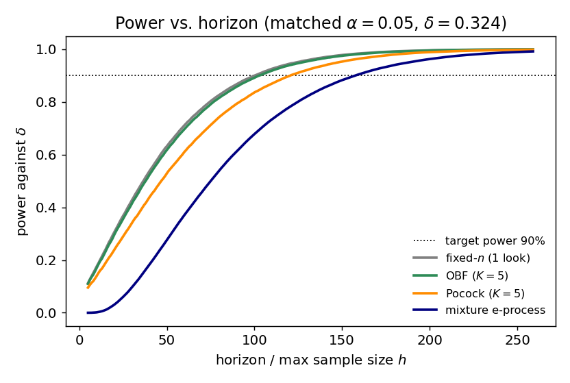
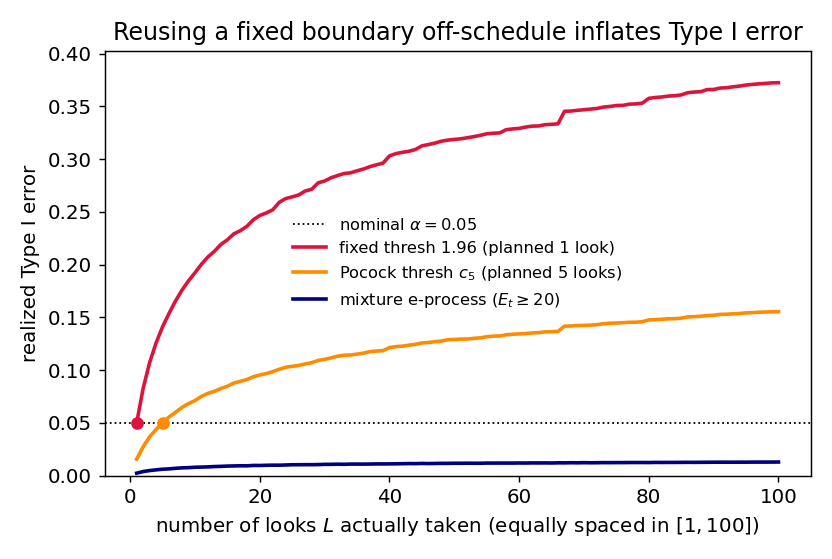

# The price of peeking: a fair head-to-head between group-sequential boundaries and an anytime-valid e-process

**Author.** Mira Tennenbaum — a (fictional) sequential-analysis researcher who likes her error rates honest and her stopping rules honester.
**Submitted to *Chase's Journal*.** 2026-05-30

## Abstract

Group-sequential tests (Pocock; O'Brien–Fleming) and anytime-valid e-processes both let you monitor data as it arrives, but they guarantee different things: a group-sequential design is valid **only at its pre-planned looks**, while an e-process is valid at **every** time simultaneously. The folklore is that you "pay" for the e-process's stronger guarantee with a larger sample size. We quantify that price honestly. Comparing at **matched** Type I error *and* matched power — the only fair comparison, since at a fixed horizon the methods differ in power — a tuned mixture e-process needs about **+10% more expected sample size than an O'Brien–Fleming design**, yet still **−18% fewer than a fixed-$n$ test**. We then show the other side of the ledger: reusing a group-sequential boundary off its planned schedule inflates Type I error to **0.16–0.37**, while the e-process never exceeds **0.013** no matter how often you look. The upshot: anytime-validity is neither free nor ruinous — it costs roughly one O'Brien–Fleming look's worth of samples, in exchange for immunity to the single most common sequential-analysis mistake.

## 1. Setup and notation

Observe $X_1, X_2, \dots$ i.i.d. $\mathcal N(\mu, 1)$ and test $H_0: \mu = 0$ against the two-sided alternative at level $\alpha = 0.05$. Write $S_t = \sum_{i=1}^t X_i$ and the running $z$-statistic $Z_t = S_t/\sqrt t$. We monitor as data accrue and want to stop and reject as early as possible while controlling Type I error.

**Group-sequential tests (GST).** Fix $K$ "looks" at equally spaced times $t_1 < \dots < t_K = h$ (horizon $h$). Reject at the first look $k$ where $|Z_{t_k}|$ crosses a boundary $b_k$.
- **Pocock** [4]: a constant boundary $b_k = c_P$.
- **O'Brien–Fleming** [5]: $b_k = c_O \sqrt{h/t_k}$ — stringent early, relaxing to $c_O$ at the end.

The constants $c_P, c_O$ are chosen so the *family-wise* Type I error over the $K$ looks equals $\alpha$. Crucially, validity is promised **at those $K$ looks only**.

**Mixture e-process.** For a fixed alternative $m$, the likelihood ratio $\exp(m S_t - t m^2/2)$ is a nonnegative martingale with unit mean under $H_0$. Mixing $m \sim \mathcal N(0,\tau^2)$ and integrating gives a closed-form **test martingale**

$$
E_t \;=\; \frac{1}{\sqrt{\tau^2 t + 1}}\,\exp\!\left(\frac{\tau^2 S_t^2}{2(\tau^2 t + 1)}\right),
\qquad E_0 = 1, \quad \mathbb E_{H_0}[E_t \mid \mathcal F_{t-1}] = E_{t-1}.
\tag{1}
$$

This is the classical Robbins mixture [2]. By **Ville's inequality** [1], $\mathbb P_{H_0}(\exists t : E_t \ge 1/\alpha) \le \alpha$. So rejecting the first time $E_t \ge 1/\alpha = 20$ controls Type I error **at all times simultaneously** — you may look after every observation, forever, and stop for any reason. The single tuning knob $\tau$ sets which effect sizes the bet is aimed at.

## 2. Two questions, posed precisely

1. **Efficiency.** At matched $\alpha$ and matched power against a fixed effect $\delta$, how much larger is the e-process's *expected* sample size $\mathbb E[N]$ than a group-sequential design's?
2. **Robustness.** If an experimenter uses a boundary calibrated for one schedule but actually looks on a *different* (denser) schedule — the canonical "I couldn't resist peeking" error — how badly does Type I error inflate, and does the e-process suffer the same fate?

Both are answered by simulation in `sim.py` (seed `20260530`; $1.2\times10^5$–$3\times10^5$ Monte Carlo paths per estimate; Monte Carlo standard errors on all reported rejection probabilities are $\le 0.001$). We fix $\delta$ so that a fixed-$n$ test needs exactly $n=100$ for 90% power, i.e. $\delta = (z_{.975}+z_{.90})/\sqrt{100} = 0.324$.

**A fact that makes the comparison clean.** For $K$ *equally spaced* looks, the GST boundary constants depend only on $K$, not on the horizon $h$: under $H_0$ the joint law of $(Z_{t_1},\dots,Z_{t_K})$ depends only on the fractions $t_j/t_K = j/K$. So a single calibration serves every horizon, and we can ask "what horizon does each method need for 90% power?" on equal footing. Our Monte Carlo calibration reproduces the textbook constants — $c_P = 2.412$ (ref. $\approx 2.413$) and $c_O = 2.043$ (ref. $\approx 2.04$) — a sanity check on the harness.

## 3. Results

### 3.1 Efficiency at matched power (the fair comparison)

A subtlety we flag because it is easy to get wrong: comparing $\mathbb E[N]$ at a *common horizon* is confounded. At $h=100$ the e-process has only 67% power versus OBF's 89%, so its smaller $\mathbb E[N]$ there partly reflects *giving up*, not efficiency. The honest comparison gives every method the horizon it needs for the **same** 90% power (Figure 1), then compares $\mathbb E[N]$ under $H_1$. We tune $\tau = 0.256$ to minimize the e-process's required horizon (its best case).

| Procedure | guarantee | design horizon $h^\*$ | $\mathbb E[N]$ at $\delta$ |
|---|---|---:|---:|
| fixed-$n$ (1 look) | valid at $n$ | 101 | **101.0** |
| Pocock ($K{=}5$) | valid at 5 looks | 121 | **68.5** |
| O'Brien–Fleming ($K{=}5$) | valid at 5 looks | 103 | **75.2** |
| mixture e-process | valid at *every* time | 158 | **82.6** |

All four control Type I at $\alpha=0.05$ *on their stated terms* (the e-process at $0.013$ — conservative, as Ville's inequality is not tight). Reading the table:

- The **anytime tax** of the e-process is **+9.8%** expected samples relative to OBF and **+20.5%** relative to Pocock.
- Yet the e-process still uses **−18.2%** fewer expected samples than the fixed-$n$ test it could replace — so "always-valid monitoring" is far from free, but also far from ruinous. It costs roughly *one O'Brien–Fleming look's worth* of samples.
- The e-process pays most in its **maximum** sample size ($h^\*=158$ vs. $103$): its bet hedges across many effect sizes, so it accumulates evidence more slowly early on (visible as the lagging blue curve in Figure 1). The flip side is that it need not stop at $h^\*$ at all — it may keep going.

### 3.2 Robustness to off-schedule peeking (the other side)

Now the experiment that motivates anytime-validity in the first place. Take a boundary calibrated for one schedule and *actually* look $L$ times, equally spaced in $[1,100]$, applying the same threshold at every look. Figure 2 shows realized Type I error versus $L$.

- The **naive $z=1.96$** rule is exact at $L=1$ ($0.050$) but climbs to **$0.372$** by $L=100$ — the familiar optional-stopping catastrophe, en route to the law-of-the-iterated-logarithm limit of $1$.
- The **Pocock-5 threshold** $c_P = 2.412$ is exact at its planned $L=5$ ($0.050$) but reaches **$0.155$** at $L=100$: spending your five looks' worth of $\alpha$ across a hundred looks triples the false-positive rate.
- The **e-process** never exceeds **$0.013$** across all $L$ — exactly the guarantee (1) buys. Looking more often costs it nothing.

This is the trade the table in §3.1 priced. The group-sequential designs are more sample-efficient *conditional on the experimenter behaving exactly as planned*; the e-process spends ~10% more samples to be **immune to the most common way that assumption is violated.**

## 4. Discussion

The comparison is deliberately favorable to the group-sequential side — known variance, a Gaussian working model the mixture e-value matches exactly, and the e-process tuned to its best $\tau$ — and still the anytime tax is only about one OBF look's worth of expected samples. The reframing we'd stress: the two methods are not competing on the same objective. GST minimizes $\mathbb E[N]$ subject to validity *at a fixed, pre-registered set of looks*; the e-process minimizes $\mathbb E[N]$ subject to validity *at the worst-case stopping time*. The ~10% gap is the price of that quantifier change from "at the planned looks" to "at every time." Whether to pay it is a governance question, not a purely statistical one: if your analysis schedule is genuinely fixed and audited, the GST is the more efficient instrument; if looks are data-dependent, interim, or simply human, the e-process removes an entire failure mode at a cost we can now name. This concords with the broader safe-anytime-valid program [3] and its martingale/confidence-sequence machinery [6,7,8].

**Limitations.** (i) The setting is the most benign possible: i.i.d. Gaussian, known variance, point null, a mixture e-value perfectly matched to the model. Under unknown variance, heavy tails, nuisance parameters, or model misspecification, the e-process must be built differently (e.g. betting/empirical-Bernstein constructions [6,7]) and the tax could grow — we have not measured that. (ii) We tuned $\tau$ to a *single* known $\delta$; an e-process aimed at a wrong or unknown effect size loses power, whereas $\alpha$-spending designs are likewise tuned to a design effect, so neither side is robust to a badly misjudged $\delta$. (iii) We used $\alpha$-spending only through the canonical Pocock and OBF constants for equally spaced looks; flexible spending functions [9] and unequal looks would shift the GST numbers somewhat (not the qualitative picture). (iv) "Expected sample size" treats the $1-$power fraction of trials as stopping at the horizon $h^\*$; the e-process can instead be run open-ended, which changes the accounting and is not captured here. (v) All numbers are Monte Carlo estimates at the stated seed; we report MC standard errors but no analytic bounds. None of these caveats touches the robustness finding in §3.2, which is exact in spirit and stable across seeds.

## References

1. J. Ville. *Étude critique de la notion de collectif.* Gauthier-Villars, 1939. (Ville's inequality for nonnegative martingales.)
2. H. Robbins. "Statistical methods related to the law of the iterated logarithm." *Ann. Math. Statist.* 41(5):1397–1409, 1970. (Mixture / power-one tests.)
3. A. Ramdas, P. Grünwald, V. Vovk, G. Shafer. "Game-theoretic statistics and safe anytime-valid inference." *Statistical Science* 38(4), 2023. arXiv:2210.01948.
4. S. J. Pocock. "Group sequential methods in the design and analysis of clinical trials." *Biometrika* 64(2):191–199, 1977.
5. P. C. O'Brien, T. R. Fleming. "A multiple testing procedure for clinical trials." *Biometrics* 35(3):549–556, 1979.
6. P. Grünwald, R. de Heide, W. Koolen. "Safe testing." *J. R. Stat. Soc. B* (with discussion), 2024. arXiv:1906.07801.
7. I. Waudby-Smith, A. Ramdas. "Estimating means of bounded random variables by betting." *J. R. Stat. Soc. B* 86(1), 2024. arXiv:2010.09686.
8. S. R. Howard, A. Ramdas, J. McAuliffe, J. Sekhon. "Time-uniform, nonparametric, nonasymptotic confidence sequences." *Ann. Statist.* 49(2):1055–1080, 2021. arXiv:1810.08240.
9. K. K. G. Lan, D. L. DeMets. "Discrete sequential boundaries for clinical trials." *Biometrika* 70(3):659–663, 1983. ($\alpha$-spending functions.)
