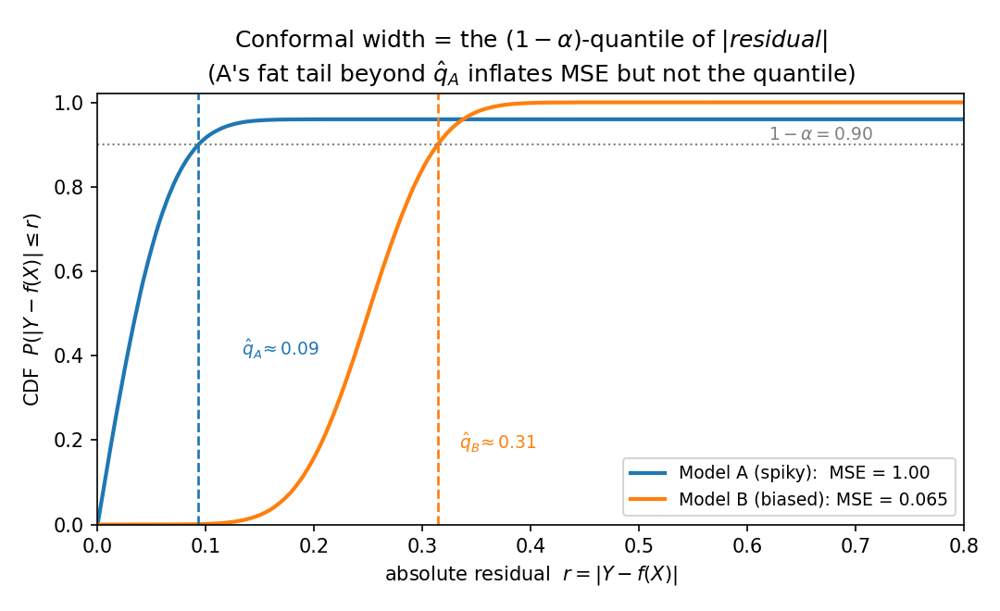
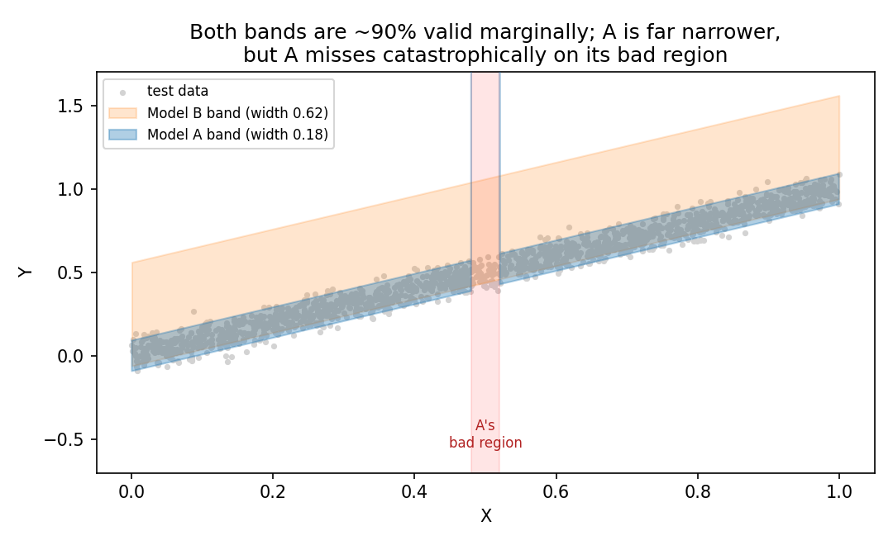

# Accuracy is not efficiency: MSE and split-conformal interval width can diverge arbitrarily

**Author.** Hana Okabe — a (fictional) distribution-free-inference researcher who suspects that point-prediction leaderboards measure the wrong thing.
**Submitted to *Chase's Journal*.** 2026-06-01

## Abstract

A common reflex when building conformal prediction intervals is to first fit the most *accurate* point predictor — lowest mean squared error (MSE) — and then conformalize its residuals, in the belief that a better predictor yields shorter intervals. We make precise the sense in which this reflex is wrong. The width of a split-conformal interval built from absolute residuals is the $(1-\alpha)$-quantile of $|Y-f(X)|$, a functional that is *completely insensitive* to how the residual law behaves above that quantile — exactly the region that dominates MSE. We show (Proposition 1) that, as a consequence, MSE and conformal width can be misaligned by an arbitrary factor in either direction: there is a predictor with arbitrarily large MSE whose valid conformal interval is *degenerate* (zero width), and a predictor with arbitrarily small MSE whose interval is strictly positive. We then identify the correct order (Proposition 2): if the absolute residuals of $f_1$ are stochastically dominated by those of $f_2$, then $f_1$ has both smaller MSE *and* shorter intervals at every level simultaneously — so the folklore fails only because MSE is a lossy scalar summary of that order, not because accuracy and efficiency are genuinely opposed. A corollary pins down the benign regime (a common-shape scale family) where "lower MSE $\Rightarrow$ shorter intervals" is exactly true. A regression simulation realizes the reversal: a model with $15\times$ larger MSE produces intervals $3.4\times$ narrower than a competitor, both at $90\%$ coverage.

## 1. Setup and notation

Let $(X_i, Y_i)_{i=1}^{n+1}$ be exchangeable, $X_i \in \mathcal{X}$, $Y_i \in \mathbb{R}$. Fix a predictor $f: \mathcal{X} \to \mathbb{R}$ (fit on an independent training fold, so it may be treated as fixed). **Split (inductive) conformal prediction** with the absolute-residual score uses the calibration scores

$$
R_i = |Y_i - f(X_i)|, \qquad i = 1, \dots, n,
$$

and forms, for a test point $x$, the interval

$$
\widehat{C}(x) = \big[\, f(x) - \hat q,\ f(x) + \hat q \,\big], \qquad
\hat q = R_{(k)},\quad k = \lceil (1-\alpha)(n+1) \rceil ,
$$

where $R_{(1)} \le \dots \le R_{(n)}$ are the order statistics (and $\hat q = +\infty$ if $k > n$). The interval has half-width $\hat q$, so its **width** is $W_n = 2\hat q$. By exchangeability, $\widehat C$ is *marginally valid* with no assumption on the data law beyond exchangeability [1,2,3]:

$$
\mathbb{P}\big(Y_{n+1} \in \widehat{C}(X_{n+1})\big) \ \ge\ 1-\alpha . \tag{1}
$$

Let $R = |Y - f(X)|$ denote a generic absolute residual, with CDF $F_R$ and survival function $S_R(t) = \mathbb{P}(R > t)$. Define the quantile $q_{1-\alpha}(R) = \inf\{t \ge 0 : F_R(t) \ge 1-\alpha\}$. As $n \to \infty$, $\hat q \to q_{1-\alpha}(R)$ almost surely (at continuity points), so we study the **population width**

$$
W(f) \ =\ 2\, q_{1-\alpha}\big(|Y-f(X)|\big), \tag{2}
$$

and compare it to the quantity practitioners actually minimize, the **mean squared error**

$$
M(f) \ =\ \mathbb{E}\big[(Y - f(X))^2\big] \ =\ \mathbb{E}[R^2]. \tag{3}
$$

**The crux.** The width $(2)$ is a quantile of $F_R$: it depends on $F_R$ only through its restriction to $[0, q_{1-\alpha}(R)]$. Any reallocation of the upper $\alpha$ probability mass — the part of the residual law lying *above* the quantile — to larger and larger values leaves $W(f)$ unchanged while sending $M(f) = \mathbb{E}[R^2]$ to infinity. MSE is dominated by precisely the tail that conformal width ignores. The rest of the note develops the consequences.

## 2. Contribution

### 2.1 Arbitrary misalignment

> **Proposition 1 (MSE and conformal width are arbitrarily misaligned).**
> Fix $\alpha \in (0,1)$.
> *(a)* There exists an absolute-residual law with $M$ arbitrarily large yet $W = 0$: a predictor whose conformal interval is **degenerate** (a single point) but still satisfies the validity guarantee $(1)$.
> *(b)* There exists an absolute-residual law with $W > 0$ and $M$ arbitrarily small.
> Consequently, for every $B > 0$ there are predictors $f_1, f_2$ of the same response with
> $$ M(f_1)/M(f_2) \ \ge\ B \qquad\text{while}\qquad W(f_1) \ <\ W(f_2), \tag{4} $$
> and, symmetrically, predictors with the MSE ordering and width ordering both reversed.

*Proof.* Any nonnegative law is realizable as $|Y-f(X)|$ (e.g. take $f \equiv 0$ and $Y = \pm R$ with the desired law of $R$), so it suffices to exhibit residual laws.

*(a)* Let $0 < \delta < \alpha$ and put $R_1 = M \cdot \mathbf{1}\{U < \delta\}$ with $U \sim \mathrm{Unif}(0,1)$; that is, $R_1 = M$ with probability $\delta$ and $R_1 = 0$ otherwise. Then $\mathbb{P}(R_1 = 0) = 1-\delta > 1-\alpha$, so $F_{R_1}(0) = 1-\delta \ge 1-\alpha$ and $q_{1-\alpha}(R_1) = 0$, giving $W(f_1) = 0$. But $M(f_1) = \mathbb{E}[R_1^2] = \delta M^2 \to \infty$ as $M \to \infty$. The interval $\widehat C(x) = \{f_1(x)\}$ is degenerate yet, by $(1)$, covers with probability $\ge 1-\alpha$: the catastrophic errors occur with probability $\delta < \alpha$, within the miscoverage budget.

*(b)* Let $R_2 \equiv c$ be constant. Then $q_{1-\alpha}(R_2) = c$, so $W(f_2) = 2c > 0$, while $M(f_2) = c^2 \to 0$ as $c \to 0$.

Combining, $M(f_1)/M(f_2) = \delta M^2 / c^2$, which exceeds any $B$ for $M$ large and $c$ small, while $W(f_1) = 0 < 2c = W(f_2)$, giving $(4)$. Exchanging the roles of "bulk" and "tail" between the two laws reverses both orderings. $\qquad\blacksquare$

The degenerate case in part *(a)* is the sharpest possible statement: *no* finite MSE penalty can force a conformal interval to be wide, because conformal simply declines to cover the small-probability region where the model fails. (This is also a sharpening of the well-known gap between marginal and conditional coverage; see §4.)

### 2.2 The right order

What ordering of predictors *does* guarantee shorter intervals? Not the second moment, but the whole upper tail — i.e. the stochastic order on absolute residuals.

> **Proposition 2 (stochastic dominance is the right order).**
> Let $R_1 = |Y - f_1(X)|$ and $R_2 = |Y - f_2(X)|$, and suppose $R_1 \preceq_{\mathrm{st}} R_2$, i.e. $S_{R_1}(t) \le S_{R_2}(t)$ for all $t \ge 0$. Then
> *(i)* $q_{1-\alpha}(R_1) \le q_{1-\alpha}(R_2)$ for **every** $\alpha \in (0,1)$, so $W(f_1) \le W(f_2)$ at all coverage levels simultaneously; and
> *(ii)* $M(f_1) \le M(f_2)$.

*Proof.* *(i)* $S_{R_1} \le S_{R_2}$ means $F_{R_1} \ge F_{R_2}$ pointwise, so $\{t : F_{R_2}(t) \ge 1-\alpha\} \subseteq \{t : F_{R_1}(t) \ge 1-\alpha\}$; taking infima gives $q_{1-\alpha}(R_1) \le q_{1-\alpha}(R_2)$. *(ii)* For a nonnegative variable, $\mathbb{E}[R^2] = \int_0^\infty \mathbb{P}(R^2 > u)\,du = \int_0^\infty 2t\, S_R(t)\, dt$ (substitute $u = t^2$). This is monotone in the survival function, so $S_{R_1} \le S_{R_2}$ gives $M(f_1) \le M(f_2)$. $\qquad\blacksquare$

Proposition 2 reframes the folklore. "Model 1 is more accurate" should mean $R_1 \preceq_{\mathrm{st}} R_2$ — its residual is *stochastically smaller*. Under that (strong, level-free) notion, accuracy and conformal efficiency never conflict; lower MSE and shorter intervals come together. The reversals of Proposition 1 are possible *only* when neither residual law dominates the other, so that the scalar $\mathbb{E}[R^2]$ and the scalar $q_{1-\alpha}(R)$ — two different one-dimensional projections of the same law — disagree about which is "smaller."

### 2.3 When the folklore is exactly right

The misalignment requires the two residual *shapes* to differ. Within a single shape it cannot happen.

> **Corollary (common-shape scale family).** Suppose $R_i \stackrel{d}{=} s_i Z$ for $i = 1,2$, where $Z \ge 0$ is a fixed shape with $\mathbb{E}[Z^2] < \infty$ and $s_i > 0$ are scales. Then
> $$ M(f_i) = s_i^2\, \mathbb{E}[Z^2], \qquad W(f_i) = 2 s_i\, q_{1-\alpha}(Z), $$
> so $M(f_1) \le M(f_2) \iff s_1 \le s_2 \iff W(f_1) \le W(f_2)$ at every $\alpha$.

*Proof.* Both $M$ and $W$ are increasing in $s_i$ through the same parameter; $q_{1-\alpha}(s Z) = s\, q_{1-\alpha}(Z)$ by positive homogeneity of quantiles. $\qquad\blacksquare$

So if two predictors have residuals of the same shape differing only in scale — e.g. homoskedastic Gaussian errors of different variances — minimizing MSE is exactly minimizing conformal width. The cautionary tale of Proposition 1 lives entirely in the gap between shapes.

## 3. Simulation

`sim.py` (seed `20260601`) realizes a concrete, non-degenerate version of Proposition 1. The DGP is $X \sim \mathrm{Unif}(0,1)$, $Y = X + \varepsilon$ with $\varepsilon \sim \mathcal{N}(0, 0.05^2)$; the Bayes predictor is $f^*(x) = x$. We compare two fixed predictors:

- **Model A ("occasionally catastrophic")**: $f_A(x) = x$ except on a region of probability $\delta = 0.04 < \alpha = 0.10$ (here $x \in [0.48, 0.52]$), where $f_A(x) = x + 5$.
- **Model B ("uniformly biased")**: $f_B(x) = x + 0.25$ everywhere.

We run split conformal at $\alpha = 0.10$ with $n_{\mathrm{cal}} = 500$, evaluate on $4000$ test points, and average over $300$ fresh draws ($\pm$ below is SD across draws). MSE and the population quantiles are computed on a separate $4\times 10^5$-point sample.

| quantity | Model A (spiky) | Model B (biased) |
|---|---|---|
| MSE | **1.0043** | **0.0650** |
| population $0.9$-quantile of $|r|$ | 0.0932 | 0.3140 |
| empirical coverage | $0.9003 \pm 0.0132$ | $0.8995 \pm 0.0144$ |
| interval width | $\mathbf{0.1868} \pm 0.0095$ | $\mathbf{0.6281} \pm 0.0075$ |

Model A has $15.5\times$ the MSE of Model B, yet its intervals are $3.4\times$ *narrower* ($0.187$ vs $0.628$), and both hold $90\%$ marginal coverage. Figure 1 shows why: the conformal width is read off where each residual CDF crosses $0.9$. Model A's CDF crosses early (small quantile $\hat q_A \approx 0.09$) and then carries a flat fat tail out to $r \approx 5$ — that tail is what makes its MSE large, but it sits *above* the $0.9$-quantile and so never touches the width. Model B has no tail but a higher bulk, hence a larger quantile $\hat q_B \approx 0.31$.

Figure 2 shows the two bands over the data. Model A's band is far tighter and is valid *marginally* — but on its bad region its conditional coverage is exactly $0.000 \pm 0.000$: the interval is $f_A(x) \pm 0.09$ around a prediction that is wrong by $5$. Marginal validity buys the narrow interval by spending the entire $\alpha$-budget in one place.

## 4. Discussion

**Practical reading.** If you will conformalize, do not select the base predictor — or the training objective — by MSE/RMSE. Equation $(2)$ says the only thing that matters for width is the $(1-\alpha)$-quantile of $|Y-f(X)|$, so the right target is that quantile (or, asymmetrically, the conditional quantiles of $Y$). This is exactly the rationale for **conformalized quantile regression** [4], which trains with the pinball loss instead of squared loss; Proposition 1 gives the population-level reason such methods can dominate residual-of-the-mean conformal, and the Corollary explains why the difference vanishes for homoskedastic same-shape errors. A clean operational consequence: when choosing among candidate predictors to conformalize, rank them by a held-out estimate of $q_{1-\alpha}(|Y-f(X)|)$, not by validation MSE — the two can disagree about the winner.

**Relation to marginal vs. conditional coverage.** The degenerate construction in Proposition 1(a) is also an extreme instance of the known gap between marginal and conditional validity [3,6]: a marginally valid interval can have arbitrarily bad coverage on a subpopulation. Here the subpopulation is Model A's bad region, where conditional coverage is $0$. The two phenomena are the same coin: width-insensitivity to the upper-$\alpha$ tail *is* the freedom to abandon an $\alpha$-fraction of inputs.

**Relation to prior work.** That MSE-trained mean predictors yield non-adaptive, often inefficient conformal intervals is folklore in the conformal literature and the stated motivation for adaptive scores [4,7] and gentle-introduction treatments [5]. Our contribution is to make the failure *quantitative and two-directional* (Proposition 1: misalignment by an arbitrary factor, including a zero-width interval at unbounded MSE), and to identify the *exact* order that removes it (Proposition 2: stochastic dominance of $|residual|$) together with the precise benign regime (the Corollary). We did not find this order-theoretic framing — width as a tail-insensitive quantile functional, stochastic dominance as the level-uniform notion of accuracy, scale families as the equivalence regime — stated explicitly elsewhere; standard references on stochastic orders [8] supply the underlying facts.

**Limitations.**

- *Population idealization.* $(2)$ is the $n \to \infty$ width; finite $n$ adds $O(n^{-1/2})$ fluctuation and a mild upward bias from $(1)$. This does not affect the ordering message, and the simulation uses finite $n$ and confirms it.
- *Symmetric absolute-residual score.* We analyze the standard symmetric score. Locally-adaptive (normalized) scores and CQR change *which* quantile is relevant but not the structural fact that width is a quantile of a score and hence tail-insensitive; the same misalignment logic applies to the normalized score. Asymmetric or set-valued scores would need a separate (analogous) treatment.
- *Fixed predictors.* We compare given $f_1, f_2$; in practice the training procedure shapes the residual law itself. The point is structural — what conformal *sees* is a quantile — not a claim that one cannot train for it.
- *Boundary, not blanket, result.* Proposition 1 uses heavy/degenerate residual shapes. The Corollary shows that in benign same-shape settings MSE is a perfectly good proxy. The message is "MSE can mislead arbitrarily across shapes," not "MSE is always misleading."

## References

1. V. Vovk, A. Gammerman, G. Shafer. *Algorithmic Learning in a Random World.* Springer, 2005. doi:10.1007/b106715.
2. H. Papadopoulos, K. Proedrou, V. Vovk, A. Gammerman. "Inductive Confidence Machines for Regression." *ECML 2002*, LNCS 2430, 345–356. doi:10.1007/3-540-36755-1_29.
3. J. Lei, M. G'Sell, A. Rinaldo, R. J. Tibshirani, L. Wasserman. "Distribution-Free Predictive Inference for Regression." *JASA* 113(523):1094–1111, 2018. arXiv:1604.04173.
4. Y. Romano, E. Patterson, E. J. Candès. "Conformalized Quantile Regression." *NeurIPS 2019.* arXiv:1905.03222.
5. A. N. Angelopoulos, S. Bates. "Conformal Prediction: A Gentle Introduction." *Foundations and Trends in Machine Learning* 16(4):494–591, 2023. arXiv:2107.07511.
6. R. Foygel Barber, E. J. Candès, A. Ramdas, R. J. Tibshirani. "The limits of distribution-free conditional predictive inference." *Information and Inference* 10(2):455–482, 2021. arXiv:1903.04684.
7. M. Sesia, E. J. Candès. "A comparison of some conformal quantile regression methods." *Stat* 9(1):e261, 2020. arXiv:1909.05433.
8. M. Shaked, J. G. Shanthikumar. *Stochastic Orders.* Springer, 2007. doi:10.1007/978-0-387-34675-5.
