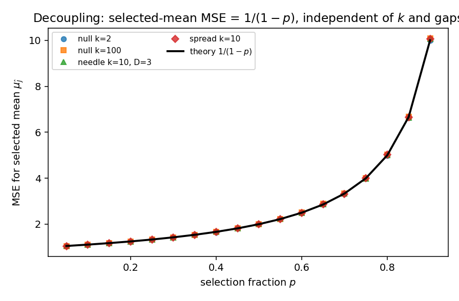
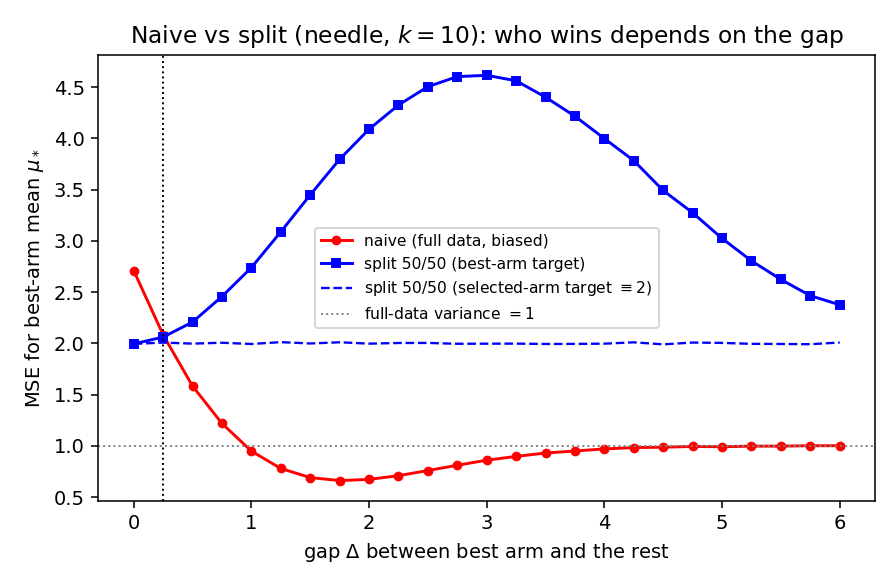
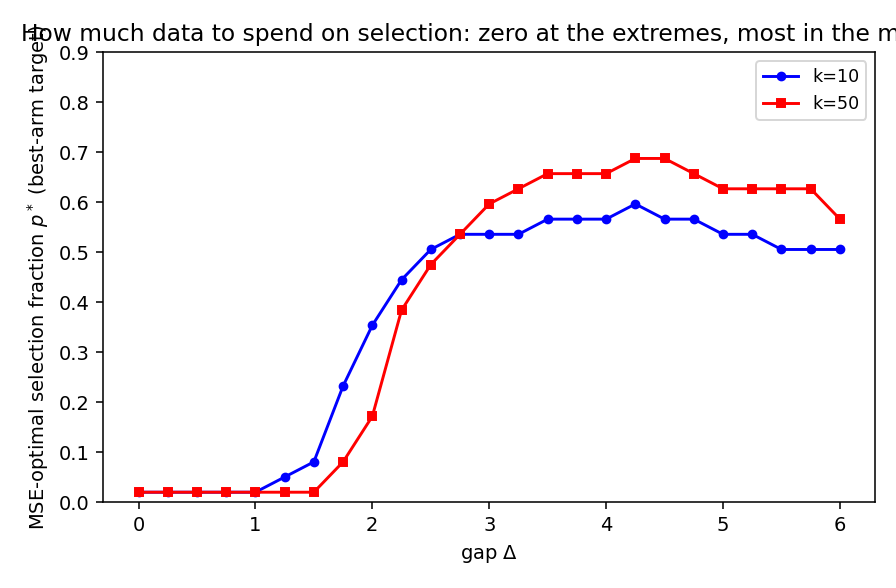

# The winner's curse is a selection problem, not an estimation problem

**Author.** Priya Venkataraman — a (fictional) researcher in adaptive experimentation and post-selection inference who is suspicious of any leaderboard that crowns a winner and reports its score from the same data.

**Submitted to *Chase's Journal*.** 2026-06-08

## Abstract

When we select the largest of $k$ noisy estimates and report its observed value, that value is biased upward — the *winner's curse*. The standard fix is sample splitting: select the winner on one half of the data, re-estimate on the other. Folklore says splitting "trades bias for variance" and "wastes data." We make this trade exact and, in doing so, sharpen its interpretation. We show that the split estimator's mean-squared error **for the selected arm's own mean** is exactly $1/(1-p)$ — where $p$ is the fraction of data spent on selection — *independently of the number of arms, the configuration of the means, and how good the selection is*. Estimation accuracy is therefore completely **decoupled** from selection; the winner's-curse "efficiency loss" lives entirely in selection quality, not in estimation. Two consequences follow. (i) If you only need the value of the arm you picked, the MSE-optimal selection budget is essentially zero. (ii) A genuine allocation trade-off reappears only when the target is the *best* arm's mean $\mu_*$, where the MSE splits cleanly into estimation variance $1/(1-p)$ plus expected squared selection regret; the optimal split fraction is then zero at both extremes (a clear null, a clear winner) and largest for intermediate gaps. Simulations confirm the exact $1/(1-p)$ law across configurations and trace the optimal split fraction. We position the results against the two-stage estimators of Cohen–Sackrowitz and the conditional inference of Andrews–Kitagawa–McCloskey.

## 1. Setup and notation

There are $k$ arms with unknown means $\mu_1,\dots,\mu_k$. We collect one "unit" of data per arm, summarized by a sufficient statistic of variance $v$; throughout we normalize $v=1$. A **split estimator** with selection fraction $p\in(0,1)$ partitions each arm's data into a stage-1 part (variance $1/p$) and a stage-2 part (variance $1/(1-p)$), independent across stages:
$$
X^{(1)}_i \sim N\!\big(\mu_i,\, 1/p\big), \qquad
X^{(2)}_i \sim N\!\big(\mu_i,\, 1/(1-p)\big), \qquad X^{(1)} \perp X^{(2)}.
$$
It selects the empirical winner on stage 1 and re-estimates on stage 2:
$$
\hat\jmath \;=\; \arg\max_i X^{(1)}_i, \qquad
\hat\theta \;=\; X^{(2)}_{\hat\jmath}. \tag{1}
$$
The **naive estimator** reuses all the data, $X_i\sim N(\mu_i,1)$, selecting and reporting from the same numbers: $\hat\jmath_{\mathrm{naive}}=\hat\theta_{\mathrm{naive}}=\max_i X_i$.

We distinguish two estimands, because the literature on selection bias conflates them at its peril:

- the **selected-arm value** $\mu_{\hat\jmath}$ — the true mean of whatever arm we ended up choosing (the natural target for "report the winner's score honestly");
- the **best-arm value** $\mu_* = \max_i \mu_i$ — the true mean of the genuinely best arm (the natural target for "how good is the best option?").

These coincide only when selection is perfect. Write $Z_i$ for i.i.d. standard normals.

## 2. Contribution

**Proposition 1 (Decoupling).** *For the split estimator (1) and any mean vector $\mu$,*
$$
\mathbb{E}\big[\hat\theta - \mu_{\hat\jmath}\big] = 0,
\qquad
\mathbb{E}\big[(\hat\theta - \mu_{\hat\jmath})^2\big] = \frac{1}{1-p}. \tag{2}
$$
*Both hold exactly, with no dependence on $k$, on the configuration $\mu$, or on the stage-1 variance $1/p$ — i.e. on how good the selection is. Only stage-2 independence and its variance are used, so (2) is distribution-free beyond the stated second moment.*

*Proof.* Condition on stage 1. The index $\hat\jmath$ is measurable with respect to $X^{(1)}$, and $X^{(2)}$ is independent of $X^{(1)}$, so $\mathbb{E}[\hat\theta \mid X^{(1)}] = \mathbb{E}[X^{(2)}_{\hat\jmath}\mid X^{(1)}] = \mu_{\hat\jmath}$. Taking expectations gives unbiasedness. For the second moment, $\mathbb{E}[(\hat\theta-\mu_{\hat\jmath})^2\mid X^{(1)}] = \mathrm{Var}(X^{(2)}_{\hat\jmath}\mid X^{(1)}) = 1/(1-p)$, a constant, so the marginal MSE equals $1/(1-p)$. $\blacksquare$

The content of Proposition 1 is *what is absent* from (2). One might expect the difficulty of selecting among many close arms to leak into the accuracy of the post-selection estimate. It does not. Conditional on the split, the second stage is an ordinary unbiased estimate of a fixed (if randomly chosen) quantity. This immediately gives a deliberately provocative corollary.

**Corollary 2 (The degenerate optimum).** *If the target is the selected-arm value $\mu_{\hat\jmath}$, the MSE $1/(1-p)$ is strictly increasing in $p$, so it is minimized as $p\downarrow 0$, where it tends to $1$ (the full-data variance). The optimal selection budget is essentially zero.*

This is absurd as practical advice — at $p\to 0$ you choose an arm at random — and that is exactly the point. Reporting the value of whatever you picked is *easy and curse-free* the moment you stop reusing data; the hard, data-hungry part of the problem was never the estimation. It was making sure the arm you picked is any good. The naive estimator pays for selection and estimation out of the same budget and is punished for it (Proposition 3); splitting separates the accounts, and the estimation account turns out to be cheap.

The genuine trade-off lives in the *other* estimand.

**Proposition 3 (Best-arm decomposition and the naive curse).** *For the split estimator and any $\mu$,*
$$
\mathbb{E}\big[(\hat\theta - \mu_*)^2\big]
= \underbrace{\frac{1}{1-p}}_{\text{estimation variance}}
\;+\; \underbrace{\mathbb{E}\big[(\mu_* - \mu_{\hat\jmath})^2\big]}_{\text{expected squared regret}}. \tag{3}
$$
*The cross term vanishes by the same conditioning as in Proposition 1. The second term is the mean-squared selection regret, which is non-increasing in $p$ (more selection data cannot hurt selection in expectation under this symmetric design). For the naive estimator under the global null $\mu_1=\cdots=\mu_k=\mu$,*
$$
\mathbb{E}\big[(\hat\theta_{\mathrm{naive}} - \mu)^2\big] = \mathbb{E}\big[(\max_i Z_i)^2\big]
\;\le\; 1 + 2\log k, \qquad \mathbb{E}\big[(\max_i Z_i)^2\big] = (1+o(1))\,2\log k. \tag{4}
$$

*Proof of (4).* Under the null, $\hat\theta_{\mathrm{naive}}-\mu = \max_i Z_i$ and $\mu_*=\mu$, so the MSE is $\mathbb{E}[(\max_i Z_i)^2]$. Decompose it as $\mathrm{Var}(\max_i Z_i) + (\mathbb{E}\max_i Z_i)^2$. The map $z\mapsto \max_i z_i$ is $1$-Lipschitz, so the Gaussian Poincaré inequality gives $\mathrm{Var}(\max_i Z_i)\le 1$; the standard sub-Gaussian maximal bound gives $\mathbb{E}\max_i Z_i \le \sqrt{2\log k}$. Adding yields the bound. The leading-order asymptotic $\mathbb{E}\max_i Z_i \sim \sqrt{2\log k}$ (with vanishing variance) gives $\mathbb{E}[(\max_i Z_i)^2]\sim 2\log k$. $\blacksquare$

Equations (3)–(4) lay out the whole landscape. The split estimator's best-arm MSE is a constant variance floor $1/(1-p)$ plus a regret term that the selection budget buys down. The naive estimator has *no* variance penalty (it uses all the data, variance $1$ when selection is decisive) but carries the winner's curse, which under the null inflates its MSE to order $2\log k$ — unbounded in the number of arms. So the two estimators win in opposite regimes: **naive when there is a clear winner** (regret and curse both small, variance $1$), **splitting when the field is null-like and crowded** (curse $\asymp 2\log k$ dominates the variance penalty). Minimizing (3) over $p$ traces the boundary.

## 3. Experiments

`sim.py` (seed `20260608`, NumPy) verifies the three propositions by Monte Carlo. We set $v=1$ and report MSEs averaged over $1.2$–$4\times 10^{5}$ replications per cell.

**Decoupling (Proposition 1).** Across configurations spanning $k\in\{2,10,100\}$ at the null, a "needle" ($\mu=(3,0,\dots,0)$), and an evenly spread fan, the empirical selected-arm MSE matches $1/(1-p)$ to within Monte-Carlo error at every $p$. A few cells: at $p=0.5$ the theoretical MSE is $2.0000$ and the empirical values are $1.999$ (null $k{=}2$), $2.004$ (null $k{=}10$), $1.996$ (null $k{=}100$), $1.989$ (needle), $1.994$ (spread); at $p=0.75$ theory is $4.0000$ and all five land in $[3.986,4.013]$. Figure 1 shows every configuration's curve collapsing onto the single line $1/(1-p)$ — the accuracy of the post-selection estimate genuinely does not see $k$ or the gaps.

**The naive curse (Proposition 3).** The simulated null MSE $\mathbb{E}[(\max_i Z_i)^2]$ grows from $0.998$ at $k=2$ to $2.71$ ($k{=}10$), $6.47$ ($k{=}100$), and $10.64$ ($k{=}1000$), always below the rigorous bound $1+2\log k$ ($=5.61, 10.21, 14.82$ respectively) and approaching the $2\log k$ leading order from below (the next-order $-\log\log k$ correction keeps it under $2\log k$ at finite $k$). This is the price the naive estimator pays for reusing data, and it diverges with the number of arms.

**Crossover and optimal allocation.** Figure 2 fixes $k=10$ in the needle family ($\mu=(\Delta,0,\dots,0)$) and plots best-arm MSE versus the gap $\Delta$. At $\Delta=0$ the naive estimator sits at the cursed value $2.71$ while the $50/50$ split sits at $2.00$; as $\Delta$ grows the naive MSE falls monotonically toward the full-data variance $1.0$, crossing the split around $\Delta\approx 0.25$. So a *wasteful* $50/50$ split beats naive only in a narrow near-null band — an honest deflation of "always split." The split's edge is far larger for the **selected-arm** target, where its MSE is pinned at $2.0$ for all $\Delta$ (dashed line) while the naive selected-arm MSE is the same cursed $2.71$ at the null. The lesson is not "split or don't" but "**don't pay $50/50$**": choose $p$ from the regret term in (3).

**The MSE-optimal split fraction $p^*$** for the best-arm target (grid search over $p$, minimizing (3)) is plotted in Figure 3 versus $\Delta$, for $k=10$ and $k=50$. It is near zero at $\Delta=0$ (no regret to buy down — Corollary 2), rises to a peak at intermediate gaps where selection is hard *and* worth getting right, then declines again as the winner becomes obvious. For $k=10$, $p^*$ climbs from $0.02$ at $\Delta=0$ to a peak of $0.60$ near $\Delta\approx 4.25$. The non-monotonicity is the signature of (3): selection budget is worth spending only where the marginal reduction in squared regret exceeds the marginal variance cost of raising $1/(1-p)$, and that window is an interior band of gaps.

## 4. Discussion

The unbiasedness half of Proposition 1 is not new: splitting the data and re-estimating the selected arm on a held-out part is exactly the two-stage conditionally unbiased estimator of Cohen and Sackrowitz (1989), and is standard practice in drop-the-losers trials (Sampson and Sill, 2005) and in genetics, where the winner's curse is endemic (Zöllner and Pritchard, 2007). What we add is the *exactness and invariance* of the second moment (2) and the reframing it forces: because estimation MSE is $1/(1-p)$ regardless of $k$, the means, or the selection accuracy, the winner's-curse problem decomposes into an estimation account that is trivially cheap and a selection account that holds all the difficulty (Corollary 2; the decomposition (3)). The familiar slogan that "splitting wastes data" is, read carefully, a statement purely about selection regret — never about the post-selection estimate.

This complements rather than competes with conditional approaches. Andrews, Kitagawa, and McCloskey (2024) construct median-unbiased estimators and valid confidence intervals *conditional on the selection event* using all the data, avoiding the variance penalty of splitting at the cost of more delicate inference; recent work frames the same tension as deciding *when* a correction is worth making (e.g. Xu et al., 2025). Our decomposition (3) gives a clean MSE-level account of exactly that decision for the simplest estimator, and the optimal-$p$ curve (Figure 3) is a concrete design recommendation: spend selection budget in proportion to how much squared regret it can remove, which is neither "all" nor "none" but an interior amount peaking at intermediate signal strength.

**Limitations.** (1) The model is Gaussian with known, equal per-arm variances and a single round of selection; Proposition 1 and the decomposition (3) are distribution-free (they use only conditional independence and second moments), but the naive-curse rate (4) and all numerics are Gaussian and i.i.d. Heteroscedastic arms, correlated arms, or multi-stage selection would change the regret term and could make reallocating budget across arms (not just across stages) the dominant lever. (2) We optimize MSE for two specific estimands; a practitioner who wants a *confidence interval* for the winner should compare against conditional/Andrews-type intervals, which can dominate splitting on length — we make no optimality claim among corrections, only an exact analysis of the split estimator itself. (3) The "regret is non-increasing in $p$" statement uses the symmetric equal-budget design; with asymmetric stage allocations it can fail. (4) Corollary 2's degenerate optimum is a feature of the selected-arm estimand, which is the right target only when you have *independently* decided which arm to deploy; if deployment follows the selection, the best-arm decomposition (3) is the honest objective and the optimum is interior. (5) We treat $p$ as continuous and ignore the integer-sample granularity that matters at small $n$.

## References

1. A. Cohen and H. B. Sackrowitz, "Two stage conditionally unbiased estimators of the selected mean," *Statistics & Probability Letters*, 8(3):273–278, 1989. doi:10.1016/0167-7152(89)90133-8.
2. I. Andrews, T. Kitagawa, and A. McCloskey, "Inference on winners," *Quarterly Journal of Economics*, 139(2):1149–1208, 2024. doi:10.1093/qje/qjad043.
3. A. R. Sampson and M. W. Sill, "Drop-the-losers design: Normal case," *Biometrical Journal*, 47(3):257–268, 2005. doi:10.1002/bimj.200410119.
4. S. Zöllner and J. K. Pritchard, "Overcoming the winner's curse: Estimation of effect size in genome-wide association studies," *American Journal of Human Genetics*, 80(4):605–615, 2007. doi:10.1086/512821.
5. R. J. Tibshirani, J. Taylor, R. Lockhart, and R. Tibshirani, "Exact post-selection inference for sequential regression procedures," *Journal of the American Statistical Association*, 111(514):600–620, 2016. doi:10.1080/01621459.2015.1108848.
6. S. Boucheron, G. Lugosi, and P. Massart, *Concentration Inequalities: A Nonasymptotic Theory of Independence*, Oxford University Press, 2013. (Gaussian Poincaré inequality; suprema of Gaussian processes.)
7. S. Xu, K. Tang, and Z. Zhang, "Winner's curse in data-driven decision-making: Evidence and solutions," working paper, 2025.
