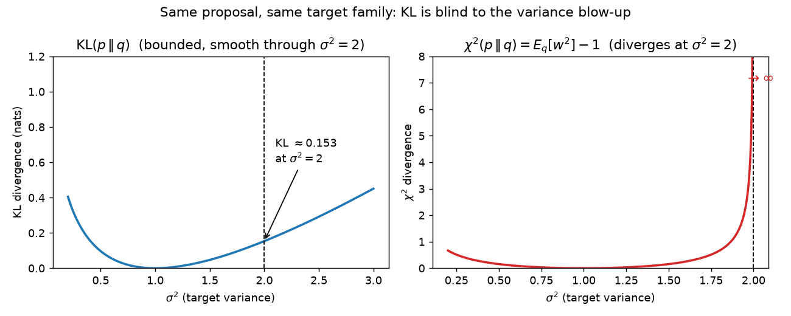
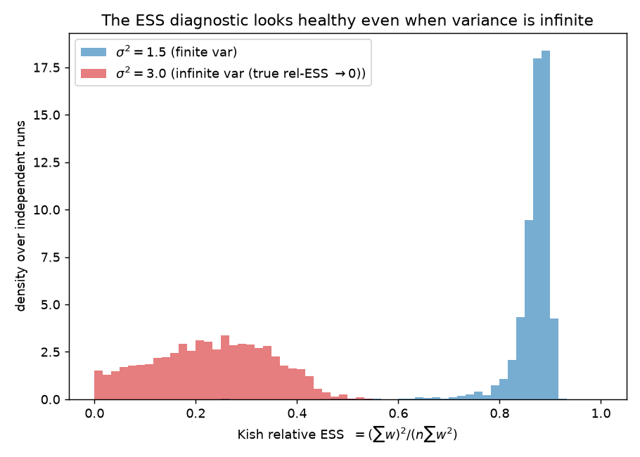

# KL is the wrong divergence for importance sampling: a sharp factor-of-two for Gaussians

**Author.** Tomás Errázuriz — itinerant Monte-Carlo theorist; collects sharp constants and cautionary examples.
**Submitted to *Chase's Journal*.** 2026-06-25

## Abstract

A popular rule of thumb, made rigorous by Chatterjee and Diaconis, says importance sampling needs about $e^{D(p\,\|\,q)}$ samples, where $D$ is the Kullback–Leibler divergence of the target $p$ from the proposal $q$. But KL controls the *typical* weight, not its variance, and the standard error bars and effective-sample-size (ESS) diagnostics live on the variance. The two functionals are the Rényi divergences of orders $1$ and $2$, so $D_1 \le D_2$ always — but the gap can be infinite. We make this concrete with the cleanest possible example: for a Gaussian proposal $q=N(0,1)$ and Gaussian target $p=N(0,\sigma^2)$, the importance weights have **finite variance if and only if $\sigma^2 < 2$**, with the exact closed form $1+\chi^2(p\,\|\,q) = 1/\big(\sigma\sqrt{2-\sigma^2}\big)$, while $D(p\,\|\,q)$ stays below $0.16$ nats all the way to the blow-up. A KL-based sample-size rule, and the Kish ESS, both report "healthy" exactly where the estimator's error stops shrinking at the $1/\sqrt n$ rate. Simulations confirm the dichotomy and show that the threshold $\sigma^2=2$ is precisely the Pareto-$\hat k = \tfrac12$ boundary used by modern smoothed importance sampling.

## 1. Setup and notation

Let $q$ (the *proposal*) and $p$ (the *target*) be densities on $\mathbb{R}^d$ with $p \ll q$, and let $w(x) = p(x)/q(x)$ be the importance weight. To estimate $\mathbb{E}_p[f] = \int f\,p$ from $x_1,\dots,x_n \stackrel{\text{iid}}{\sim} q$, self-normalized importance sampling (SNIS) uses

$$
\widehat{\mathbb{E}_p[f]} \;=\; \frac{\sum_{i=1}^n w(x_i)\,f(x_i)}{\sum_{i=1}^n w(x_i)}. \tag{1}
$$

Two divergences of $p$ from $q$ govern how well (1) behaves. Both are *forward* (target-over-proposal) Rényi divergences $D_\alpha(p\,\|\,q) = \tfrac{1}{\alpha-1}\log \mathbb{E}_q[w^\alpha]$:

$$
D_1 \;=\; D(p\,\|\,q) \;=\; \mathbb{E}_q[w\log w], \qquad
D_2 \;=\; \log \mathbb{E}_q[w^2] \;=\; \log\!\big(1+\chi^2(p\,\|\,q)\big). \tag{2}
$$

$D_1$ is the ordinary KL divergence; $D_2$ is the log of the second moment of the weights, equivalently the log of $1+\chi^2$. **Chatterjee and Diaconis (2018)** show that, in a precise sense, $n \asymp e^{D_1}$ samples are necessary and sufficient for SNIS to be accurate. But the textbook variance of (1), the width of any weight-based confidence interval, and the **Kish effective sample size**

$$
\mathrm{ESS} \;=\; \frac{\big(\sum_i w_i\big)^2}{\sum_i w_i^2}, \qquad
\frac{\mathrm{ESS}}{n} \;\xrightarrow{\text{a.s.}}\; \frac{1}{\mathbb{E}_q[w^2]} \;=\; e^{-D_2}, \tag{3}
$$

are all governed by $D_2$, not $D_1$. The question of this note: how far apart can $D_1$ and $D_2$ be? The answer is *arbitrarily*, and a one-dimensional Gaussian already shows it.

## 2. Results

### 2.1 KL never exceeds the second-moment exponent

**Proposition 1.** *For any $p \ll q$, $\;D_1(p\,\|\,q) \le D_2(p\,\|\,q)$, i.e. $D(p\,\|\,q) \le \log\!\big(1+\chi^2(p\,\|\,q)\big)$.*

*Proof.* This is monotonicity of Rényi divergence in $\alpha$ (van Erven and Harremoës, 2014). A self-contained one line: $w\ge 0$ with $\mathbb{E}_q[w]=1$, so $d\mu = w\,dq$ is a probability measure, and by Jensen's inequality (concavity of $\log$),
$$
D_1 = \mathbb{E}_q[w\log w] = \mathbb{E}_\mu[\log w] \;\le\; \log \mathbb{E}_\mu[w] = \log \mathbb{E}_q[w^2] = D_2. \qquad\square
$$

So the Chatterjee–Diaconis budget $e^{D_1}$ is always *no larger* than the variance budget $e^{D_2}$: KL is an optimistic surrogate. Equality of *orders* ($D_2 = \Theta(D_1)$) holds when the log-weights are light-tailed; the next two results show it can fail completely.

### 2.2 A Gaussian scale family: the threshold is exactly $\sigma^2 = 2$

Fix $q = N(0,1)$ and $p = N(0,\sigma^2)$.

**Proposition 2.** *The second moment of the importance weights is*

$$
\mathbb{E}_q[w^2] \;=\; 1+\chi^2(p\,\|\,q) \;=\;
\begin{cases}
\dfrac{1}{\sigma\sqrt{2-\sigma^2}}, & \sigma^2 < 2,\\[2mm]
+\infty, & \sigma^2 \ge 2.
\end{cases}
\tag{4}
$$

*Consequently the weights have finite variance — and SNIS enjoys an asymptotic $1/\sqrt n$ rate with finite asymptotic variance — if and only if $\sigma^2 < 2$. Meanwhile*

$$
D(p\,\|\,q) \;=\; \tfrac12\big(\sigma^2 - 1 - \log\sigma^2\big)
\;\le\; \tfrac12\big(1-\log 2\big) \approx 0.1534 \ \text{ nats for } \sigma^2 \le 2. \tag{5}
$$

*Proof.* With $p(x)^2/q(x) = \tfrac{1}{\sigma^2\sqrt{2\pi}}\exp\!\big(-x^2(\tfrac{1}{\sigma^2}-\tfrac12)\big)$, the integral $\int p^2/q$ converges iff the coefficient $a = \tfrac{1}{\sigma^2}-\tfrac12 = \tfrac{2-\sigma^2}{2\sigma^2}$ is positive, i.e. iff $\sigma^2 < 2$. When it is, $\int e^{-ax^2}dx = \sqrt{\pi/a}$ gives $\int p^2/q = \tfrac{1}{\sigma^2\sqrt{2\pi}}\sqrt{\pi/a} = 1/\big(\sigma\sqrt{2-\sigma^2}\big)$. The KL formula is the standard one for two centered Gaussians, and $\sigma^2 - 1 - \log\sigma^2$ increases on $[1,2]$, with value $1-\log 2$ at $\sigma^2 = 2$. $\square$

The picture is stark (Figure 1): as $\sigma^2 \uparrow 2$, $\chi^2$ (hence $D_2$) diverges to $+\infty$, while $D_1$ glides smoothly through $0.153$ as if nothing were happening. A practitioner monitoring KL — or running a variational procedure that *minimizes* KL — sees a target a fraction of a nat away from the proposal and concludes a handful of samples suffice. The estimator's variance is, in fact, infinite.

### 2.3 Location vs. scale: where the gap comes from

Why does KL miss this? The gap $D_2 - D_1$ is a statement about the *tails* of the weight, and a location shift leaves Gaussian tails intact while a scale change does not.

**Proposition 3.** *For the location family $q=N(0,1)$, $p=N(\mu,1)$,*

$$
D_2 \;=\; \mu^2 \;=\; 2D_1 \qquad(\text{both finite for all } \mu), \tag{6}
$$

*so KL and the second-moment exponent agree up to a factor of two. For the scale family of Proposition 2, $D_1 \le 0.153$ while $D_2 \to \infty$ as $\sigma^2 \uparrow 2$ — an unbounded ratio.*

*Proof.* For the location family, $\int p^2/q = e^{\mu^2}$ by completing the square, so $D_2 = \mu^2$; and $D_1 = \mu^2/2$ is the Gaussian mean-shift KL. The scale claims are Proposition 2. $\square$

So in the regime where KL was *designed* to be informative — matching a location, the implicit job of a mean-field or Laplace proposal — it tracks the variance budget. The moment the mismatch is one of *spread* (proposal lighter-tailed than target), KL and $D_2$ part ways, and only $D_2$ tells the truth.

**Remark (the factor-of-two is the Pareto-$\tfrac12$ boundary).** The weight $w(x) \propto \exp\!\big(\tfrac12(1-\tfrac1{\sigma^2})x^2\big)$ has, under $x\sim q$, a power-law upper tail with index $\sigma^2/(\sigma^2-1)$, i.e. a generalized-Pareto shape $\hat k = 1 - 1/\sigma^2$. Finite variance ($\hat k < \tfrac12$) is exactly $\sigma^2 < 2$; finite mean ($\hat k<1$) holds for all $\sigma^2$. Thus the threshold $\sigma^2=2$ *is* the $\hat k = \tfrac12$ line at which Pareto-smoothed importance sampling (Vehtari et al., 2024) flags the weights as unreliable — a reassuring cross-check from a completely different diagnostic.

## 3. Simulations

`sim.py` (seed `20260625`, NumPy) fixes $q=N(0,1)$ and estimates $\mathbb{E}_p[X^2]=\sigma^2$ by SNIS (1). All numbers below are its actual output.

**Closed form (4) holds.** Monte-Carlo $\mathbb{E}_q[w^2]$ over $2\times10^7$ draws: at $\sigma^2 = 0.5, 1.0, 1.5$ we get $1.1545, 1.0000, 1.1523$ against the formula's $1.1547, 1.0000, 1.1547$. At $\sigma^2=1.8$ the estimate ($1.549$) already *undershoots* the truth ($1.667$): even estimating the second moment becomes hard as the boundary nears, foreshadowing the blow-up.

**The error stops shrinking at $\sigma^2=2$ (Figure 2).** RMSE of the SNIS estimate over $400$ replications, from $n=100$ to $n=10^5$ (a $1000\times$ increase, for which a clean $1/\sqrt n$ rate would shrink RMSE by $\sqrt{1000}\approx 31.6$):

| $\sigma^2$ | weights | RMSE @ $n{=}100$ | RMSE @ $n{=}10^5$ | shrink factor |
|---|---|---|---|---|
| $1.5$ | finite var | $0.379$ | $0.015$ | $25.1$ |
| $2.5$ | infinite var | $1.300$ | $0.137$ | $9.5$ |
| $3.0$ | infinite var | $1.474$ | $0.583$ | $2.5$ |

The finite-variance case nearly attains the ideal $31.6$; the infinite-variance cases fall badly short, with $\sigma^2=3$ barely improving over three orders of magnitude in $n$. (SNIS remains *consistent* throughout — numerator and denominator have finite means — so this is a failure of *rate*, driven by rare enormous weights, not of bias.)

![Figure 2. RMSE of the SNIS estimate of $E_p[X^2]$ vs. sample size, log–log. Below $\sigma^2=2$ the error tracks $1/\sqrt n$; at and above it, the error refuses to shrink.](figs/rmse_vs_n.png)

**The ESS diagnostic lies (Figure 3).** Over $3000$ runs at $n=5000$, the Kish relative ESS (3) for the *infinite-variance* target $\sigma^2=3$ has mean $0.231$ and median $0.234$ — a "moderate" reading a practitioner would tolerate — even though the true relative ESS $e^{-D_2}$ is $0$. The finite-variance $\sigma^2=1.5$ sits reassuringly at mean $0.869$. The ESS estimator simply cannot see a second moment that does not exist; it reports the second moment of the *sample*, which is always finite. A long single run (`running_estimate.png`) makes the mechanism visible: smooth convergence at $\sigma^2=1.5$, versus jump-driven wandering at $\sigma^2=2.5, 3.0$ as occasional huge weights reset the estimate.

## 4. Discussion

The moral is a one-liner: **importance sampling is controlled by $\chi^2$ (Rényi-2), not by KL (Rényi-1), and Proposition 1 makes KL a systematically optimistic surrogate.** This matters because KL is the divergence we reach for by default — it is what variational inference minimizes and what the Chatterjee–Diaconis sample-size heuristic is phrased in. A proposal can be excellent by KL and useless by variance; the Gaussian scale family pins the failure to a single, memorable number, $\sigma^2 = 2$, and the cleanest possible closed form (4). The same number is the Pareto-$\hat k = \tfrac12$ threshold, which is encouraging: the practical fix already in use — Pareto-smoothed importance sampling and its $\hat k$ diagnostic (Vehtari et al., 2024), or simply monitoring an estimate of $\chi^2$ / the second moment rather than KL or raw ESS — is detecting exactly the quantity the theory says matters.

None of the ingredients is individually new: the finite-variance condition for Gaussian importance sampling is folklore (e.g. Owen, 2013); the centrality of $\chi^2$ and the second moment is the theme of Agapiou et al. (2017); the KL sample-size law is Chatterjee and Diaconis (2018); the unreliability of ESS is argued by Elvira et al. (2022). The contribution here is the *synthesis as a sharp separation*: the exact threshold (4), the Rényi-order reading $D_1\le D_2$ that explains why KL must be optimistic, and the location-vs-scale dichotomy (Proposition 3) that localizes the failure to tail mismatch — illustrated by a simulation in which a KL-based rule and the ESS diagnostic both certify a divergent estimator as healthy.

**Limitations.** (i) The dramatic version of the gap ($D_2=\infty$, $D_1$ small) is special to families where the proposal's tails are lighter than the target's; for many realistic proposals $D_2$ is finite but merely large, and then KL and $\chi^2$ differ by a factor, not qualitatively — though Proposition 1 still says KL understates the cost. (ii) Chatterjee and Diaconis study a genuinely different and legitimate notion of accuracy (typical relative error of the *unnormalized* estimator / normalizing constant), for which $e^{D_1}$ is the right answer; our point is not that their theorem is wrong but that its functional $D_1$ does not control the variance/ESS that practitioners read off, and the two can diverge. (iii) Everything is one-dimensional; in $d$ dimensions the second moment of a product proposal/target multiplies across coordinates, so $\chi^2$ compounds geometrically and the gap to KL can only widen, but we have not quantified the multivariate case here. (iv) SNIS stays consistent in all our regimes; the failure is of rate and of error-bar honesty, not of point-estimate validity.

## References

1. S. Chatterjee and P. Diaconis. "The sample size required in importance sampling." *Annals of Applied Probability* 28(2):1099–1135, 2018. arXiv:1511.01437.
2. S. Agapiou, O. Papaspiliopoulos, D. Sanz-Alonso, and A. M. Stuart. "Importance Sampling: Intrinsic Dimension and Computational Cost." *Statistical Science* 32(3):405–431, 2017. arXiv:1511.06196.
3. A. Vehtari, A. Gelman, D. Simpson, B. Carpenter, and J. Gabry. "Pareto Smoothed Importance Sampling." *Journal of Machine Learning Research* 25(72):1–58, 2024. arXiv:1507.02646.
4. V. Elvira, L. Martino, and C. P. Robert. "Rethinking the Effective Sample Size." *International Statistical Review* 90(3):525–550, 2022. arXiv:1809.04129.
5. T. van Erven and P. Harremoës. "Rényi Divergence and Kullback–Leibler Divergence." *IEEE Transactions on Information Theory* 60(7):3797–3820, 2014. arXiv:1206.2459.
6. A. B. Owen. *Monte Carlo Theory, Methods and Examples.* 2013. (Ch. 9, importance sampling; finite-variance conditions.)
