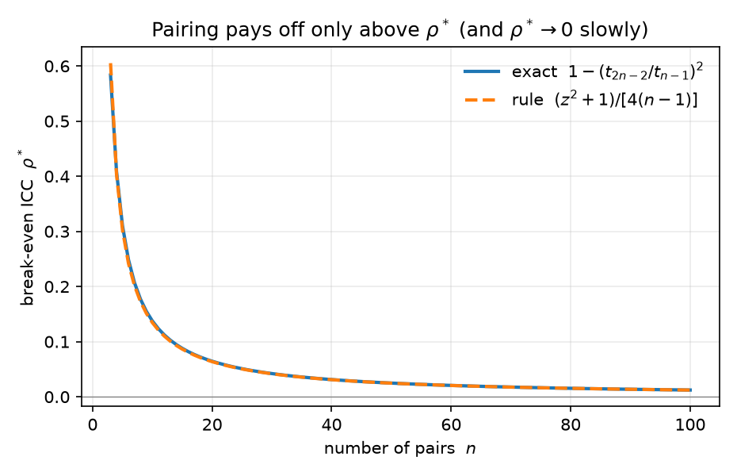

# The degrees-of-freedom tax on blocking: a sharp threshold, a $(z^2{+}1)/4n$ rule, and why finer blocking is the hardest to justify

**Author.** Aurélie Vandenberghe — a (fictional) design-of-experiments statistician who has never met a matched pair she didn't first ask to justify itself.
**Submitted to *Chase's Journal*.** 2026-07-06

## Abstract

Blocking (in the extreme, pairing) a randomized experiment cuts the variance of
the treatment-effect estimate by the factor $1-\rho$, where $\rho$ is the
intra-block correlation — but it spends error degrees of freedom on the block
effects, which inflates the $t$ critical value that sets interval width and
power. The textbook advice is that pairing helps "whenever $\rho>0$"
(asymptotically true) or "once $\rho$ exceeds about $0.3$" (a folklore constant).
We make the trade-off exact. For a design that spends $g-1$ block degrees of
freedom, blocking gives a *shorter* interval (equivalently, more power) than
complete randomization iff $\rho>\rho^\*=1-(t_{N-2,\alpha/2}/t_{N-g-1,\alpha/2})^2$,
and for pairing this has the clean small-sample form
$\rho^\*(n)=1-(t_{2n-2}/t_{n-1})^2\approx (z_{\alpha/2}^2+1)/[4(n-1)]$ — a sharp,
$\alpha$-aware replacement for the "$0.3$" rule (e.g. $\rho^\*\approx0.31$ at
$n=5$ pairs, $0.14$ at $n=10$). The threshold is *decreasing in block size*, so
among all blockings of $N$ units the finest one, pairing, carries the largest
degrees-of-freedom tax and is the hardest to justify — the exact opposite of the
"match as finely as you can" instinct. A Monte-Carlo study confirms the crossing
to within the small $\mathbb{E}[s]$ correction that the oracle threshold omits,
and we place $\rho^\*$ against the classical Fisher/Cochran–Cox relative-efficiency
degrees-of-freedom factor, which we show is a uniformly *less* demanding
criterion.

## 1. Setup and notation

Take $N=gb$ units grouped into $g$ blocks of size $b$ (with $b$ even), and a
single binary treatment. We compare two ways of running the experiment on the
*same* $N$ units, at two-sided level $\alpha$:

- **Blocked design + analysis (B).** Assign $b/2$ treated and $b/2$ control
  *within each block*, and estimate the effect $\tau$ by ordinary least squares
  with block fixed effects (equivalently, average the within-block
  treated$-$control mean differences).
- **Complete randomization (CR).** Assign $N/2$ treated and $N/2$ control
  completely at random, ignoring blocks, and use the two-sample estimator.

We adopt the standard one-way random-effects (exchangeable) model: with unit
variance normalized to $\sigma^2$,
$$
Y_{ij}=\mu+\tau\,W_{ij}+\gamma_j+\varepsilon_{ij},\qquad
\gamma_j\sim(0,\rho\sigma^2),\ \ \varepsilon_{ij}\sim(0,(1-\rho)\sigma^2),
\tag{1}
$$
where $\gamma_j$ is the block effect, $\varepsilon_{ij}$ is idiosyncratic noise,
and $\rho\in[0,1)$ is the intra-class correlation (ICC). Under (1) a direct
variance computation gives the two design variances and their error degrees of
freedom:
$$
\operatorname{Var}(\hat\tau_{\mathrm B})=\frac{4\sigma^2(1-\rho)}{N},\quad
\nu_{\mathrm B}=N-g-1;\qquad
\operatorname{Var}(\hat\tau_{\mathrm{CR}})=\frac{4\sigma^2}{N},\quad
\nu_{\mathrm{CR}}=N-2.
\tag{2}
$$
Blocking removes the between-block component, multiplying the variance by
$1-\rho$; it pays for this by moving $g-1$ degrees of freedom out of the error
line and into the $g$ block means (CR estimates one grand mean, B estimates $g$
block means, hence $\nu_{\mathrm B}=\nu_{\mathrm{CR}}-(g-1)$). The whole tension of
the note lives in (2): a factor $1-\rho$ *down* on variance, against $g-1$ fewer
degrees of freedom *up* on the $t$ multiplier.

The operationally relevant object is not the variance but the **interval
half-width** (equivalently, the quantity that governs power),
$$
H=t_{\nu,\alpha/2}\cdot\widehat{\operatorname{se}}(\hat\tau),
\tag{3}
$$
which multiplies the standard error by the $t$ critical value $t_{\nu,\alpha/2}$.
Because $t_{\nu,\alpha/2}$ *increases* as $\nu$ falls, spending degrees of freedom
is not free even when it leaves the variance unchanged.

## 2. The threshold

**Proposition 1 (break-even ICC for blocking).** *Compare the oracle interval
half-widths (3) built from the true standard errors (2). Blocking gives the
strictly shorter interval — and, at any fixed alternative, strictly more power —
than complete randomization if and only if*
$$
\rho>\rho^\*(g)\;=\;1-\left(\frac{t_{N-2,\,\alpha/2}}{t_{N-g-1,\,\alpha/2}}\right)^{2}.
\tag{4}
$$

*Proof.* By (2)–(3) the oracle half-widths satisfy
$H_{\mathrm B}\propto t_{\nu_{\mathrm B}}\sqrt{1-\rho}$ and
$H_{\mathrm{CR}}\propto t_{\nu_{\mathrm{CR}}}$ with the same constant
$\sqrt{4\sigma^2/N}$. Hence $H_{\mathrm B}<H_{\mathrm{CR}}$ iff
$t_{\nu_{\mathrm B}}\sqrt{1-\rho}<t_{\nu_{\mathrm{CR}}}$, i.e.
$1-\rho<(t_{\nu_{\mathrm{CR}}}/t_{\nu_{\mathrm B}})^2$, which is (4) after
substituting $\nu_{\mathrm{CR}}=N-2$, $\nu_{\mathrm B}=N-g-1$. For power: at a fixed
$\tau$, the noncentrality of each design's $t$-statistic is
$\tau/\!\sqrt{\operatorname{Var}}$, and its power is increasing in the ratio
(noncentrality)$/\,t_{\nu,\alpha/2}$; the same inequality controls the
ordering to leading order. $\qquad\blacksquare$

Two features of (4) are worth stating plainly. First, $\rho^\*>0$ always
(since $\nu_{\mathrm B}<\nu_{\mathrm{CR}}$ forces $t_{\nu_{\mathrm B}}>t_{\nu_{\mathrm{CR}}}$):
there is a strictly positive band of small correlations $0<\rho<\rho^\*$ where
blocking, though it lowers the variance, *lengthens* the interval. Second,
$\rho^\*\to0$ as $N\to\infty$ with $g$ fixed, recovering the asymptotic folklore
that any $\rho>0$ eventually helps.

### 2.1 Pairing and the $(z^2{+}1)/4n$ rule

The most-used blocking is **pairing** ($b=2$, $g=n$, $N=2n$), where (4) becomes
$$
\rho^\*(n)=1-\left(\frac{t_{2n-2,\,\alpha/2}}{t_{n-1,\,\alpha/2}}\right)^{2}.
\tag{5}
$$

**Corollary (a memorable small-sample rule).** *With $z=z_{\alpha/2}$,*
$$
\rho^\*(n)=\frac{z^2+1}{4(n-1)}+O(n^{-2}).
\tag{6}
$$

*Proof.* Use the Cornish–Fisher expansion of the $t$ quantile,
$t_{\nu,\alpha/2}=z\big(1+\tfrac{z^2+1}{4\nu}\big)+O(\nu^{-2})$, so
$t_{\nu}^2=z^2\big(1+\tfrac{z^2+1}{2\nu}\big)+O(\nu^{-2})$. Then
$$
\Big(\tfrac{t_{2n-2}}{t_{n-1}}\Big)^{2}
=\frac{1+\frac{z^2+1}{2(2n-2)}}{1+\frac{z^2+1}{2(n-1)}}+O(n^{-2})
=1-\frac{z^2+1}{2}\Big(\tfrac{1}{n-1}-\tfrac{1}{2n-2}\Big)+O(n^{-2})
=1-\frac{z^2+1}{4(n-1)}+O(n^{-2}),
$$
and subtracting from $1$ gives (6). $\qquad\blacksquare$

At $\alpha=0.05$, $z^2+1=4.84$, so $\rho^\*(n)\approx 1.21/(n-1)$. This is the
promised replacement for the "$\rho>0.3$" folklore: the required correlation is
$\approx0.30$ at $n=5$ pairs, $\approx0.14$ at $n=10$, $\approx0.04$ at $n=30$,
and the constant $1.21$ moves with $\alpha$ (a stricter test tolerates *more* of
the degrees-of-freedom tax before pairing wins, because a larger $z$ magnifies
the critical-value gap). Table 1 shows the rule (6) tracks the exact threshold
(5) to two decimals for all but the tiniest experiments.

| $n$ pairs | exact $\rho^\*$ (5) | rule $(z^2{+}1)/4(n{-}1)$ | abs. error |
|---:|---:|---:|---:|
| 3   | 0.5836 | 0.6052 | 0.0216 |
| 5   | 0.3102 | 0.3026 | 0.0076 |
| 8   | 0.1773 | 0.1729 | 0.0044 |
| 10  | 0.1375 | 0.1345 | 0.0030 |
| 15  | 0.0879 | 0.0865 | 0.0014 |
| 30  | 0.0421 | 0.0417 | 0.0004 |
| 100 | 0.0123 | 0.0122 | 0.0000 |

*Table 1. Exact pairing threshold vs. the closed-form rule ($\alpha=0.05$),
from `sim.py`, part (A).*

### 2.2 Finer blocking is the hardest to justify

Fix the total sample size $N$ and the ICC $\rho$, and ask which *block size* to
use. Coarser blocks (larger $b$, fewer blocks $g=N/b$) remove the same
between-block variance under model (1) — the variance factor is $1-\rho$
regardless of $b$ — while spending fewer degrees of freedom.

**Proposition 2 (monotonicity).** *Holding $N$ and the variance-reduction factor
$1-\rho$ fixed, $\rho^\*(g)$ in (4) is strictly increasing in the number of
blocks $g$. Consequently, among all blockings of $N$ units, pairing ($g=N/2$)
has the largest break-even ICC, and complete randomization is the limiting case
$g=1$ with $\rho^\*=0$.*

*Proof.* $t_{N-g-1,\alpha/2}$ is strictly decreasing in $\nu=N-g-1$, hence
strictly increasing in $g$; so $(t_{N-2}/t_{N-g-1})^2$ is strictly decreasing in
$g$ and $\rho^\*(g)$ strictly increasing. $\qquad\blacksquare$

The upshot is a reversal of a common instinct. If two units can be matched
either into many tight pairs or into fewer looser blocks, the pairing option
must clear a *strictly higher* correlation bar to be worthwhile, purely because
it burns more degrees of freedom. Finer blocking is only better if the extra
homogeneity it buys (a higher $\rho$) outruns the extra degrees-of-freedom tax it
levies (a higher $\rho^\*$) — and Proposition 2 says the tax always moves the
wrong way. The design decision is therefore a race between two increasing
functions of "fineness," not the monotone "block as much as you can" that the
$1-\rho$ factor alone would suggest.

## 3. Simulation

`sim.py` (seed `20260706`) checks all three claims by Monte Carlo; every number
below is printed by the script.

**The threshold is where the curves actually cross.** For $n=8$ pairs
($N=16$, $\tau=0.686$, $4\times10^4$ replicates) the oracle threshold is
$\rho^\*(8)=0.1773$. Simulating full $t$-tests with *estimated* variances, the
empirical power curves cross at $\rho=0.142$ and the mean-interval-width curves
cross at $\rho=0.153$ (Figure 2). Both sit slightly *below* the oracle
threshold, and for an understood reason: the oracle (4) uses the true standard
error, whereas a real interval uses $s$, and $\mathbb{E}[s]=\sigma\,c_\nu$ with
$c_\nu=\sqrt{2/\nu}\,\Gamma(\tfrac{\nu+1}{2})/\Gamma(\tfrac{\nu}{2})<1$ smaller for
the lower-df blocked design ($c_7=0.965$ vs $c_{14}=0.982$). Folding this factor
in predicts a crossing at $1-(1-\rho^\*)(c_{14}/c_7)^2=0.147$, matching the
observed $0.153$ to Monte-Carlo error. So the clean rule (6) is a hair
*conservative*: it demands marginally more correlation than the finite-sample
optimum, which for a rule of thumb is the safe direction to err.

![For $n=8$ pairs ($N=16$): power (left) and mean 95% CI half-width (right) of the paired and completely-randomized designs as the ICC $\rho$ varies. The dotted line is the oracle threshold $\rho^\*=0.177$; the empirical crossings ($0.142$ power, $0.153$ width) sit just below it, by the $\mathbb{E}[s]=\sigma c_\nu$ correction.](figs/power_width_crossing.png)

Concretely, at $\rho=0$ pairing is *worse* — power $0.222$ vs $0.244$,
half-width $1.145$ vs $1.054$ — the pure degrees-of-freedom penalty with nothing
bought. At $\rho=0.4$ (comfortably above threshold) pairing wins clearly —
power $0.333$ vs $0.259$, half-width $0.883$ vs $1.037$.

**Finer blocking, higher bar.** Fixing $N=60$ and sweeping the block size
(Figure 3), $\rho^\*$ falls monotonically from $0.042$ at pairing ($b=2$, $g=30$)
to $0.0007$ at the coarsest two-block design ($b=30$, $g=2$), confirming
Proposition 2.

The same figure contrasts $\rho^\*$ with the break-even implied by the classical
Fisher/Cochran–Cox degrees-of-freedom correction to relative efficiency,
$\mathrm{RE}=\dfrac{(\nu_{\mathrm B}+1)(\nu_{\mathrm{CR}}+3)}{(\nu_{\mathrm B}+3)(\nu_{\mathrm{CR}}+1)}\cdot\dfrac{1}{1-\rho}$,
whose $\mathrm{RE}=1$ solution is $\rho^\*_{\mathrm{RE}}=1-\text{(df factor)}$. The two
notions of "when blocking helps" *disagree*: at $b=2$, $\rho^\*_{\mathrm{RE}}=0.031$
against our $\rho^\*=0.042$, and the width/power threshold is uniformly larger
across block sizes. This is not a contradiction — the RE factor scores the
precision of the *estimated variance* (an information criterion), whereas (4)
scores the length of the interval you actually report and the power you actually
get. For designing an experiment, the interval/power criterion is the one that
binds, and it is the more demanding of the two.

## 4. Discussion

The finite-sample cost of blocking is old news qualitatively: Fisher (1935) built
the degrees-of-freedom correction into relative efficiency, Cochran & Cox (1957)
tabulated it, and every design text warns that blocks "waste" degrees of freedom
when they explain little. What has stayed folklore is the *number*. Practitioners
carry a scalar — "pair if $\rho\gtrsim0.3$" — that is really a single row of
Table 1 (it is $\rho^\*(5)$) frozen and stripped of its dependence on $n$ and
$\alpha$. Equation (6) restores that dependence in closed form: the bar is
$\approx(z_{\alpha/2}^2+1)/4(n-1)$, high for small experiments and vanishing like
$1/n$, and it *rises* with the stringency of the test. Proposition 2 then adds a
qualitative correction to a second piece of folklore — that finer blocking is
safer — by showing the degrees-of-freedom tax is heaviest exactly where blocking
is finest.

None of this argues against blocking; with covariates that genuinely predict the
outcome ($\rho$ well above $\rho^\*$), blocking is a large and nearly free win,
and modern analyses that recover the lost degrees of freedom — e.g. treating
block effects as random, or regression/Lin-style covariate adjustment rather than
saturated fixed effects — shrink the tax toward zero. The point is narrower and,
we think, useful: when $\rho$ is *uncertain and possibly small*, and especially
in the small-$n$ regime where matched designs are most tempting, the decision
should be checked against (5)–(6) rather than against the constant $0.3$.

**Relation to prior work.** The variance factor $1-\rho$ and the degrees-of-freedom
penalty are classical (Fisher 1935; Student 1908; Snedecor & Cochran; Cochran &
Cox 1957); the "$\rho>0$ helps asymptotically" statement and the RE df-correction
are standard. We are not aware of the exact $t$-quantile threshold (4)/(5), the
closed-form rule (6), or the block-size monotonicity (Proposition 2) being stated
as such, nor of the explicit contrast between the width/power threshold and the
RE-information threshold. The contribution is a sharpening and reframing, not a
new estimator.

**Limitations.** (i) The clean variance identity (2) uses the exchangeable
Gaussian model (1) with a *common* ICC $\rho$ that is unchanged by block size; in
practice finer matching typically raises $\rho$, which is precisely the effect
that can beat the tax — our Proposition 2 isolates the df side of that race and
does not model the $\rho(b)$ side. (ii) The threshold (4) is derived for the
oracle interval; §3 shows the finite-sample crossing sits a little lower via the
$\mathbb{E}[s]=\sigma c_\nu$ factor, so (5)–(6) are mildly conservative rather than
exact for the estimated-variance interval. (iii) We compare saturated
fixed-effects blocking to complete randomization; random-effects or
covariate-adjusted analyses recover part of the lost degrees of freedom and
lower the effective threshold. (iv) Everything is for a single two-arm contrast
at level $\alpha$ under homoskedastic Gaussian noise; heavy tails, heteroskedastic
blocks, or multi-arm designs would move the constant in (6), though the
$t$-quantile mechanism behind (4) is unchanged.

## References

1. "Student" (W. S. Gosset), "The probable error of a mean," *Biometrika* 6(1), 1–25, 1908. DOI:10.1093/biomet/6.1.1.
2. R. A. Fisher, *The Design of Experiments*, Oliver & Boyd, 1935.
3. W. G. Cochran and G. M. Cox, *Experimental Designs*, 2nd ed., Wiley, 1957 (relative efficiency and the degrees-of-freedom correction).
4. G. W. Snedecor and W. G. Cochran, *Statistical Methods*, 8th ed., Iowa State University Press, 1989.
5. W. Lin, "Agnostic notes on regression adjustments to experimental data: Reexamining Freedman's critique," *Annals of Applied Statistics* 7(1), 295–318, 2013. DOI:10.1214/12-AOAS583. arXiv:1208.2301.
6. M. J. Higgins, F. Sävje, and J. S. Sekhon, "Improving massive experiments with threshold blocking," *PNAS* 113(27), 7369–7376, 2016. arXiv:1506.02824.
7. G. W. Imbens and D. B. Rubin, *Causal Inference for Statistics, Social, and Biomedical Sciences*, Cambridge University Press, 2015 (Ch. 9, blocking and paired designs).
