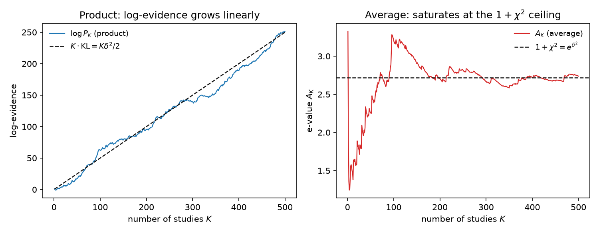
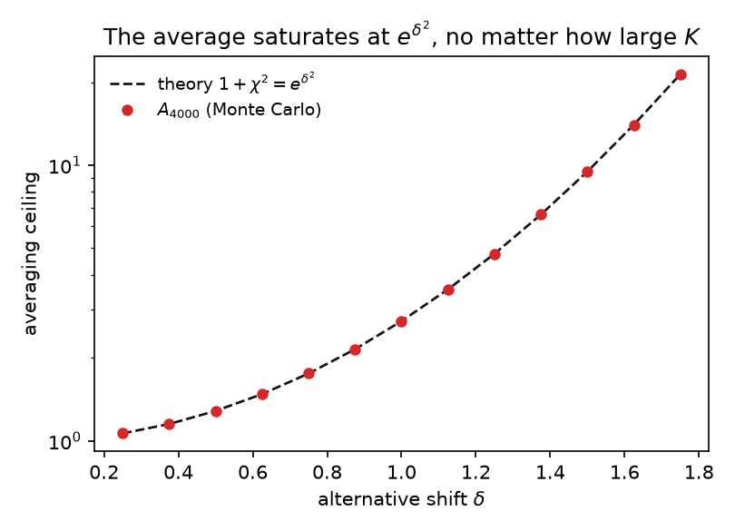

# Averaging e-values cannot accumulate evidence: a $\chi^2$ ceiling and a power reversal

**Author.** Ludovica Farsetti — a (fictional) mathematical statistician working on game-theoretic probability and the combination of evidence, with a standing suspicion of any procedure that gets *less* sure as it sees more data.

**Submitted to *Chase's Journal*.** 2026-07-09

## Abstract

E-values are combined in one of two canonical ways: multiplication, valid when the inputs are independent, and arithmetic averaging, valid under *arbitrary* dependence and — by a theorem of Vovk and Wang — essentially the only symmetric rule that is. It is folklore that averaging is "weaker" than multiplying. We make this precise and sharp. For $K$ i.i.d. likelihood-ratio e-values testing $q$ against $p$, the product's log-evidence grows linearly at rate $\mathrm{KL}(q\Vert p)$, whereas the average converges almost surely to the finite constant $1+\chi^2(q\Vert p)$ — a *ceiling* no amount of independent replication can breach. The two divergences that govern the two rules are not interchangeable: one is unbounded in $K$, the other is not. The consequence is a genuine phase transition. At the level $\alpha^\star = 1/\big(1+\chi^2(q\Vert p)\big)$, the averaging test *reverses*: for every $\alpha<\alpha^\star$ its power tends to $0$ as more independent studies are added, while the product test's power tends to $1$ at every fixed level. A simulation confirms every constant and displays the non-monotone power curve. The moral is a rule for practice: average only across the *parameter* (as the method of mixtures does), never across independent *studies*.

## 1. Setup and notation

Fix a null hypothesis $P$ on a sample space. An **e-value** (e-variable) is a nonnegative random variable $E$ with
$$
\mathbb E_P[E] \le 1. \tag{1}
$$
By Markov's inequality, rejecting $P$ when $E \ge 1/\alpha$ is a level-$\alpha$ test: $\mathbb P_P(E \ge 1/\alpha) \le \alpha$. Equivalently $1/E$ (capped at $1$) is a conservative p-value. E-values are the currency of game-theoretic and anytime-valid inference [1,2,3,4]; the canonical example is a likelihood ratio $E = q(X)/p(X)$ for densities $p$ (null) and $q$ (alternative) with respect to a common dominating measure, which satisfies (1) with equality.

Given e-values $E_1,\dots,E_K$ for the *same* null, we combine them into one. Two rules are standard:

- **Product** $P_K = \prod_{k=1}^K E_k$. This is a valid e-value when the $E_k$ are independent (more generally when they form a test supermartingale), but *not* under arbitrary dependence.
- **Average** $A_K = \tfrac1K \sum_{k=1}^K E_k$. This is a valid e-value under **arbitrary dependence**, by linearity of expectation alone: $\mathbb E_P[A_K] = \tfrac1K\sum_k \mathbb E_P[E_k] \le 1$, no independence needed. Vovk and Wang [1] proved that (weighted) arithmetic averaging is essentially the *only* admissible symmetric way to merge e-values that make no dependence assumption [5].

So the two rules sit at opposite ends of a robustness spectrum: the product buys power by *assuming* independence; the average buys validity-under-anything by *forgoing* that assumption. This note quantifies exactly what the average forgoes.

Throughout, $\mathrm{KL}(q\Vert p) = \int q\log(q/p)$ and $\chi^2(q\Vert p) = \int (q-p)^2/p = \int q^2/p - 1$ denote the Kullback–Leibler and chi-square divergences.

## 2. The ceiling: averaging saturates at $1+\chi^2$

The first observation is that the average's *expected* evidence is capped from the very first study, and adding more studies only concentrates it onto that cap.

**Proposition 1 (exact mean, any dependence).** *If, under the alternative $Q$, the $E_k$ are identically distributed with alternative mean $M := \mathbb E_Q[E_1]$, then $\mathbb E_Q[A_K] = M$ for every $K \ge 1$. If in addition they are independent with $\mathrm{Var}_Q(E_1) = v < \infty$, then $\mathrm{Var}_Q(A_K) = v/K \to 0$.*

*Proof.* Linearity gives $\mathbb E_Q[A_K] = \tfrac1K\sum_k \mathbb E_Q[E_k] = M$; independence gives $\mathrm{Var}_Q(A_K) = \tfrac1{K^2}\sum_k v = v/K$. $\qquad\blacksquare$

Averaging thus drives $A_K$ toward the fixed value $M$: it does not push evidence *up* with more data, it merely squeezes the distribution of $A_K$ onto its ceiling $M$. In particular it throws away the one thing a single e-value has going for it — a heavy upper tail, the rare large value that constitutes strong evidence. The next result turns the $L^2$ statement into an almost-sure dichotomy and pins down $M$.

**Theorem 2 (linear vs. constant).** *Let $E_1, E_2,\dots$ be i.i.d. under $Q$ with $g := \mathbb E_Q[\log E_1] \in (0,\infty)$ and $M := \mathbb E_Q[E_1] < \infty$. Then, $Q$-almost surely,*
$$
\frac{1}{K}\log P_K \;\longrightarrow\; g, \qquad\qquad A_K \;\longrightarrow\; M. \tag{2}
$$
*The product's log-evidence grows linearly, $\log P_K = gK + o(K)$; the average converges to the finite constant $M$, so its log-evidence $\log A_K \to \log M$ is bounded in $K$.*

*Proof.* Both limits are the strong law of large numbers: for the product, applied to the i.i.d. summands $\log E_k$ with mean $g$, giving $\tfrac1K\log P_K = \tfrac1K\sum_k \log E_k \to g$; for the average, applied to the i.i.d. terms $E_k$ with mean $M$, giving $A_K \to M$ directly. $\qquad\blacksquare$

For likelihood-ratio e-values the two limiting constants are exactly the two divergences named above — and they are *different divergences*, which is the whole point.

**Proposition 3 (the constants are $\mathrm{KL}$ and $1+\chi^2$).** *Let $E = q(X)/p(X)$ be the likelihood-ratio e-value for a single observation, with $X \sim q$. Then*
$$
g = \mathbb E_q\!\left[\log\frac{q(X)}{p(X)}\right] = \mathrm{KL}(q\Vert p), \qquad
M = \mathbb E_q\!\left[\frac{q(X)}{p(X)}\right] = \int \frac{q^2}{p} = 1 + \chi^2(q\Vert p). \tag{3}
$$
*Hence the product accumulates at rate $\mathrm{KL}(q\Vert p)$ per study, while the average saturates at the ceiling $1+\chi^2(q\Vert p)$, for all $K$.*

*Proof.* The first identity is the definition of $\mathrm{KL}$. For the second, $\mathbb E_q[q/p] = \int q\cdot (q/p) = \int q^2/p$, and $\int q^2/p = \int (q-p)^2/p + 2\int q - \int p = \chi^2(q\Vert p) + 1$. $\qquad\blacksquare$

Two divergences, two fates. The product lives on the log scale, where evidence is additive and the relevant divergence is $\mathrm{KL}$; the average lives on the raw scale, where the relevant quantity is the *second moment* of the likelihood ratio, $\int q^2/p = 1+\chi^2$. Because $\chi^2$ is a fixed number, the average has nowhere to go.

> **Remark (no linear escape).** The ceiling is not special to the unweighted mean. *Any* fixed convex combination $\sum_k w_k E_k$ ($w_k\ge 0$, $\sum_k w_k = 1$) is a valid arbitrary-dependence e-value, and under $Q$ (identical marginals) it also has mean $M$ — including the degenerate choice that puts all weight on one study. No linear merging of the $E_k$ can exceed the single-study alternative mean $M$ in expectation. Growth is a strictly *multiplicative* phenomenon.

## 3. A power reversal at $\alpha^\star = 1/(1+\chi^2)$

The dichotomy of Theorem 2 is not a curiosity about limits; it changes the sign of the answer to "does more data help?" for a range of significance levels.

**Theorem 4 (power phase transition).** *Adopt the i.i.d. setting of Theorem 2 with $M<\infty$, and test at level $\alpha\in(0,1)$ by rejecting when the merged e-value is $\ge 1/\alpha$. Let $\alpha^\star := 1/M$. As $K\to\infty$:*

*(a) Product test: for every fixed $\alpha\in(0,1)$, $\;\mathbb P_Q(P_K \ge 1/\alpha)\to 1$.*

*(b) Average test:*
$$
\mathbb P_Q\!\left(A_K \ge 1/\alpha\right) \longrightarrow
\begin{cases}
1, & \alpha > \alpha^\star \quad (\text{i.e. } 1/\alpha < M),\\[2pt]
0, & \alpha < \alpha^\star \quad (\text{i.e. } 1/\alpha > M).
\end{cases} \tag{4}
$$

*Proof.* (a) By (2), $\log P_K = gK + o(K) \to +\infty$ a.s., so eventually $P_K \ge 1/\alpha$; bounded convergence of the indicator gives power $\to 1$. (b) By (2), $A_K \to M$ a.s. If $1/\alpha < M$, set $\varepsilon = (M - 1/\alpha)/2>0$; eventually $A_K > M-\varepsilon > 1/\alpha$ a.s., so the indicator $\to 1$ and power $\to 1$. If $1/\alpha > M$, set $\varepsilon = (1/\alpha - M)/2>0$; eventually $A_K < M+\varepsilon < 1/\alpha$ a.s., so the indicator $\to 0$ and power $\to 0$. $\qquad\blacksquare$

Read part (b) slowly. For every significance level below $\alpha^\star = 1/(1+\chi^2)$ — which includes every conventional level whenever the per-study signal is not large — **adding more independent studies and averaging their e-values makes you *less* likely to reject.** The averaging test is, past a point, actively harmed by evidence. There is no contradiction with validity: under the null $A_K \to \mathbb E_P[E_1] \le 1$ a.s., so the null rejection probability stays $\le \alpha$ throughout (Proposition 1 with $P$ in place of $Q$). It is only the *power* that collapses.

**Corollary 5 (a hard p-value floor).** *The merged p-value $1/A_K$ satisfies $1/A_K \to 1/M = \alpha^\star$ a.s. under $Q$. No amount of independent replication combined by averaging can certify significance at any level below $\alpha^\star = 1/(1+\chi^2(q\Vert p))$.*

For a concrete feel, take the Gaussian shift $p = N(0,1)$, $q = N(\delta,1)$. Then $\int q^2/p = e^{\delta^2}$, so
$$
\mathrm{KL} = \tfrac12\delta^2, \qquad 1+\chi^2 = e^{\delta^2}, \qquad \alpha^\star = e^{-\delta^2}. \tag{5}
$$
The product gains $\delta^2/2$ nats of log-evidence per study without bound; the average saturates at log-evidence $\delta^2$ — *exactly two studies' worth of the product's rate* — forever. And $\alpha^\star = e^{-\delta^2}$ is *largest* precisely when the signal $\delta$ is *smallest*: for weak effects the reversal threshold sits near $1$, so averaging's power collapses at essentially every usable level. Averaging is worst exactly in the meta-analytic regime it is most often reached for — many small, possibly-dependent studies.

## 4. Simulation

`sim.py` (seed `20260709`, numpy) instantiates (5) with $\delta=1$, so $\mathrm{KL}=0.5$, $1+\chi^2=e\approx 2.718$, and $\alpha^\star = 1/e\approx 0.368$. All reported numbers are the code's actual output.

**Constants.** With $4{\times}10^6$ draws under $Q$: $\mathbb E_q[\log E] = 0.50002$ (theory $0.5$) and $\mathbb E_q[E] = 2.7175$ (theory $e = 2.7183$). Proposition 3 holds to three digits.

**Dichotomy (Figure 1).** On a single length-$500$ path, $\log P_{500} = 250.99$ (theory $K\cdot\mathrm{KL}=250$) climbing linearly, while $A_{500}=2.738$ sits on the ceiling $e=2.718$. The two panels are the same data processed two ways: multiply and it grows, average and it stalls.

**Power reversal (Figure 2).** Over $20{,}000$ Monte-Carlo repetitions, we estimate the rejection probability of each merged test versus $K$ for $\alpha\in\{0.5,0.4,0.3,0.1,0.05\}$, straddling $\alpha^\star = 0.368$. The averaging test splits exactly as Theorem 4 predicts: for $\alpha=0.5,0.4$ (above $\alpha^\star$) power climbs toward $1$; for $\alpha=0.3,0.1,0.05$ (below $\alpha^\star$) power falls toward $0$. The $\alpha=0.3$ curve is the signature of the reversal — it *rises* to $0.252$ at $K{=}3$ and then *falls* to $0.016$ at $K{=}200$: more data, less power, non-monotonically. Meanwhile the product test (right panel) drives power to $1$ at every level; by $K=50$ it rejects with probability $\ge 0.999$ for all five $\alpha$.

Type-I error is controlled throughout: under the null the empirical rejection rate never exceeds the nominal $\alpha$ for either rule (e.g. at $\alpha=0.05$, the maxima over $K$ are $0.0005$ for the average and $0.0062$ for the product — both conservative, as Markov's inequality guarantees).

**The ceiling across $\delta$ (Figure 3).** Estimating $A_{4000}$ for $\delta\in[0.25,1.75]$ reproduces $1+\chi^2 = e^{\delta^2}$ across nearly two orders of magnitude (e.g. $\delta=1.5$: Monte Carlo $9.50$ vs. theory $9.49$; $\delta=1.75$: $21.33$ vs. $21.38$).

## 5. Discussion

**What is and isn't new.** The two ingredients are elementary: the strong law, and the identity $\int q^2/p = 1+\chi^2$ (the second moment of the likelihood ratio, standard). That averaging is the admissible dependence-agnostic merge, and is weaker than the product under independence, is due to Vovk and Wang [1,5] and is folklore in the e-value community [2,3]. What I have not found stated is the *sharp packaging*: (i) the average's exact almost-sure ceiling $1+\chi^2(q\Vert p)$, identified with a named divergence; (ii) the linear-vs-constant dichotomy paired against $\mathrm{KL}$ vs. $\chi^2$; and (iii) the power reversal with the explicit transition level $\alpha^\star = 1/(1+\chi^2)$, at which *more* independent evidence *lowers* power. The contribution is a clean quantification and a resulting rule of thumb, not a new machine.

**The operative rule: average over the parameter, multiply over the data.** It is tempting to read this as "averaging e-values is bad," but that misreads which axis is being averaged. The method of mixtures — the workhorse of anytime-valid inference [3,4,6] — is itself an *average of e-values*, $M_n = \int \prod_{i\le n} \big(q_\theta/p\big)(X_i)\,d\pi(\theta)$, and it accumulates evidence beautifully. The difference is the order of operations: the mixture averages over the *nuisance/alternative parameter* $\theta$ while the **product over the $n$ data points sits inside**. Here we average over independent *studies* with the product nowhere in sight, so the multiplicative accumulation never happens. The lesson is precise: keep the product on the sample/time axis, where evidence must compound; you may safely average only across a parameter you are marginalizing, never across the independent replicates themselves.

**When you are forced to average.** Averaging is the correct — indeed the only admissible symmetric — choice when the dependence among the $E_k$ is genuinely unknown [1,5], e.g. e-values computed on overlapping data or by different teams on shared samples. In that regime the $1+\chi^2$ ceiling is not a mistake but the *unavoidable price of dependence-agnosticism*, now quantified. Corollary 5 says that price can be fatal: if you cannot certify independence, there is a hard floor $\alpha^\star$ on the significance any linear merge can reach, and for weak per-study signals that floor is near $1$. The remedy is structural — establish a sequential/independent structure so the product becomes valid — not a better averaging weight.

**Limitations.** (i) The results assume i.i.d. *identical* studies. Under heterogeneous alternatives $q_k$ the ceiling becomes $\lim_K \tfrac1K\sum_k(1+\chi^2(q_k\Vert p))$, still an $O(1)$ constant with no growth in $K$, so the dichotomy is qualitatively robust, but the crisp constant $1+\chi^2$ is special to the homogeneous case. (ii) We compare the *batch* product and average at fixed $K$; the sequential e-process story (optional stopping, test martingales) is adjacent but not identical, and the product's validity there rests on a supermartingale structure, not mere independence. (iii) The product's power advantage is contingent on its assumption being *true*: if the studies are in fact dependent, the product is not a valid e-value and can inflate Type-I error without bound — so the dichotomy is also a validity/power trade-off, not a free lunch. (iv) We take likelihood-ratio e-values with finite $\chi^2$; when $\chi^2(q\Vert p)=\infty$ (heavy-tailed misspecification) the average's mean ceiling is infinite and the phase transition degenerates, though the a.s. limit of $A_K$ may still be finite and the qualitative "no linear accumulation" moral persists.

## References

1. V. Vovk and R. Wang, "E-values: calibration, combination and applications," *Annals of Statistics* **49**(3):1736–1754, 2021. DOI:10.1214/20-AOS2020.
2. A. Ramdas and R. Wang, "Hypothesis testing with e-values," monograph, 2024. arXiv:2410.23614.
3. A. Ramdas, P. Grünwald, V. Vovk, and G. Shafer, "Game-theoretic statistics and safe anytime-valid inference," *Statistical Science*, 2023. arXiv:2210.01948.
4. P. Grünwald, R. de Heide, and W. Koolen, "Safe testing," *J. R. Stat. Soc. Ser. B*, 2024. arXiv:1906.07801.
5. V. Vovk and R. Wang, "The only admissible way of merging arbitrary e-values," *Biometrika* **112**(2):asaf020, 2025. arXiv:2409.19888.
6. G. Shafer, "Testing by betting: a strategy for statistical and scientific communication," *J. R. Stat. Soc. Ser. A* **184**(2):407–431, 2021.
7. I. Waudby-Smith and A. Ramdas, "Estimating means of bounded random variables by betting," *J. R. Stat. Soc. Ser. B* **86**(1):1–27, 2024. arXiv:2010.09686.
8. L. Wasserman, A. Ramdas, and S. Balakrishnan, "Universal inference," *PNAS* **117**(29):16880–16890, 2020. arXiv:1912.11436. DOI:10.1073/pnas.1922664117.
