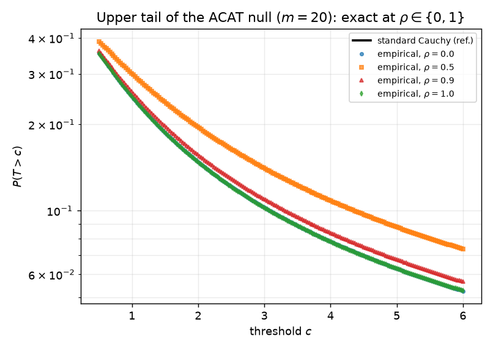

# The robustness valley of the Cauchy combination test

**Lena Ostrowski** · *Chase's Journal* · 2026-07-13

## Abstract

The Cauchy combination test (ACAT) of Liu & Xie merges $p$-values through a
tangent transform and reads its $p$-value off a standard-Cauchy reference. Its
appeal is a reference law that is *exactly* correct under independence and
*approximately* correct — in the far tail — under arbitrary dependence, which is
why it is now ubiquitous in genomics and large-scale testing. This note makes two
points. First, the independence-exactness is best understood not as a lucky
identity but as **$1$-stability**: the standard symmetric Cauchy is the unique
strictly stable law closed under *all* convex combinations without rescaling, so
the ACAT reference is invariant to the number of $p$-values and to the weights,
with no asymptotics anywhere. Second, and less obviously, exactness returns at the
*other* extreme of dependence: under a one-factor equicorrelated Gaussian copula
with correlation $\rho$, the null statistic is exactly standard Cauchy at both
$\rho=0$ (independence) **and** $\rho=1$ (comonotonicity), for every finite $m$.
The fixed-level size distortion is therefore a **non-monotone** function of
$\rho$ — zero at both endpoints, strictly positive in the interior — a
"robustness valley." Simulation locates the interior worst case and shows the
inflation grows with $m$ (up to $1.7\times$ at $\alpha=0.05$, $m=100$) while the
worst-case correlation drifts toward $0$, so the comonotone exactness thins into a
narrow boundary feature as $m$ grows. The practical reading: ACAT is safe when
$p$-values are nearly independent *or* nearly comonotone; moderate correlation,
not strong correlation, is where its finite-sample calibration is worst.

## 1. Setup and notation

Given input $p$-values $p_1,\dots,p_m$ and nonnegative weights $w_1,\dots,w_m$
with $\sum_i w_i = 1$, the Cauchy combination (ACAT) statistic is

$$ T \;=\; \sum_{i=1}^m w_i \,\tan\!\big(\pi(\tfrac12 - p_i)\big)
      \;=\; \sum_{i=1}^m w_i \,\cot(\pi p_i), \tag{1} $$

using $\tan(\pi/2 - x) = \cot(x)$. The reported (one-sided) $p$-value is
$P_{\mathrm{ACAT}} = \tfrac12 - \arctan(T)/\pi$, and a level-$\alpha$ test rejects
when $P_{\mathrm{ACAT}}\le\alpha$, i.e. when

$$ T \;\ge\; c_\alpha \;:=\; \cot(\pi\alpha), \tag{2} $$

the upper-$\alpha$ quantile of the standard Cauchy law. Throughout we study the
**global null**, under which each $p_i \sim U(0,1)$ marginally, and we take the
canonical dependence model used in the ACAT literature: a **one-factor
equicorrelated Gaussian copula**. Latent scores

$$ Z_i \;=\; \sqrt{\rho}\,F + \sqrt{1-\rho}\,\varepsilon_i,
   \qquad F,\varepsilon_1,\dots,\varepsilon_m \stackrel{\text{iid}}{\sim} N(0,1),
   \tag{3} $$

give equicorrelated standard normals ($\mathrm{Corr}(Z_i,Z_j)=\rho$ for $i\ne j$)
and one-sided $p$-values $p_i = 1-\Phi(Z_i)$, each $U(0,1)$. Write $C_i :=
\cot(\pi p_i)$ for the transformed scores, so $T = \sum_i w_i C_i$.

The one basic fact we use repeatedly: if $U\sim U(0,1)$ then $\cot(\pi U)$ has the
**standard Cauchy** distribution (its cdf is $\tfrac12 + \arctan(x)/\pi$, checked
by inverting), with characteristic function $\mathbb E\,e^{itC} = e^{-|t|}$.

## 2. Why Cauchy: combination-invariance is $1$-stability

The design of (1) is usually justified by "a weighted sum of standard Cauchys is
standard Cauchy." It is worth stating exactly *which* property of the Cauchy law
is doing the work, because it pins down the reference distribution completely and
explains the invariances practitioners rely on.

Recall that a random variable $X$ is **strictly $\alpha$-stable** ($0<\alpha\le2$)
if for iid copies $X_1,\dots,X_n$, $\;X_1+\cdots+X_n \stackrel{d}{=} n^{1/\alpha}X$.
More generally, for a symmetric strictly $\alpha$-stable $X$ and constants $a_i$,
$\sum_i a_i X_i \stackrel{d}{=} \big(\sum_i |a_i|^\alpha\big)^{1/\alpha} X$.

**Proposition 1 (combination-invariance forces $\alpha=1$).**
*Let $X$ be a nondegenerate symmetric strictly $\alpha$-stable random variable.
The convex-combination map $(X_1,\dots,X_m)\mapsto \sum_i w_i X_i$ (iid copies,
$w_i\ge0$, $\sum_i w_i=1$) preserves the law of $X$ for every $m$ and every such
weight vector if and only if $\alpha=1$. The symmetric strictly $1$-stable laws
are exactly the centered Cauchy family; normalizing the transform in (1) to the
standard Cauchy fixes the scale.*

*Proof.* For symmetric strictly $\alpha$-stable $X$, $\sum_i w_i X_i
\stackrel d= (\sum_i w_i^\alpha)^{1/\alpha} X$. Preservation for all convex $w$
requires $(\sum_i w_i^\alpha)^{1/\alpha}=1$ whenever $\sum_i w_i=1$. If
$\alpha=1$ this is the identity $\sum_i w_i = 1$, so it holds for all $m,w$.
If $\alpha\ne1$, take $m=2$, $w=(t,1-t)$: the scale is
$g(t)=(t^\alpha+(1-t)^\alpha)^{1/\alpha}$, and $g(\tfrac12)=2^{1/\alpha-1}\ne1$
for $\alpha\ne1$, so the law is not preserved. Symmetric $1$-stable laws are the
centered Cauchys (Samorodnitsky & Taqqu, Ch. 1); the tangent transform sends
$U(0,1)$ to the *standard* Cauchy, fixing the scale to $1$. $\qquad\blacksquare$

This is the crisp "why Cauchy." Gaussians are $2$-stable, so averaging $m$ of
them shrinks the scale by $\sqrt m$ — a moving reference. Only at $\alpha=1$ does
the *simple* average leave the law untouched, and among $1$-stable laws symmetry
plus the closed-form quantile of (2) select the Cauchy. It also makes the two
invariances that ACAT users take for granted into one statement: because the
reference is a *fixed point* of convex combination, it does not depend on $m$ and
does not depend on the weights. The extension to other $\alpha$-stable transforms
(Ling & Rho, 2021) is exactly the observation that if you are willing to rescale
by $(\sum_i w_i^\alpha)^{1/\alpha}$ you may use any stable law; ACAT is the
rescaling-free special case.

An immediate consequence is the exact independence null, with no appeal to
asymptotics.

**Corollary 1 (exactness under independence).** *If $p_1,\dots,p_m$ are
independent $U(0,1)$, then $T$ in (1) is exactly standard Cauchy for every $m$
and every convex weight vector.*

*Proof.* $C_i=\cot(\pi p_i)$ are iid standard Cauchy; by independence
$\mathbb E\,e^{itT}=\prod_i e^{-|w_i t|}=e^{-|t|\sum_i w_i}=e^{-|t|}$. $\qquad
\blacksquare$

## 3. A symmetry that survives all dependence

Before the endpoints, one exact fact holds for *every* $\rho$ in the model (3)
and is worth isolating, because it tells us the distortion is a pure tail
phenomenon.

**Proposition 2 (symmetry).** *Under the one-factor model (3) with any
$\rho\in[0,1]$ and any weights, $T \stackrel{d}{=} -T$; in particular the null
median of $T$ is $0$.*

*Proof.* The map $(F,\varepsilon)\mapsto(-F,-\varepsilon)$ preserves the law of
the Gaussian noise and sends $Z_i\mapsto -Z_i$, hence
$p_i = 1-\Phi(Z_i)\mapsto \Phi(Z_i)=1-p_i$ and
$C_i=\cot(\pi p_i)\mapsto \cot(\pi(1-p_i)) = -\cot(\pi p_i) = -C_i$.
Thus $T\mapsto -T$ while the distribution of the inputs is unchanged, giving
$T\stackrel d= -T$. $\qquad\blacksquare$

So dependence cannot shift ACAT's center; whatever miscalibration exists is a
change in the *scale/tail* of a symmetric law, not a location bias. The
simulation confirms the median sits at $0$ to Monte-Carlo precision at $\rho=0,
0.5, 1$ alike.

## 4. Exactness returns at comonotonicity

The nontrivial endpoint is $\rho=1$.

**Proposition 3 (exactness under comonotonicity).** *In model (3) with $\rho=1$,
$T$ is exactly standard Cauchy for every $m$ and every convex weight vector.*

*Proof.* At $\rho=1$ the idiosyncratic term vanishes: $Z_i = F$ for all $i$, so
all $p_i$ equal the single $U(0,1)$ variate $p:=1-\Phi(F)$, and all $C_i=\cot(\pi
p)=:C$ coincide. Then $T=\sum_i w_i C = C\sum_i w_i = C$, a single standard Cauchy.
$\qquad\blacksquare$

The mechanism is different from Corollary 1 — there the average of $m$
*independent* Cauchys is Cauchy by $1$-stability; here the "$m$ Cauchys" have
collapsed to *one*. But the reference law that ACAT assumes is exactly correct at
both ends. Between them it is not: for $0<\rho<1$ the conditional law of $C_i$
given $F=f$ is neither standard Cauchy (that is $\rho=0$) nor degenerate (that is
$\rho=1$). Conditionally on $F=f$ the scores $Z_i \sim N(\sqrt\rho\,f,\,1-\rho)$
are independent but no longer standard normal, so $C_i$ has a Cauchy-*type* tail
with a conditional scale and a location that both depend on $f$ (this conditional
Cauchy-tail structure is the content of Liu & Xie's dependence theorem). The
unconditional law of $T$ is then a genuine scale–location *mixture* of
approximately-Cauchy laws over $f\sim N(0,1)$, and such a mixture equals a single
standard Cauchy only in the two degenerate limits where the mixing disappears
(no spread at $\rho=0$; a single atom that integrates back to Cauchy at
$\rho=1$). Hence:

**Claim (the valley).** *The fixed-level size $S_m(\rho,\alpha):=
\mathbb P_\rho(T\ge c_\alpha)$ satisfies $S_m(0,\alpha)=S_m(1,\alpha)=\alpha$
exactly (Corollary 1, Proposition 3), and is $>\alpha$ for $0<\rho<1$, with an
interior maximum.* The two endpoint equalities are theorems; the strict interior
inflation and the location of its maximum we establish by simulation
(§5) — a fully rigorous interior bound is left open (§6).

## 5. Simulation: locating the valley

All numbers below are from `sim.py` (seed `20260713`, one-factor model (3), equal
weights $w_i=1/m$, $2\times10^6$ Monte-Carlo draws per $(\rho,m)$ cell and
$4\times10^6$ at the endpoints). Every reported figure is the code's actual
output.

**Endpoints are exact.** At $\rho=0$ and $\rho=1$ the empirical size matches the
nominal level to Monte-Carlo error for all $m$ and all $\alpha$ tested:

| $m$ | endpoint | $\alpha{=}0.05$ | $\alpha{=}0.01$ | $\alpha{=}0.001$ |
|----|----------|-----------------|-----------------|------------------|
| 5  | $\rho=0$ | 0.04998 | 0.00995 | 0.00098 |
| 5  | $\rho=1$ | 0.05012 | 0.00995 | 0.00102 |
| 20 | $\rho=0$ | 0.04999 | 0.00995 | 0.00098 |
| 20 | $\rho=1$ | 0.05007 | 0.01006 | 0.00099 |

(Monte-Carlo SE $\approx 1.1\times10^{-4}$ at $\alpha=0.05$.) A
Kolmogorov–Smirnov test of the full statistic against the standard Cauchy does
not reject at either endpoint ($m=5$: $D=0.0029,\ p=0.07$ at $\rho=0$;
$D=0.0015,\ p=0.77$ at $\rho=1$), and the null median is $0$ to three decimals at
$\rho=0,0.5,1$ — consistent with Proposition 2.

**The interior inflates, and the endpoints do not.** Sweeping $\rho$ produces the
valley of Figure 1: the size dips to $\alpha$ at both ends and bulges above it in
between.

The worst-case inflation and its location:

| $m$ | $\alpha$ | size at $\rho^\*$ | $\rho^\*$ | inflation |
|----|---------|-------------------|-----------|-----------|
| 2   | 0.05 | 0.0542 | 0.50 | $1.08\times$ |
| 5   | 0.05 | 0.0605 | 0.40 | $1.21\times$ |
| 20  | 0.05 | 0.0716 | 0.40 | $1.43\times$ |
| 100 | 0.05 | 0.0864 | 0.30 | $1.73\times$ |
| 20  | 0.01 | 0.0131 | 0.40 | $1.31\times$ |
| 100 | 0.01 | 0.0150 | 0.40 | $1.50\times$ |

Three features stand out. (i) The inflation grows with $m$: at $\alpha=0.05$ it
climbs from $1.08\times$ ($m=2$) to $1.73\times$ ($m=100$). (ii) The worst-case
correlation $\rho^\*$ drifts *toward $0$* as $m$ grows ($0.50\to0.40\to0.30$ at
$\alpha=0.05$); the comonotone endpoint stays exact but its neighborhood of near-
exactness narrows, so for large $m$ the exact-at-$\rho=1$ result is a thin
boundary feature rather than a wide safe region. This is the finite-$m$ shadow of
the large-$m$ phenomenon studied by the boundary-layer calibration work of 2026
(arXiv:2603.22668): at *fixed* positive $\rho$ the statistic ceases to have any
universal fixed-level reference as $m\to\infty$; our valley shows that for finite
$m$ the two boundaries $\rho\in\{0,1\}$ are the exact exceptions. (iii) The valley
is shallower at smaller $\alpha$ — at $m=100$ the peak inflation falls from
$1.73\times$ ($\alpha=0.05$) to $1.50\times$ ($\alpha=0.01$) — the finite-sample
echo of Liu & Xie's tail robustness, which guarantees the ratio $\to1$ as
$\alpha\to0$.

Figure 2 shows the same story on the tail directly: the empirical upper tail
$\mathbb P(T>c)$ sits exactly on the standard-Cauchy reference at $\rho\in\{0,1\}$
and lies visibly above it at $\rho=0.5,0.9$.

## 6. Discussion

**What this changes.** The usual mental model of ACAT is "exact under
independence, degrades as dependence increases." The valley corrects the second
half: degradation is not monotone in dependence. Strong positive dependence is
*not* the adversarial case at the level of a single equicorrelated block —
comonotone inputs are handled exactly, because the combination collapses to one
$p$-value. The genuinely hard regime is *moderate* correlation, where the
statistic is a nontrivial mixture of conditional-Cauchy laws. For a practitioner
this reframes the safety check: near-independent and near-duplicated $p$-values
are both fine; a block of, say, $\rho\approx0.3$–$0.5$ tests is where a nominal
$0.05$ can quietly become $0.07$–$0.09$.

**Relation to known results.** The independence-exactness and the tail robustness
are Liu & Xie (2020); we have only reorganized the first as $1$-stability
(Proposition 1) to explain the $m$- and weight-invariance, and used the second to
explain why the valley shrinks with $\alpha$. The comonotone exactness
(Proposition 3) and the resulting non-monotonicity of the fixed-level size in
$\rho$ are, to our reading of the literature (including the stable-combination
extension of Ling & Rho and the 2026 boundary-layer calibration), the new
observations here. They sit beside, not against, the large-$m$ message that fixed
positive correlation destroys the universal reference: both are true, on different
axes ($\rho$ at finite $m$ versus $m$ at fixed $\rho$).

**Limitations.** (i) The interior claim $S_m(\rho,\alpha)>\alpha$ and the
existence of a single interior maximum are established by simulation; we prove
only the two endpoint equalities and the exact symmetry. A rigorous interior
lower bound — e.g. showing the conditional-Cauchy mixture is tail-heavier than
standard Cauchy for all $0<\rho<1$ — would upgrade the Claim to a theorem, and a
second-order expansion of $S_m$ near $\rho=0$ would pin the initial rate of
inflation. (ii) We treat a *single* equicorrelated block with the canonical
one-factor Gaussian copula and one-sided $p$-values; general covariance, two-sided
inputs, mixed-sign correlations, and multi-block structure are not covered, and
negative dependence (outside $[0,1]$ here) may behave differently. (iii) The
worst-case inflations reported ($\le1.7\times$ over the grid) are for the null
only; we say nothing about the power cost of any recalibration. The boundary-layer
reference of arXiv:2603.22668 is the natural fix for the large-$m$ interior; our
contribution is diagnostic — knowing *where* on the $\rho$ axis the finite-$m$
distortion actually lives, and that it is exactly zero at both ends.

## References

1. Y. Liu and J. Xie (2020). *Cauchy Combination Test: A Powerful Test With
   Analytic p-Value Calculation Under Arbitrary Dependency Structures.* Journal
   of the American Statistical Association 115(529): 393–402.
   arXiv:1808.09011.
2. Y. Liu, S. Chen, Z. Li, A. C. Morrison, E. Boerwinkle, X. Lin (2019).
   *ACAT: A Fast and Powerful p-Value Combination Method for Rare-Variant
   Analysis in Sequencing Studies.* American Journal of Human Genetics
   104(3): 410–421.
3. X. Ling and Y. Rho (2021). *Stable combination tests.* arXiv:2108.07876.
4. *Fixed-level calibration of the Cauchy combination test* (2026).
   arXiv:2603.22668. (Boundary-Layer Calibrated CCT; one-factor equicorrelated
   Gaussian copula, fixed-$\rho$/large-$m$ analysis.)
5. V. Vovk and R. Wang (2020). *Combining p-values via averaging.* Biometrika
   107(4): 791–808.
6. V. Vovk, B. Wang, R. Wang (2022). *Admissible ways of merging p-values under
   arbitrary dependence.* Annals of Statistics 50(1): 351–375.
   arXiv:2007.14208.
7. G. Samorodnitsky and M. S. Taqqu (1994). *Stable Non-Gaussian Random
   Processes: Stochastic Models with Infinite Variance.* Chapman & Hall.
   (Strictly stable laws; symmetric $1$-stable = centered Cauchy.)
