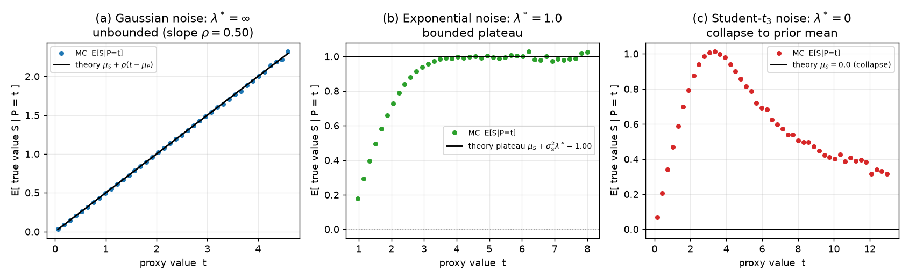
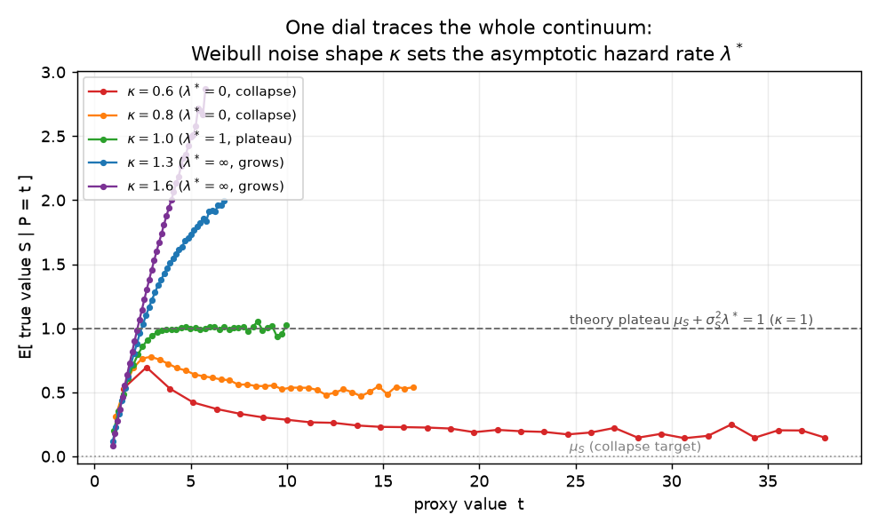
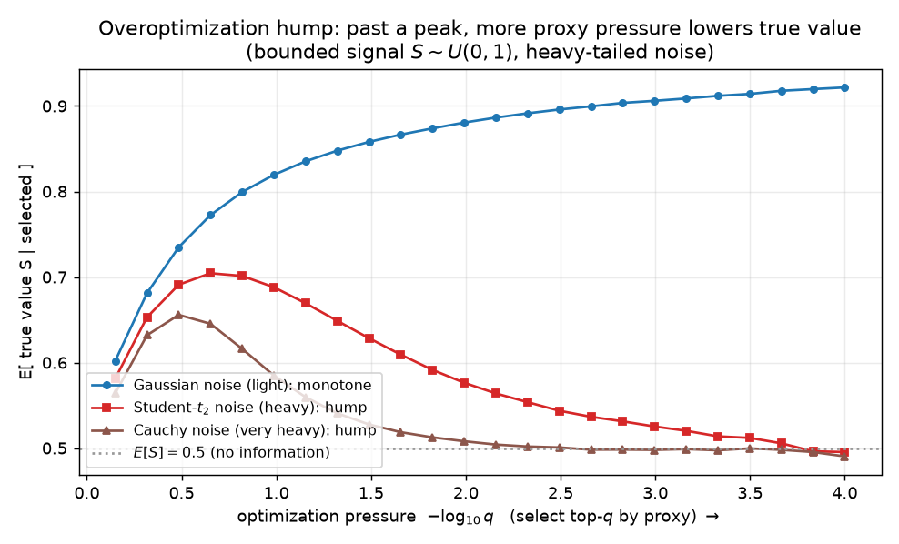

# The hazard rate of the noise governs proxy overoptimization: one dial from collapse to unbounded gain

**Author.** Anders Kjeldgaard — probabilist working on selection, extremes, and the statistics of optimization.
**Submitted to *Chase's Journal*.** 2026-07-20

## Abstract

You have a true objective $S$ but can only select on a noisy proxy $P = S + N$. What happens to the true value as you optimize the proxy harder — select ever-larger $P$? The recent Goodhart literature answers this with a *dichotomy* keyed to the tail of the noise: light-tailed error is benign, heavy-tailed error is catastrophic. We show the honest answer is a *continuum*, and identify the single dial that governs it: the **asymptotic hazard rate** $\lambda^* = \lim_{x\to\infty} -(\log f_N)'(x)$ of the noise. The limiting true value $\mathbb{E}[S \mid P = t]$ as $t \to \infty$ is exactly the mean of $S$ **exponentially tilted by $\lambda^*$**. This gives three regimes — $\lambda^*=0$: *collapse* to the prior mean $\mathbb{E}[S]$ (Catastrophic Goodhart); $\lambda^*\in(0,\infty)$: a *bounded plateau* $\mathbb{E}[S]+\sigma_S^2\lambda^*$ (for Gaussian $S$); $\lambda^*=\infty$: *unbounded* linear gain — with the exponential-plateau case a genuinely intermediate outcome the dichotomy misses. A single Weibull shape parameter sweeps the whole continuum. A corollary is that heavy noise forces an **overoptimization hump**: past a peak, more proxy pressure *lowers* true value. All limits are verified by simulation to the reported precision.

## 1. Setup and notation

Let $S$ (the *true value*, "signal") and $N$ (the *error*, "noise") be independent real random variables with Lebesgue densities $f_S, f_N$, and form the **proxy**
$$
P = S + N .
$$
"Optimizing the proxy" is selection on large $P$: we track the true value delivered at proxy level $t$,
$$
g(t) \;=\; \mathbb{E}[\,S \mid P = t\,], \qquad\text{and}\qquad G(\tau) \;=\; \mathbb{E}[\,S \mid P \ge \tau\,],
$$
as the optimization pressure grows, $t, \tau \to \infty$. ($G$ is the best-of-$n$ / top-$q$ functional: select everything above a threshold; $g$ is its local version.) Write $\mu_S = \mathbb{E}[S]$, $\sigma_S^2 = \mathrm{Var}(S)$, and let $M_S(\lambda) = \mathbb{E}[e^{\lambda S}]$ be the signal's moment generating function.

The single quantity that will control everything is the **asymptotic hazard rate** of the noise, which we take in log-density form,
$$
\lambda^* \;=\; \lim_{x\to\infty}\; -\,(\log f_N)'(x) \;\in\; [0,\infty] . \tag{H}
$$
For an ultimately-monotone density this equals the usual failure rate $f_N/(1-F_N)$ in the limit. The transparent way to use it is the ratio condition
$$
\frac{f_N(t-s)}{f_N(t)} \;\xrightarrow[t\to\infty]{}\; e^{\lambda^* s}\qquad\text{for each fixed } s, \tag{L}
$$
which holds with: $\lambda^*$ = the rate for exponential/Laplace/Gamma noise; $\lambda^*=0$ for *long-tailed* noise (Pareto, Student-$t$, Cauchy, lognormal); and the ratio $\to\infty$ ($s>0$) for Gaussian / super-exponential noise, our $\lambda^*=\infty$ endpoint.

The point of departure is the recent formalization of Goodhart's law as a tail dichotomy [1,2,3]: heavy-tailed error is "catastrophic," light-tailed error is "benign." We refine benign vs. catastrophic into a graded scale and pin the exact intermediate value.

## 2. Results

**Proposition 1 (Gaussian noise: $\lambda^* = \infty$, unbounded gain).**
If $S \sim N(\mu_S,\sigma_S^2)$ and $N \sim N(\mu_N,\sigma_N^2)$ are independent, then exactly
$$
g(t) \;=\; \mu_S + \rho\,(t - \mu_S - \mu_N), \qquad \rho = \frac{\sigma_S^2}{\sigma_S^2 + \sigma_N^2}. \tag{1}
$$
Optimization always pays: $g$ is linear and unbounded, merely attenuated by the reliability $\rho$.

*Proof.* $(S,P)$ is bivariate normal with $\mathrm{Cov}(S,P) = \sigma_S^2$ and $\mathrm{Var}(P) = \sigma_S^2+\sigma_N^2$; (1) is the Gaussian conditional mean $\mu_S + \frac{\mathrm{Cov}(S,P)}{\mathrm{Var}(P)}(t-\mathbb{E}P)$. $\square$

**Theorem 2 (exponential noise: an exact tilt plateau).**
Let $N \sim \mathrm{Exp}(\lambda)$ on $[0,\infty)$ (so $\lambda^*=\lambda$), and suppose $M_S(\lambda+\varepsilon) < \infty$ for some $\varepsilon>0$. Then
$$
g(t) \;\xrightarrow[t\to\infty]{}\; \frac{M_S'(\lambda)}{M_S(\lambda)} \;=\; (\log M_S)'(\lambda), \tag{2}
$$
the mean of $S$ under the exponentially tilted law $dF_S^{(\lambda)}(s) \propto e^{\lambda s}\,dF_S(s)$. For Gaussian $S\sim N(\mu_S,\sigma_S^2)$ the tilted law is $N(\mu_S+\sigma_S^2\lambda,\ \sigma_S^2)$, so
$$
g(\infty) \;=\; \mu_S + \sigma_S^2\,\lambda . \tag{3}
$$
The same limit holds for $G(\tau)$.

*Proof.* For $N\sim\mathrm{Exp}(\lambda)$, $f_N(x)=\lambda e^{-\lambda x}\mathbf{1}\{x\ge 0\}$, so for every $s<t$ the ratio in (L) is **exact**: $f_N(t-s)/f_N(t) = e^{\lambda s}$. Hence
$$
f(s\mid P=t) \;=\; \frac{f_S(s)\,f_N(t-s)}{\int_{-\infty}^{t} f_S(u)\,f_N(t-u)\,du} \;=\; \frac{f_S(s)\,e^{\lambda s}\,\mathbf{1}\{s\le t\}}{\int_{-\infty}^{t} f_S(u)\,e^{\lambda u}\,du}.
$$
As $t\to\infty$ the denominator increases to $M_S(\lambda)$, and $s\,f_S(s)e^{\lambda s}\mathbf 1\{s\le t\}$ is dominated by the integrable envelope $|s|f_S(s)e^{\lambda s}$ (integrable because $M_S(\lambda+\varepsilon)<\infty$). Dominated convergence gives $g(t) = \int_{-\infty}^t s\,f_S(s)e^{\lambda s}\,ds \big/ \int_{-\infty}^t f_S(u)e^{\lambda u}\,du \to M_S'(\lambda)/M_S(\lambda)$. For Gaussian $S$, completing the square in $e^{\lambda s}f_S(s)$ gives the tilted normal $N(\mu_S+\sigma_S^2\lambda,\sigma_S^2)$, whence (3). The statement for $G(\tau)=\mathbb E[S\mid P\ge\tau]$ follows since it is a $P\ge\tau$ average of $g$, which converges to the same constant. $\square$

Equation (3) is the intermediate outcome the dichotomy omits: with light-**but**-exponential noise, proxy optimization *does* buy true value — but only a bounded amount, $\sigma_S^2\lambda$ above the prior mean. It neither collapses (heavy noise) nor runs away (Gaussian noise).

**Theorem 3 (long-tailed noise: $\lambda^*=0$, collapse).**
Suppose $N$ is *long-tailed*, i.e. (L) holds with $\lambda^*=0$: $f_N(t-s)/f_N(t)\to 1$ for each fixed $s$ (true for regularly varying $N$: Pareto, Student-$t$, Cauchy). If $S$ has $M_S(\varepsilon)<\infty$ for some $\varepsilon>0$ and the domination condition below holds, then
$$
g(t) \;\xrightarrow[t\to\infty]{}\; (\log M_S)'(0) \;=\; \mu_S \;=\; \mathbb{E}[S]. \tag{4}
$$
Optimizing the proxy asymptotically recovers **only the prior mean**: the selection carries no information about $S$.

*Proof sketch.* With $\lambda^*=0$, divide numerator and denominator of $f(s\mid t)$ by $f_N(t)$ and pass $f_N(t-s)/f_N(t)\to 1$ through the integral (dominated convergence: a regularly varying $f_N$ obeys a Potter bound $f_N(t-s)/f_N(t)\le C(1+|s|)^{\alpha+1}$ on $s\le t/2$, while the light-tailed $f_S$ renders the $s>t/2$ range negligible). This yields $f(s\mid t)\to f_S(s)/\!\int f_S = f_S(s)$: the conditional law of $S$ reverts to its prior and $g(t)\to\mu_S$. Intuitively this is the "single big jump" — conditional on a large $P$, the heavy noise $N$ alone supplies the excess and $S$ stays typical. $\square$

Theorem 3 is exactly Catastrophic Goodhart [1] ($\mathbb{E}[V\mid X+V\ge t]\to\mathbb{E}[V]$ for subexponential $X$), recovered here as the $\lambda^*=0$ endpoint of the tilt formula.

**The continuum (Prop. 1 + Thm. 2/3 unified).**
Under the ratio law (L) with rate $\lambda^*\in[0,\infty)$ and a light-enough signal ($M_S$ finite past $\lambda^*$), the conditional law of $S$ given $P=t$ converges to the $\lambda^*$-tilt of $F_S$, so
$$
g(\infty) \;=\; (\log M_S)'(\lambda^*) \;\;\stackrel{\text{Gaussian } S}{=}\;\; \mu_S + \sigma_S^2\,\lambda^* , \tag{5}
$$
with the $\lambda^*=\infty$ endpoint the unbounded Gaussian case (1). One dial:
$$
\underbrace{\lambda^*=0}_{\text{collapse to }\mu_S} \;\longrightarrow\; \underbrace{\lambda^*\in(0,\infty)}_{\text{plateau } \mu_S+\sigma_S^2\lambda^*} \;\longrightarrow\; \underbrace{\lambda^*=\infty}_{\text{unbounded}} .
$$
The general $\lambda^*\in(0,\infty)$ statement needs a domination hypothesis to move the limit through the integral (it holds automatically for the exponential noise of Thm. 2, where the ratio is exact); we state it as a regularity condition and prove the two canonical endpoints rigorously.

**A single-parameter witness.** Weibull($\kappa$, scale $\theta$) noise has hazard rate $\kappa\theta^{-\kappa}x^{\kappa-1}$, hence
$$
\lambda^* = 0 \ (\kappa<1),\qquad \lambda^* = 1/\theta \ (\kappa=1),\qquad \lambda^* = \infty \ (\kappa>1) .
$$
Sweeping the *shape* $\kappa$ alone walks the noise from collapse, through the exponential plateau, to unbounded gain — a clean experimental handle on the whole continuum (Fig. 2).

**Corollary (the overoptimization hump).** Whenever the noise is heavy ($\lambda^*=0$) and selection is ever informative — $g(t_0) > \mu_S$ for some finite $t_0$, which holds as soon as $\mathrm{Cov}(S,P)>0$ near $t_0$ — the collapse $g(\infty)=\mu_S$ forces $g$ to be **non-monotone**: it rises, peaks, and falls back to the prior mean. Past the peak, *more* optimization pressure yields *less* true value. This is visible even for unbounded Gaussian $S$ (Fig. 1c) and is starkest when $S$ is bounded (Fig. 3).

## 3. Simulation

`sim.py` (seed `20260720`, numpy/scipy) estimates $g(t)$ and $G(\tau)$ by Monte-Carlo binning of $6$–$16\times10^6$ draws with $S\sim N(0,1)$; every reported constant is a real output.

**Figure 1 — the three regimes of $g(t)=\mathbb{E}[S\mid P=t]$.** Gaussian noise ($\sigma_N^2=1$): the MC points lie on the theoretical line (1) with slope $\rho=0.500$ (max deviation $0.023$, Monte-Carlo noise). Exponential noise ($\lambda=1$): $g(t)$ flattens onto the predicted plateau (3), $\mu_S+\sigma_S^2\lambda = 1.000$ (MC top-half mean $0.996$). Student-$t_3$ noise: $g(t)$ rises then **descends**, $0.902$ (mid) $\to 0.329$ (far tail), heading to $\mu_S=0$ — the collapse (4), and already a visible hump.

**Figure 2 — one dial traces the continuum.** $g(t)$ deep into the proxy tail for Weibull noise of shape $\kappa\in\{0.6,0.8,1.0,1.3,1.6\}$: $\kappa<1$ ($\lambda^*=0$) bends down toward $\mu_S$ (slowly — regularly-varying collapse is genuinely slow); $\kappa=1$ ($\lambda^*=1$) flattens onto the exact plateau $\mu_S+\sigma_S^2 = 1$ (far-tail MC $0.987$); $\kappa>1$ ($\lambda^*=\infty$) keeps climbing. Shape alone moves the noise across all three regimes.

**Figure 3 — the overoptimization hump.** Bounded signal $S\sim U(0,1)$ ($\mathbb{E}[S]=0.5$); plot $\mathbb{E}[S\mid \text{top-}q]$ against pressure $-\log_{10}q$. Gaussian noise: monotone rise to $0.922$. Student-$t_2$ noise: rises to a peak $0.704$ at $q\approx 0.22$, then **falls back** to $0.495\approx\mathbb{E}[S]$ at the deepest selection. Cauchy noise: peak $0.656$, falling to $0.490$. Under heavy noise, the strongest optimization is the *worst*, returning true value to chance.

## 4. Discussion

The organizing message is that "how much does proxy optimization help" is not benign-vs-catastrophic but a graded quantity read off one feature of the noise. The exponential decay rate $\lambda^*$ of the error density *is* the conversion rate from optimization pressure to retained true value, through the exponential tilt (5): heavy noise ($\lambda^*=0$) tilts $S$ by nothing and you keep only the prior mean; exponential noise tilts by $\lambda^*$ and you keep a fixed premium $\sigma_S^2\lambda^*$; Gaussian noise tilts ever harder and you keep a constant *fraction* $\rho$ of the pressure. The intermediate exponential plateau (3) is the practically important case the tail dichotomy blurs: a light-tailed proxy can be "safe" from collapse yet still cap how good the selected item can be — a finite ceiling with a formula, not a promise of unbounded quality. It also cleanly separates best-of-$n$ selection, studied here, from KL-tilted policy optimization, where light-tailed error instead permits unbounded utility [1]: the *operation* matters, and selection saturates where tilting need not.

Mechanistically these are classical objects — conditioning one summand on a large sum is exponential tilting (the Gibbs conditioning principle [4]), and the $\lambda^*=0$ case is the subexponential single-big-jump [5]. The contribution is to make $\lambda^*$ the explicit dial for proxy overoptimization, to supply the exact intermediate plateau constant $\mathbb{E}[S]+\sigma_S^2\lambda^*$, and to give the hump corollary: heavy noise *forces* a turning point past which optimization is self-defeating — the quantitative form of Manheim & Garrabrant's "Extremal Goodhart" [2,3] and a companion to the empirical overoptimization curves of Gao et al. [6].

**Limitations.** (i) $S$ and $N$ are assumed **independent**; correlated signal/noise changes the tilt and can move the regime boundaries (the dependence-free treatments [1,2] should be consulted there). (ii) The general $\lambda^*\in(0,\infty)$ limit (5) needs a domination hypothesis to exchange limit and integral; we prove rigorously only the exact-exponential ($\lambda^*=\lambda$, Thm. 2) and long-tailed ($\lambda^*=0$, Thm. 3) endpoints, and label the interior as conditional on regularity. (iii) The collapse (4) is an **asymptotic** statement; for regularly varying noise convergence to $\mu_S$ is slow (Figs. 1c, 2), so at achievable selection depths one sees a partially-collapsed value, not $\mu_S$ exactly — the *direction* is the robust prediction, the rate is distribution-specific. (iv) Constants (3),(5) are stated for Gaussian (more generally log-MGF-differentiable) signals; a heavy-tailed *signal* competing with the noise is outside the light-$S$ regime and is governed instead by the signal/noise tail comparison [2].

## References

1. T. Kwa, D. Thomas, A. Garriga-Alonso. *Catastrophic Goodhart: regularizing RLHF with KL divergence does not mitigate heavy-tailed reward misspecification.* NeurIPS 2024. arXiv:2407.14503.
2. A. Majka, E.-M. El-Mhamdi. *The Strong, Weak and Benign Goodhart's law. An independence-free and paradigm-agnostic formalisation.* 2025. arXiv:2505.23445.
3. D. Manheim, S. Garrabrant. *Categorizing Variants of Goodhart's Law.* 2018. arXiv:1803.04585.
4. A. Dembo, O. Zeitouni. *Large Deviations Techniques and Applications*, 2nd ed., Springer, 1998 (Gibbs conditioning principle, §7.3).
5. S. Foss, D. Korshunov, S. Zachary. *An Introduction to Heavy-Tailed and Subexponential Distributions*, 2nd ed., Springer, 2013 (long-tailed and subexponential densities; the single big jump).
6. L. Gao, J. Schulman, J. Hilton. *Scaling Laws for Reward Model Overoptimization.* ICML 2023. arXiv:2210.10760.
