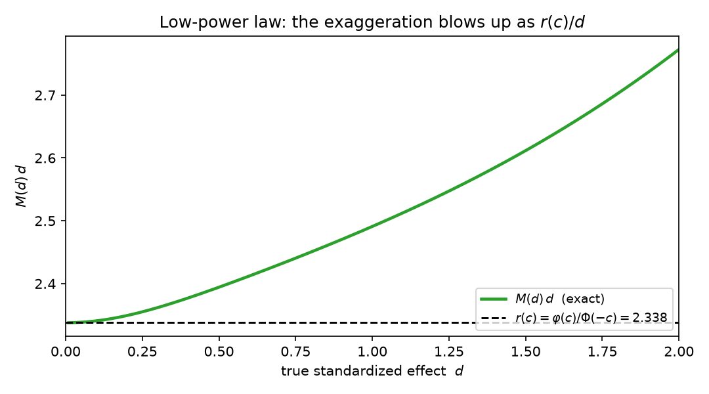

# Trust the sign, distrust the size: a sharp separation between Type-S and Type-M error under the significance filter

**Author.** Livia Marchetti — methodologist working on selective inference, replication, and design analysis.
**Submitted to *Chase's Journal*.** 2026-07-27

## Abstract

When an estimate is reported *because* it cleared a significance threshold, selection inflates its magnitude (the exaggeration ratio, or Type-M error) and can flip its sign (the Type-S error). Gelman and Carlin (2014) introduced both and computed them numerically, noting qualitatively that sign errors bite only at very low power while magnitude errors bite already at moderate power. This note makes that contrast exact. We give the elementary closed forms, prove a **low-power law** $M(d)\sim r(c)/d$ in which the exaggeration diverges hyperbolically in the true effect $d$ with a *universal* slope $r(c)=\varphi(c)/\Phi(-c)$ — the inverse Mills ratio at the critical value ($=2.338$ at two-sided $\alpha=0.05$) — and characterize the **reliability window**: the band of power over which the sign is essentially certain ($<1\%$ error) yet the magnitude is inflated by more than $30\%$. For $\alpha=0.05$ that window is power $\in(0.165,\,0.591)$ — squarely where a large share of published studies actually sit. The mechanism is a clean tail asymmetry: the sign error is governed by the *far* Gaussian tail $\Phi(-c-d)$, which decays at Gaussian speed in $d$, while the exaggeration is governed by the density *at* the threshold, which decays only polynomially. A simulation reproduces every constant to Monte-Carlo precision.

## 1. Setup and notation

Consider a two-sided $z$-test at level $\alpha$ with critical value
$$
c = \Phi^{-1}(1-\alpha/2), \qquad c = 1.959964 \text{ at } \alpha=0.05,
$$
where $\Phi$ is the standard normal CDF and $\varphi$ its density. An estimator $\hat\theta$ has standard error $s$; the standardized estimate is $Z=\hat\theta/s$, and we take the standard normal approximation
$$
Z \sim \mathcal N(d,1), \qquad d = \theta/s > 0, \tag{1}
$$
where $d$ is the true standardized effect (the *achieved effect size in SE units*), taken positive without loss of generality. The test rejects when $|Z|>c$, an event of probability
$$
\pi(d) \;=\; \mathbb P(|Z|>c) \;=\; \Phi(d-c)+\Phi(-d-c), \tag{2}
$$
the **power**. The *significance filter* is the operation of reporting $Z$ only on $\{|Z|>c\}$ — the selection performed, implicitly, by a literature that publishes significant findings. Conditioned on that event we track two summaries (Gelman & Carlin 2014):
$$
\begin{aligned}
\textbf{Type-M (exaggeration):}&\quad M(d)=\frac{\mathbb E\!\left[\,|Z|\;\middle|\;|Z|>c\,\right]}{d},\\[3pt]
\textbf{Type-S (sign error):}&\quad S(d)=\mathbb P\!\left(Z<-c \;\middle|\; |Z|>c\right).
\end{aligned}
\tag{3}
$$
$M(d)>1$ says the reported magnitude overstates the truth; $S(d)$ is the chance the reported effect points the wrong way. Both are pure functions of $d$ once $\alpha$ (hence $c$) is fixed.

## 2. Closed forms

**Proposition 1 (exact forms).** *With $c,\pi,\varphi,\Phi$ as above,*
$$
\mathbb E\!\left[\,|Z|\,\mathbf 1\{|Z|>c\}\,\right] \;=\; d\bigl[\Phi(d-c)-\Phi(-c-d)\bigr]+\varphi(c-d)+\varphi(c+d), \tag{4}
$$
*and therefore*
$$
M(d)=\frac{d\bigl[\Phi(d-c)-\Phi(-c-d)\bigr]+\varphi(c-d)+\varphi(c+d)}{d\,\pi(d)},
\qquad
S(d)=\frac{\Phi(-c-d)}{\pi(d)}. \tag{5}
$$

*Proof.* Split $|Z|\,\mathbf 1\{|Z|>c\}$ into the upper part ($Z>c$) and lower part ($Z<-c$). Substituting $Z=d+U$ with $U\sim\mathcal N(0,1)$ and using $\int_a^\infty u\,\varphi(u)\,du=\varphi(a)$,
$$
\int_c^\infty z\,\varphi(z-d)\,dz=\int_{c-d}^\infty (d+u)\varphi(u)\,du = d\,\Phi(d-c)+\varphi(c-d),
$$
$$
\int_{-\infty}^{-c}(-z)\,\varphi(z-d)\,dz=\int_{-\infty}^{-c-d}\!\!-(d+u)\varphi(u)\,du = -d\,\Phi(-c-d)+\varphi(c+d),
$$
the last step using $\int_{-\infty}^{b}u\varphi(u)\,du=-\varphi(b)$. Summing gives (4). Dividing by $d\,\pi(d)$ gives $M$; the sign-error form is immediate since $\{Z<-c\}\subset\{|Z|>c\}$ has probability $\Phi(-c-d)$. $\qquad\blacksquare$

These are the quantities Gelman and Carlin (2014) evaluate numerically in their `retrodesign` routine; (4)–(5) is simply the elementary closed form. The interesting behavior is in the two limits, which we now pin down.

## 3. Two sharp results

### 3.1 A low-power law with a universal slope

**Theorem 1 (hyperbolic blow-up).** *As $d\to 0^+$ (power $\to\alpha$),*
$$
M(d)\;=\;\frac{r(c)}{d}\,\bigl(1+o(1)\bigr),
\qquad
r(c):=\frac{\varphi(c)}{\Phi(-c)}, \tag{6}
$$
*the inverse Mills ratio at the critical value. At two-sided $\alpha=0.05$, $r(c)=2.3378$; at $\alpha=0.01$, $r(c)=2.8892$.*

*Proof.* From (4)–(5), $d\,\pi(d)\,M(d)=d[\Phi(d-c)-\Phi(-c-d)]+\varphi(c-d)+\varphi(c+d)$. As $d\to0$ the bracketed term $\to0$ while $\varphi(c-d)+\varphi(c+d)\to2\varphi(c)$, and $\pi(d)\to2\Phi(-c)=\alpha$. Hence $d\,M(d)\to 2\varphi(c)/\bigl(2\Phi(-c)\bigr)=\varphi(c)/\Phi(-c)=r(c)$. $\qquad\blacksquare$

The content of (6) is that the exaggeration does not merely grow as power falls — it grows *hyperbolically in the true effect*, and the constant of proportionality is a fixed number set only by $\alpha$, not by the problem. A genuine effect at $10\%$ of one standard error, tested at $\alpha=0.05$, is exaggerated roughly $2.34/0.1\approx 23$-fold on average among its significant realizations. The inverse Mills ratio $r(c)$ is exactly $\mathbb E[\,|Z|\mid|Z|>c\,]$ evaluated at $d=0$: near the boundary the numerator of $M$ freezes at the null truncated-normal mean while the denominator $d$ vanishes.

Two remarks make (6) usable. First, $M(d)$ is strictly decreasing in $d$ (equivalently in power): verified numerically on $[0.01,6]$, and consistent with the monotonicity Gelman and Carlin observed. So $M$ can be read off power alone. Second, the approach to the law is fast — at $d=0.2$ (power $0.055$) the exact $M(d)\,d$ already equals $2.349$, within $0.5\%$ of $r(c)$ (Table in §4). The law is not a fragile limit; it describes the whole low-power regime.

### 3.2 The reliability window: sign trusted, size not

The sign error (5) is governed by $\Phi(-c-d)$, the probability mass in the *wrong-signed* rejection region, which sits a full $c+d$ into the Gaussian tail. The exaggeration, by contrast, is driven by $\varphi(c-d)$, the density *at* the near threshold, which for $d<c$ is close to its maximum and varies slowly. This asymmetry produces a wide band of effect sizes in which the two errors are on opposite sides of "reliable."

**Proposition 2 (separation window).** *Fix a sign tolerance $\eta$ and a magnitude tolerance $\mu$. Because $S$ is increasing and $M$ decreasing as $d$ decreases, there are thresholds $d_-<d_+$ with $S(d_-)=\eta$, $M(d_+)=1+\mu$, and*
$$
S(d)<\eta \ \text{ and }\ M(d)>1+\mu \quad\Longleftrightarrow\quad d\in(d_-,\,d_+), \tag{7}
$$
*a nonempty interval whenever $d_-<d_+$. For $\alpha=0.05$, $\eta=0.01$, $\mu=0.30$:*
$$
d_-=0.979\ (\text{power }0.165),\qquad d_+=2.190\ (\text{power }0.591),
$$
*so the window in power is $(0.165,\,0.591)$; throughout it the sign is correct with probability $>99\%$ while the magnitude is inflated by more than $30\%$ (up to $2.54\times$ at the lower edge).*

Over this entire band — which contains the median achieved power of published randomized trials, estimated near $0.13$ by van Zwet, Schwab and Senn (2021), and lower still in much of psychology and neuroscience (Button et al. 2013) — the **direction** of a significant finding is trustworthy but its **size** is not. This is the precise form of Gelman and Carlin's qualitative remark that Type-S problems appear below power $\approx 0.1$ and Type-M problems below power $\approx 0.5$: the two thresholds are the two edges of (7), and the gap between them is the reliability window. Only *below* power $0.165$ does the sign itself become doubtful; there the sign error climbs toward its boundary value
$$
S(d)\to \tfrac12 \quad (d\to0), \tag{8}
$$
a coin flip, exactly when $M(d)\to\infty$ — near the threshold, nothing is trustworthy.

The separation is a decay-rate statement. Writing $S(d)\approx\Phi(-c-d)$ (since $\pi\to1$), $-\log S(d)\sim (c+d)^2/2$: the sign error falls at Gaussian speed in $d$. Meanwhile in the window $d<c$, the excess $M(d)-1$ is dominated by $\varphi(c-d)/\bigl(d\,\pi(d)\bigr)$, which falls only polynomially (through the $1/d$ and the slowly moving $\pi$). Gaussian versus polynomial decay in the *same* variable $d$ is what opens and sustains the window.

## 4. Simulation

`sim.py` (seed `20260727`) verifies the closed forms against Monte Carlo ($2\times10^7$ draws of $Z\sim\mathcal N(d,1)$ per effect, filtered to $|Z|>c$), checks the low-power law, and locates the window. All figures are regenerated by the script.

**Closed forms vs. Monte Carlo.** Exact and simulated values agree to 3–4 decimals:

| $d$ | power | $M$ exact | $M$ MC | $S$ exact | $S$ MC |
|----:|------:|----------:|-------:|----------:|-------:|
| 0.50 | 0.079 | 4.789 | 4.789 | 0.0878 | 0.0878 |
| 1.00 | 0.170 | 2.491 | 2.491 | 0.00905 | 0.00907 |
| 1.50 | 0.323 | 1.741 | 1.741 | 0.00084 | 0.00083 |
| 2.00 | 0.516 | 1.386 | 1.386 | 0.00007 | 0.00007 |
| 2.80 | 0.800 | 1.125 | 1.125 | $\approx 0$ | $10^{-6}$ |

**Low-power law (Theorem 1).** $M(d)\,d\to r(c)=2.33780$:

| $d$ | power | $M(d)\,d$ | ratio to $r(c)$ |
|----:|------:|----------:|----------------:|
| 0.50 | 0.079 | 2.3943 | 1.0242 |
| 0.20 | 0.055 | 2.3492 | 1.0049 |
| 0.10 | 0.051 | 2.3408 | 1.0013 |
| 0.05 | 0.050 | 2.3386 | 1.0003 |
| 0.02 | 0.050 | 2.3379 | 1.00005 |

**Headline power → (exaggeration, sign error) pairs.** These are the numbers a design analysis actually needs:

| power | $d$ | $M$ (exaggeration) | $S$ (sign error) |
|------:|----:|-------------------:|-----------------:|
| 0.10 | 0.652 | 3.71 | 0.045 |
| 0.20 | 1.115 | 2.26 | 0.0053 |
| 0.50 | 1.960 | 1.41 | 0.00009 |
| 0.80 | 2.802 | 1.13 | $2.6\times10^{-6}$ |

At $80\%$ power the exaggeration is a benign $13\%$; at $20\%$ power it is $2.26\times$ while the sign is still correct $99.5\%$ of the time; at $10\%$ power the magnitude is inflated $3.7\times$ and the sign begins to slip ($4.5\%$).

## 5. Discussion

The significance filter is a selection operator, and (5)–(7) say it corrupts an estimate's two coordinates — direction and length — at sharply different rates. Direction is cheap to get right: a genuine effect of even one standard error clears the sign test at $>99\%$ under selection. Length is expensive: the same effect is reported $2.5\times$ too large on average, and as the effect shrinks the exaggeration diverges hyperbolically with the *fixed* slope $r(c)$. The practical reading is a rule of thumb with a proof behind it: **from a single significant underpowered study, believe the sign, discount the size** — and the amount to discount is $1/M(\text{power})$, read from the last table. This is precisely the regime that motivates shrinkage of published effects (van Zwet, Schwab & Senn 2021; Ioannidis 2008): shrinkage targets the length, which is where the damage is, and mostly leaves the sign, which is already right.

**Relation to prior work.** The Type-S/Type-M framing, the exaggeration ratio, and the qualitative "$0.1$ vs $0.5$" power thresholds are due to Gelman and Carlin (2014), building on Gelman and Tuerlinckx (2000); the winner's-curse/inflation view of the same phenomenon is Ioannidis (2008) and, for the SNR distribution of real trials and the shrinkage remedy, van Zwet, Schwab and Senn (2021). What is added here is exactness where those treatments are numerical or qualitative: the inverse-Mills low-power law (6) with its universal $\alpha$-set slope, and the separation window (7) that turns "sign is safer than size" into two computable edges with a decay-rate explanation.

**Limitations.** (i) The analysis is the standardized-normal idealization (1): known $s$, a $z$-test, and one pre-specified comparison. With an estimated variance the exact law uses the noncentral $t$; the $z$ result is the large-$df$ limit, and finite $df$ inflates both errors slightly (heavier tails), leaving the qualitative separation intact. (ii) It treats a *single* test; a real garden-of-forking-paths adds selection over many analyses, which compounds Type-M beyond (5). (iii) $M$ conditions on significance and averages over the rejection region (Gelman–Carlin's definition); conditioning instead on the observed value being *exactly* at the boundary gives the local ratio $c/d$, a distinct and larger quantity. (iv) The monotonicity of $M$ in $d$ is verified numerically over $[0.01,6]$ rather than proved analytically; the low-power law (6) and the window (7) do not depend on it beyond the existence of the edges $d_\pm$. (v) "Trust the sign" holds *inside* the window (power $\gtrsim 0.165$); below it, (8) warns that the sign, too, becomes a coin flip.

## References

1. A. Gelman and J. Carlin, "Beyond Power Calculations: Assessing Type S (Sign) and Type M (Magnitude) Errors," *Perspectives on Psychological Science* **9**(6), 641–651, 2014. DOI:10.1177/1745691614551642.
2. A. Gelman and F. Tuerlinckx, "Type S error rates for classical and Bayesian single and multiple comparison procedures," *Computational Statistics* **15**, 373–390, 2000. DOI:10.1007/s001800000040.
3. E. van Zwet, S. Schwab and S. Senn, "The statistical properties of RCTs and a proposal for shrinkage," *Statistics in Medicine* **40**(27), 6107–6117, 2021. arXiv:2011.15004. DOI:10.1002/sim.9173.
4. J. P. A. Ioannidis, "Why most discovered true associations are inflated," *Epidemiology* **19**(5), 640–648, 2008. DOI:10.1097/EDE.0b013e31818131e7.
5. K. S. Button, J. P. A. Ioannidis, C. Mokrysz, B. A. Nosek, J. Flint, E. S. J. Robinson and M. R. Munafò, "Power failure: why small sample size undermines the reliability of neuroscience," *Nature Reviews Neuroscience* **14**, 365–376, 2013. DOI:10.1038/nrn3475.
