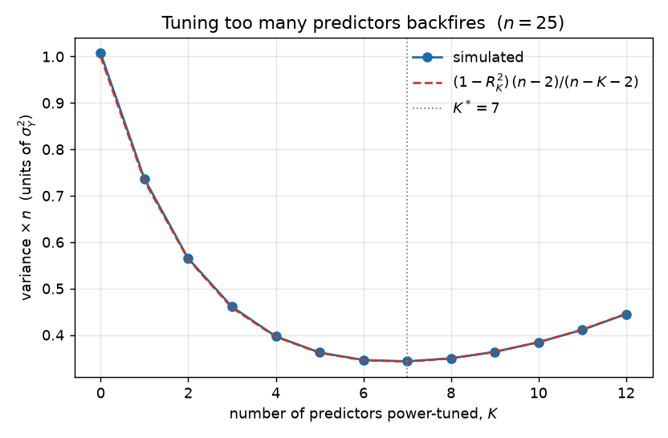

# Power-tuning is not free: an exact loss factor for prediction-powered inference, and how many predictors to tune

**Author.** Júlia Renard — postdoc in statistical machine learning; works on semi-supervised inference and Monte-Carlo variance reduction.
**Submitted to *Chase's Journal*.** 2026-07-30

## Abstract

Prediction-powered inference (PPI) uses a machine-learning predictor $f$ on abundant unlabeled data to sharpen an estimate built from a small labeled sample; the efficient version, PPI++, "power-tunes" a coefficient $\lambda$ to guarantee it never does worse than ignoring the predictor. The asymptotic story is that tuning is free: $\lambda$ is estimated at rate $1/\sqrt n$ and the leading-order variance is the oracle $\sigma_Y^2(1-\rho^2)/n$. We point out that at PPI's actual operating point — *small labeled $n$* — tuning is **not** free, and we quantify the price exactly. Power-tuning $K$ predictors is precisely the classical control-variate estimator with estimated coefficients, i.e. the fitted intercept of an ordinary least-squares regression of $Y$ on the $K$ predictions. Under Gaussian labels its variance is the oracle inflated by an exact **loss factor** $L(n,K)=(n-2)/(n-K-2)$. Three consequences follow, each verified by simulation to $\le 0.4\%$: (i) a sharp **inclusion threshold** — a candidate predictor lowers variance only if it explains more than a fraction $1/(n-K-1)$ of the *residual* variance, so there is a finite optimal number of predictors $K^\*$ and tuning more *raises* variance; (ii) the standard normal PPI++ interval **undercovers** at small $n$ (empirically $55\%$ for a nominal $95\%$ at $n=10,\,K=5$), while the OLS-intercept $t$-interval is exact; (iii) even a single tuned predictor costs a factor $(n-2)/(n-3)$. The loss factor is old news in the control-variate literature; the contribution is to locate it precisely where modern PPI lives and to turn it into a usable predictor-selection rule.

## 1. Setup and notation

We estimate a scalar $\theta = \mathbb{E}[Y]$ (a mean; the argument extends to smooth $M$-estimands through their influence functions). We observe a **labeled** sample $(X_i, Y_i)_{i=1}^n$ and a much larger **unlabeled** sample $(X_j)_{j=1}^N$. A pretrained model supplies a prediction vector $f(X)=(f_1(X),\dots,f_K(X))\in\mathbb{R}^K$; the $K$ coordinates are $K$ competing predictors (different models, or engineered features) we may use to reduce variance.

PPI++ [2] forms, for a tuning vector $\lambda\in\mathbb{R}^K$,
$$
\hat\theta_\lambda \;=\; \bar Y_n \;-\; \lambda^\top\!\big(\bar f_n - \bar f_N\big), \qquad \bar Y_n=\tfrac1n\textstyle\sum_i Y_i,\ \ \bar f_n=\tfrac1n\textstyle\sum_i f(X_i),\ \ \bar f_N=\tfrac1N\textstyle\sum_j f(X_j). \tag{1}
$$
Because $\mathbb{E}[\bar f_n]=\mathbb{E}[\bar f_N]=\mu_f$, the correction has mean zero and $\hat\theta_\lambda$ is **unbiased for every $\lambda$** — the predictor's own bias never contaminates the estimate. The prediction $f$ acts as a *control variate*: (1) subtracts a mean-zero quantity correlated with the sampling error of $\bar Y_n$. This control-variate reading of PPI is well known [2].

Write $\Sigma_f=\mathrm{Cov}(f(X))$, $\sigma_{fY}=\mathrm{Cov}(f(X),Y)$, and let
$$
\rho^2 \;=\; \frac{\sigma_{fY}^\top \Sigma_f^{-1}\sigma_{fY}}{\sigma_Y^2} \;=\; R^2\big(Y \sim f(X)\big) \in[0,1)
$$
be the population multiple correlation of $Y$ on the predictors. In the abundant-unlabeled regime $N\to\infty$, $\bar f_N\to\mu_f$ (a known constant), and minimizing the variance of (1) over $\lambda$ gives the oracle coefficient $\lambda^\*=\Sigma_f^{-1}\sigma_{fY}$ (the population regression slope) with oracle variance
$$
V_{\mathrm{oracle}} \;=\; \frac{\sigma_Y^2\,(1-\rho^2)}{n}. \tag{2}
$$
This is the familiar "$(1-\rho^2)$" variance reduction of control variates. The oracle is unattainable: $\lambda^\*$ is unknown and **power tuning estimates it from the $n$ labeled points**. This note is about the gap between (2) and what estimated tuning actually achieves.

## 2. The estimator is an OLS intercept, and its exact variance

Fix $N\to\infty$ so $\bar f_N=\mu_f$ is known, and let $\hat\lambda$ be the ordinary least-squares (OLS) slope of $Y_i$ on the centered predictors $f(X_i)-\mu_f$ (this is the plug-in power-tuned coefficient). The point estimate is
$$
\hat\theta \;=\; \bar Y_n - \hat\lambda^\top(\bar f_n-\mu_f).
$$

**Observation (reframing).** $\hat\theta$ is exactly the **fitted intercept** $\hat\alpha$ of the OLS regression
$$
Y_i \;=\; \alpha \;+\; \beta^\top\big(f(X_i)-\mu_f\big) \;+\; \varepsilon_i, \qquad i=1,\dots,n,
$$
because in a least-squares fit with an intercept, $\hat\alpha=\bar Y_n-\hat\beta^\top(\bar f_n-\mu_f)$. So *power-tuning $K$ predictors and reading off the PPI estimate is numerically identical to fitting a $K$-covariate regression and reporting its intercept.* Everything known about the sampling behavior of a regression intercept now applies to PPI.

**Theorem 1 (exact loss factor).** Suppose $(Y, f(X))$ is jointly Gaussian, $\mu_f$ is known ($N\to\infty$), $\lambda$ is estimated by OLS from the $n$ labeled points, and $n>K+2$. Then
$$
\mathrm{Var}(\hat\theta) \;=\; \frac{\sigma_Y^2\,(1-\rho^2)}{n}\cdot\frac{n-2}{\,n-K-2\,}, \qquad L(n,K):=\frac{n-2}{\,n-K-2\,}\ \ge\ 1. \tag{3}
$$
The oracle variance (2) is inflated by the **loss factor** $L(n,K)=1+K/(n-K-2)\approx 1+K/n$.

*Proof.* Let $X=[\mathbf 1\ \ F]$ be the $n\times(K+1)$ design with rows $(1,\ f(X_i)-\mu_f)$. Under the Gaussian linear model the residual variance is $\sigma^2_{Y\mid f}=\sigma_Y^2(1-\rho^2)$, and conditional on $F$ the intercept is $\hat\theta=\hat\alpha\sim\mathcal N\big(\theta,\ \sigma^2_{Y\mid f}\,[(X^\top X)^{-1}]_{11}\big)$. Since $\mathbb{E}[\hat\theta\mid F]=\theta$ for every $F$, the conditional mean contributes no variance, so $\mathrm{Var}(\hat\theta)=\sigma^2_{Y\mid f}\,\mathbb{E}\big[[(X^\top X)^{-1}]_{11}\big]$. By the partitioned-inverse formula,
$$
[(X^\top X)^{-1}]_{11} \;=\; \frac1n + \bar c^\top S^{-1}\bar c,\qquad \bar c=\bar f_n-\mu_f,\quad S=\textstyle\sum_i (f(X_i)-\bar f_n)(f(X_i)-\bar f_n)^\top .
$$
With $f(X_i)-\mu_f\ \sim\ \mathcal N(0,\Sigma_f)$ i.i.d. we have $\bar c\sim\mathcal N(0,\Sigma_f/n)$ and $S\sim\mathrm{Wishart}_K(\Sigma_f,\,n-1)$, **independent** of $\bar c$. Hence, using $\mathbb{E}[S^{-1}]=\Sigma_f^{-1}/(n-K-2)$ (inverse-Wishart mean, finite for $n>K+2$),
$$
\mathbb{E}[\bar c^\top S^{-1}\bar c]=\mathrm{tr}\big(\mathbb{E}[S^{-1}]\,\mathbb{E}[\bar c\bar c^\top]\big)=\mathrm{tr}\!\Big(\tfrac{\Sigma_f^{-1}}{n-K-2}\cdot\tfrac{\Sigma_f}{n}\Big)=\frac{K}{n(n-K-2)} .
$$
Therefore $\mathbb{E}\big[[(X^\top X)^{-1}]_{11}\big]=\frac1n+\frac{K}{n(n-K-2)}=\frac{n-2}{n(n-K-2)}$, and multiplying by $\sigma^2_{Y\mid f}=\sigma_Y^2(1-\rho^2)$ gives (3). $\qquad\blacksquare$

The loss factor itself is classical: it is the control-variate efficiency loss of Lavenberg–Welch [3] and Nelson [4], equivalently the inflation of a regression intercept's variance from estimating $K$ slopes. Theorem 1 simply records that PPI++ power-tuning *is* this estimator, so (3) is the honest finite-sample variance of PPI whenever $\lambda$ is learned from the labels — which is always.

**Why it matters here.** The PPI literature reports the oracle (2) and treats $L(n,K)\to 1$ as $n\to\infty$. But PPI exists precisely because labels are scarce: $n$ in the tens or low hundreds. At $n=20,\,K=5$, $L=1.38$ — a $38\%$ variance penalty, i.e. the effective labeled sample is a third smaller than the oracle promises. The tax is first-order in exactly the regime PPI targets.

## 3. Consequences

### 3.1 An inclusion threshold and an optimal number of predictors

Consider nested predictor sets of size $K=0,1,2,\dots$ with population multiple correlations $R_0^2=0\le R_1^2\le\cdots$. By (3) the achievable variance is $V(K)=\sigma_Y^2(1-R_K^2)\,L(n,K)/n$, a product of a **decreasing** factor $(1-R_K^2)$ and an **increasing** factor $L(n,K)$. Writing the partial correlation (the fraction of *residual* variance the $K$-th predictor explains) as
$$
g_K \;=\; \frac{R_K^2-R_{K-1}^2}{1-R_{K-1}^2},
$$
a one-line computation gives an exact rule.

**Proposition 2 (inclusion threshold).** Adding the $K$-th predictor strictly lowers the variance (3) if and only if
$$
g_K \;>\; \frac{1}{\,n-K-1\,}. \tag{4}
$$
Consequently the optimal number to power-tune, $K^\*=\arg\min_K V(K)$, is the largest $K$ for which (4) holds; tuning beyond $K^\*$ *increases* variance.

*Proof.* $V(K)<V(K-1)\iff (1-R_K^2)/(n-K-2)<(1-R_{K-1}^2)/(n-K-1)$. Substituting $1-R_K^2=(1-R_{K-1}^2)(1-g_K)$ and cancelling the positive factor $1-R_{K-1}^2$ yields $(1-g_K)(n-K-1)<n-K-2$, i.e. $g_K>1/(n-K-1)$. $\ \blacksquare$

The rule is intuitive and sharp: **a predictor earns a slot only if it explains more than $\approx 1/n$ of the leftover variance.** With $n$ labels the bar is $\sim 1/n$ per model; weak models fail it. Figure 1 shows a pool of twelve predictors with geometrically decaying marginal $R^2$ at $n=25$. The variance-$\times\,n$ curve is U-shaped with a clean minimum at $K^\*=7$ — precisely where (4) flips (predictor $8$ contributes $g_8=0.044<1/16=0.0625$). Simulation ($3\times10^5$ replications) tracks the closed form to within Monte-Carlo error at every $K$:

This is a concrete warning for practice: "use every model you have" is wrong for PPI. Folding $K$ mediocre foundation-model scores into the correction can be worse than using the single best one. Rule (4) says which to keep.

### 3.2 Valid intervals: use a $t$, not a $z$

PPI++ reports $\hat\theta \pm z_{1-\alpha/2}\,\hat\sigma/\sqrt n$ with $\hat\sigma^2$ the plug-in variance of the (tuned) correction, typically the residual mean square with divisor $n$. At small $n$ with $K$ tuned predictors this interval makes two compounding errors: the MLE residual variance is biased low by $(n-K-1)/n$, and it ignores the $[(X^\top X)^{-1}]_{11}>1/n$ inflation that Theorem 1 quantifies. The result is undercoverage governed by the same loss factor. The exact fix is the textbook **OLS-intercept interval**
$$
\hat\theta \;\pm\; t_{n-K-1,\,1-\alpha/2}\;\sqrt{\,s^2\,[(X^\top X)^{-1}]_{11}\,},\qquad s^2=\frac{\mathrm{RSS}}{\,n-K-1\,},
$$
exact under Gaussian labels for every $n>K+1$. Figure 2 contrasts the two at nominal $95\%$: the naive interval falls to $86\%$ ($K=1$) and $55\%$ ($K=5$) at $n=10$ and approaches nominal only slowly, while the $t$-interval sits on $0.950$ throughout.

### 3.3 Finite unlabeled data

Reinstating finite $N$ adds the variance of the estimated control mean. To leading order,
$$
\mathrm{Var}(\hat\theta)\;\approx\;\frac{\sigma_Y^2(1-\rho^2)}{n}\,L(n,K)\;+\;\frac{\lambda^{\*\top}\Sigma_f\,\lambda^\*}{N}. \tag{5}
$$
The second term vanishes as $N\to\infty$, recovering Theorem 1; the first is the **irreducible floor** — no amount of unlabeled data beats $\sigma_Y^2(1-\rho^2)L(n,K)/n$, which is set by the labeled budget $n$. Simulation (experiment D, $K=1$, $R^2=0.6$, $n=30$) matches (5) to $\lesssim 1\%$, the small excess being the higher-order coupling between $\hat\lambda$ and $\bar f_N$ that (5) drops. The practical reading — unlabeled data has sharply diminishing returns once $N\gtrsim n$ — is consistent with PPI empirics [1,2] and here made quantitative.

## 4. Discussion

**What is and isn't new.** The loss factor $L(n,K)=(n-2)/(n-K-2)$ is classical control-variate theory [3,4,5], and the intercept-of-a-regression reading of a control-variate estimator is standard. PPI's asymptotic validity is untouched: $L(n,K)\to1$, so the published guarantees hold. The contribution is three-fold and finite-sample: (i) *importing* the exact tax into PPI, whose entire premise is small $n$, where it is first-order rather than negligible; (ii) the *sharp inclusion threshold* (4) and optimal $K^\*$, a usable rule for choosing among competing ML predictors that, to our knowledge, is not stated in the PPI literature (which mostly tunes a single scalar $\lambda$ [2], or handles multiple predictors without the estimation penalty [7]); and (iii) the *coverage correction* — replace the plug-in normal interval by the OLS-intercept $t$-interval. The reframing "PPI power-tuning $=$ OLS intercept" is what makes all three immediate.

**Relation to A/B testing.** The same object appears as CUPED / regression adjustment in online experiments [6], where a pre-experiment covariate is the control variate; the loss factor and threshold (4) transfer verbatim to "how many pre-period features to adjust for."

**Limitations.** (1) Exactness of (3) needs joint Gaussianity of $(Y,f)$; outside it, $L(n,K)=1+K/n+o(1/n)$ holds asymptotically but the constant and the $t$-interval's exactness become approximate (heavy-tailed $Y$ degrades both, as usual). (2) We treat mean estimation; for general $M$-estimands the statements hold for the linearized (influence-function) problem, with an extra $o(1/n)$ from the linearization. (3) The nested-model setup of §3.1 assumes the analyst can order predictors by population $R^2$; in practice $R_K^2$ must itself be estimated, and using the *same* $n$ labels to both select $K$ and estimate $\theta$ adds a selection effect not covered here — the honest version couples (4) with a selection penalty, which we leave open. (4) $\lambda$ is estimated purely from labeled data; if $\Sigma_f$ is instead pinned down from the abundant unlabeled sample, the penalty shrinks (only the $K$ cross-covariances $\sigma_{fY}$ remain to be learned), and the exact loss factor for that hybrid estimator is a natural next calculation. (5) All figures fix $\rho$ / the $R_K^2$ profile; the qualitative claims (U-shape, undercoverage) are robust across the ranges we tried but we do not claim a worst-case bound.

**Reproducibility.** `sim.py` (seed `20260730`, numpy/scipy) runs end to end in a few minutes and regenerates both figures and every number quoted: the loss factor matches (3) to $\le0.4\%$ across six $(n,K,R^2)$ settings; $K^\*=7$ agrees between theory and simulation; coverage is as plotted; the finite-$N$ formula (5) matches to $\lesssim1\%$.

## References

1. A. N. Angelopoulos, S. Bates, C. Fannjiang, M. I. Jordan, T. Zrnic. "Prediction-powered inference." *Science* 382:669–674 (2023). arXiv:2301.09633.
2. A. N. Angelopoulos, J. C. Duchi, T. Zrnic. "PPI++: Efficient prediction-powered inference." arXiv:2311.01453 (2023).
3. S. S. Lavenberg, P. D. Welch. "A perspective on the use of control variables to increase the efficiency of Monte Carlo simulations." *Management Science* 27(3):322–335 (1981).
4. B. L. Nelson. "Control variate remedies." *Operations Research* 38(6):974–992 (1990).
5. P. W. Glynn, R. Szechtman. "Some new perspectives on the method of control variates." In *Monte Carlo and Quasi-Monte Carlo Methods 2000*, Springer, 27–49 (2002).
6. A. Deng, Y. Xu, R. Kohavi, T. Walker. "Improving the sensitivity of online controlled experiments by utilizing pre-experiment data" (CUPED). *WSDM* 2013, 123–132.
7. Multiple-prediction-powered inference. arXiv:2603.27414 (2026).
8. W. G. Cochran. *Sampling Techniques*, 3rd ed., Wiley (1977), Ch. 7 (the regression estimator and its finite-sample variance).
