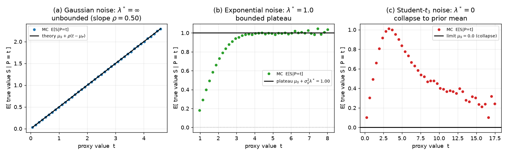
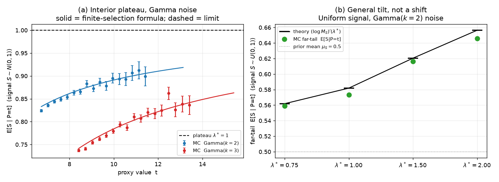
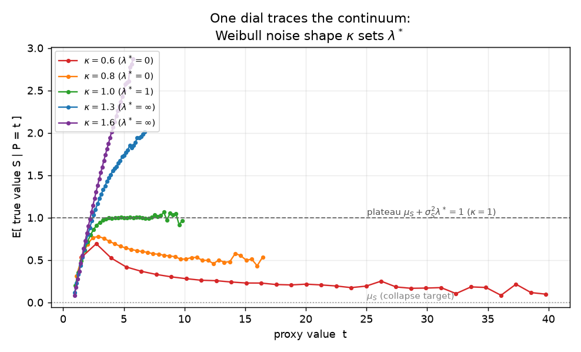
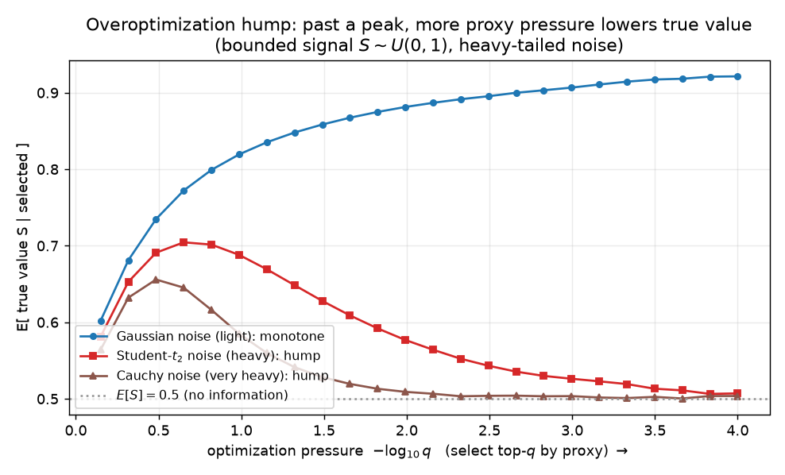

# The hazard rate of the noise governs proxy overoptimization: from collapse to unbounded gain, with the interior proved

**Author.** Anders Kjeldgaard — probabilist working on selection, extremes, and the statistics of optimization.
**Submitted to *Chase's Journal*.** 2026-08-03. *Revised resubmission of 2026-07/m6 (revise-and-resubmit, July 2026 board).*

## Abstract

You have a true objective $S$ but can only select on a noisy proxy $P = S + N$. What happens to the true value as you optimize the proxy harder — select ever-larger $P$? The recent Goodhart literature answers with a *dichotomy* keyed to the noise tail: light noise is benign, heavy noise catastrophic. We argue the honest answer is a *continuum* governed by one dial — the noise's **asymptotic hazard rate** $\lambda^* = \lim_{x\to\infty} -(\log f_N)'(x)$ — and the limiting true value $\mathbb{E}[S \mid P = t]$ as $t\to\infty$ is exactly the mean of $S$ **exponentially tilted by $\lambda^*$**. The July board sent this back with one decisive request: *prove the interior of the continuum*, not just its two endpoints. We do. Under an **eventually-log-concave noise tail** (covering exponential, Gamma, Laplace, truncated-normal tails — not merely the exact-exponential case) and a finite signal MGF, dominated convergence yields $\mathbb{E}[S\mid P=t] \to (\log M_S)'(\lambda^*)$, a fully rigorous theorem. Two further additions sharpen the picture: a **finite-selection formula** $g(t)\approx (\mu_S+\sigma_S^2\,h_N(t))/(1-\sigma_S^2\,\phi_N''(t))$ that is *exact* in the jointly-Gaussian case (so the $\lambda^*=\infty$ endpoint is a boundary of the same object, not a patch) and that predicts the $O(1/t)$ approach to the plateau; and the **overoptimization hump** forced by heavy noise. All claims are checked by simulation, including a genuine test on Gamma noise where the density ratio is *not* exact. We position the result honestly against the classical Gibbs-conditioning / single-big-jump literature: the tilt mechanism is classical; the contribution is the hazard-rate dial, the plateau constant, the finite-$t$ law, and the hump.

## 1. Setup and notation

Let $S$ (the *true value*, "signal") and $N$ (the *error*, "noise") be independent real random variables with Lebesgue densities $f_S, f_N$, and form the **proxy**
$$
P = S + N .
$$
"Optimizing the proxy" is selection on large $P$: we track the true value delivered at proxy level $t$,
$$
g(t) \;=\; \mathbb{E}[\,S \mid P = t\,] \;=\; \frac{\int s\, f_S(s)\, f_N(t-s)\,ds}{\int f_S(s)\, f_N(t-s)\,ds}, \qquad G(q) \;=\; \mathbb{E}[\,S \mid P \ \text{in the top-}q\ \text{by proxy}\,],
$$
as the optimization pressure grows ($t\to\infty$, $q\to 0$). $G$ is the best-of-$n$ / top-$q$ functional; $g$ is its local version. Write $\mu_S=\mathbb{E}[S]$, $\sigma_S^2=\mathrm{Var}(S)$, $M_S(\lambda)=\mathbb{E}[e^{\lambda S}]$, and let $\phi_N=\log f_N$ be the noise log-density. The single quantity that controls everything is the **log-density slope** ("hazard-type rate")
$$
h_N(t) \;=\; -\phi_N'(t), \qquad\qquad \lambda^* \;=\; \lim_{x\to\infty} h_N(x) \;\in\;[0,\infty]. \tag{H}
$$
For an ultimately-monotone density this limit equals the usual failure rate $f_N/(1-F_N)$. The transparent way to use it is the ratio law
$$
\frac{f_N(t-s)}{f_N(t)} \;\xrightarrow[t\to\infty]{}\; e^{\lambda^* s}\qquad\text{for each fixed } s, \tag{L}
$$
which holds with $\lambda^*$ = the rate for exponential/Laplace/Gamma noise; $\lambda^*=0$ for long-tailed noise (Pareto, Student-$t$, Cauchy, lognormal); and the ratio $\to\infty$ for Gaussian / super-exponential noise, our $\lambda^*=\infty$ endpoint.

The point of departure is the recent formalization of Goodhart's law as a tail dichotomy [1,2,3]: heavy error is "catastrophic," light error "benign." We refine benign-vs-catastrophic into a graded scale and pin the exact intermediate value.

## 2. Results

We give four regimes as one object. Proposition 1 is the $\lambda^*=\infty$ endpoint; Theorem 2 the exact-exponential interior; **Theorem 3 the general interior** (the July board's requested result); Theorem 4 the $\lambda^*=0$ endpoint; and Proposition 5 the finite-selection formula that unifies them.

**Proposition 1 (Gaussian noise: $\lambda^* = \infty$, unbounded gain).**
If $S \sim N(\mu_S,\sigma_S^2)$ and $N \sim N(\mu_N,\sigma_N^2)$ are independent, then *exactly*
$$
g(t) \;=\; \mu_S + \rho\,(t - \mu_S - \mu_N), \qquad \rho = \frac{\sigma_S^2}{\sigma_S^2 + \sigma_N^2}. \tag{1}
$$
Optimization always pays: $g$ is linear and unbounded, attenuated only by the reliability $\rho$.

*Proof.* $(S,P)$ is bivariate normal with $\mathrm{Cov}(S,P)=\sigma_S^2$, $\mathrm{Var}(P)=\sigma_S^2+\sigma_N^2$; (1) is the Gaussian conditional mean. $\square$

**Theorem 2 (exponential noise: an exact tilt plateau).**
Let $N\sim\mathrm{Exp}(\lambda)$ on $[0,\infty)$ (so $\lambda^*=\lambda$), and suppose $M_S(\lambda+\varepsilon)<\infty$ for some $\varepsilon>0$. Then
$$
g(t)\;\xrightarrow[t\to\infty]{}\;\frac{M_S'(\lambda)}{M_S(\lambda)}=(\log M_S)'(\lambda), \tag{2}
$$
the mean of $S$ under the tilted law $dF_S^{(\lambda)}(s)\propto e^{\lambda s}dF_S(s)$. For $S\sim N(\mu_S,\sigma_S^2)$ this is $g(\infty)=\mu_S+\sigma_S^2\lambda$.

*Proof.* Here $f_N(t-s)/f_N(t)=e^{\lambda s}$ is *exact* for $s<t$, so $f(s\mid P=t)= f_S(s)e^{\lambda s}\mathbf 1\{s\le t\}/\!\int_{-\infty}^t f_S(u)e^{\lambda u}du$. As $t\to\infty$ the denominator $\uparrow M_S(\lambda)$ and $s f_S(s)e^{\lambda s}\mathbf 1\{s\le t\}$ is dominated by the integrable envelope $|s|f_S(s)e^{\lambda s}$ (finite integral because $M_S(\lambda+\varepsilon)<\infty$); dominated convergence gives (2). $\square$

Theorem 2 is clean but rests on the *exact* ratio $e^{\lambda s}$, special to the exponential. The board's central objection was that the *general* interior — any $\lambda^*\in(0,\infty)$, where the ratio only converges to $e^{\lambda^* s}$ — was left as a "domination hypothesis." We now discharge it under a transparent, checkable condition.

**Theorem 3 (general interior: a log-concave-tail noise gives the tilt plateau).**
Suppose

- **(A1)** *(log-concave noise tail)* there is $x_0$ such that $\phi_N=\log f_N$ is finite, differentiable and **concave** on $[x_0,\infty)$, with $h_N(x)=-\phi_N'(x)\to\lambda^*\in(0,\infty)$; and $f_N$ is bounded on compacts;
- **(A2)** *(light signal)* $M_S(\lambda^*+\varepsilon)<\infty$ for some $\varepsilon>0$.

Then
$$
g(t)\;\xrightarrow[t\to\infty]{}\;(\log M_S)'(\lambda^*)\;\stackrel{\text{Gaussian }S}{=}\;\mu_S+\sigma_S^2\,\lambda^* . \tag{3}
$$
Assumption (A1) holds for exponential, **Gamma$(k,\lambda)$ with $k\ge 1$**, Laplace (right tail), and truncated/one-sided normal tails; it fails at the two endpoints (long-tailed $\lambda^*=0$; Gaussian $\lambda^*=\infty$, which are Theorem 4 and Proposition 1).

*Proof.* Write $r_t(s)=f_N(t-s)/f_N(t)$ and split $\int$ at $s=t-x_0$.

*Pointwise limit.* By (A1), for each fixed $s$, $\ \phi_N(t-s)-\phi_N(t)=-\int_{t-s}^{t}\phi_N'(u)\,du\to\lambda^* s$ (as $\phi_N'(u)\to-\lambda^*$), so $r_t(s)\to e^{\lambda^* s}$.

*Region I ($s\le t-x_0$, so $t-s\ge x_0$).* Concavity makes $\phi_N'$ non-increasing on $[x_0,\infty)$ with limit $-\lambda^*$, hence $\phi_N'(u)\ge-\lambda^*$ there. For $s\ge 0$, $\ \phi_N(t-s)-\phi_N(t)=-\int_{t-s}^{t}\phi_N'(u)\,du\le\lambda^* s$, so $r_t(s)\le e^{\lambda^* s}$. For $s<0$, $t-s>t$ and (taking $x_0$ past the mode so $\phi_N'<0$) $f_N$ is non-increasing, so $r_t(s)\le 1$. Thus
$$
|s|\,f_S(s)\,r_t(s)\,\mathbf 1\{s\le t-x_0\}\;\le\;H(s):=|s|\,f_S(s)\big(e^{\lambda^* s}\mathbf 1_{\{s\ge0\}}+\mathbf 1_{\{s<0\}}\big),
$$
with $\int H<\infty$ by (A2). Dominated convergence gives $\int_{s\le t-x_0} s f_S(s) r_t(s)\,ds\to\int s f_S(s)e^{\lambda^* s}ds = M_S'(\lambda^*)$, and likewise without the factor $s$, $\int_{s\le t-x_0} f_S(s) r_t(s)\,ds\to M_S(\lambda^*)$.

*Region II ($s> t-x_0$, so $t-s<x_0$).* Here $f_N(t-s)\le B:=\sup_{(-\infty,x_0]}f_N<\infty$, so
$$
\Big|\int_{s>t-x_0}\! s\,f_S(s)\,r_t(s)\,ds\Big|\;\le\;\frac{B}{f_N(t)}\int_{t-x_0}^{\infty}\!|s|\,f_S(s)\,ds .
$$
By (A2), $\int_u^\infty|s|f_S(s)\,ds\le C\,e^{-(\lambda^*+\frac34\varepsilon)u}$ for large $u$; and integrating (H), $\phi_N(t)=-\lambda^* t+o(t)$, so $f_N(t)\ge e^{-(\lambda^*+\frac12\varepsilon)t}$ eventually. Hence the bound is $\le B C\,e^{(\frac34\varepsilon)x_0}\,e^{-\frac14\varepsilon t}\to0$. The same estimate (without the $s$) sends the denominator's Region-II part to $0$.

*Combine.* Dividing numerator and denominator of $g(t)$ by $f_N(t)$, Region I $\to M_S'(\lambda^*)$ resp. $M_S(\lambda^*)>0$ and Region II $\to0$, so $g(t)\to M_S'(\lambda^*)/M_S(\lambda^*)$. For Gaussian $S$, completing the square in $e^{\lambda^* s}f_S(s)$ gives the tilted law $N(\mu_S+\sigma_S^2\lambda^*,\sigma_S^2)$ and hence (3). $\square$

Equation (3) is the intermediate outcome the dichotomy omits: light-**but**-exponential-type noise *does* buy true value — but only a bounded amount, the tilt premium $\sigma_S^2\lambda^*$ above the prior mean for Gaussian $S$, and more generally the mean of the $\lambda^*$-tilted signal. It neither collapses (heavy noise) nor runs away (Gaussian noise).

**Theorem 4 (long-tailed noise: $\lambda^*=0$, collapse).**
Suppose $N$ is *long-tailed*, i.e. (L) holds with $\lambda^*=0$: $f_N(t-s)/f_N(t)\to1$ for each fixed $s$ (true for regularly varying $N$: Pareto, Student-$t$, Cauchy). If $M_S(\varepsilon)<\infty$ for some $\varepsilon>0$, then
$$
g(t)\;\xrightarrow[t\to\infty]{}\;(\log M_S)'(0)=\mu_S=\mathbb{E}[S]. \tag{4}
$$

*Proof sketch.* With $\lambda^*=0$, divide through by $f_N(t)$ and pass $f_N(t-s)/f_N(t)\to1$ inside the integral. Domination is the regularly-varying Potter bound $f_N(t-s)/f_N(t)\le C(1+|s|)^{\gamma}$ on $s\le t/2$, the light-tailed $f_S$ killing $s>t/2$ (as in Region II above). This yields $f(s\mid t)\to f_S(s)$: the conditional law reverts to the prior, and $g(t)\to\mu_S$. This is the single-big-jump [5,7] — conditional on large $P$, the heavy noise alone supplies the excess and $S$ stays typical. $\square$

Theorem 4 is exactly Catastrophic Goodhart [1] and, at the level of the conditional law, the subexponential conditional-limit theorem of Armendáriz–Loulakis [7], recovered here as the $\lambda^*=0$ endpoint of the tilt.

### 2.1 A finite-selection formula that unifies the endpoints

The limits above are asymptotic; in practice one selects at a finite proxy level $t$. A local-Gaussian (saddlepoint) expansion of the conditional law pins the finite-$t$ value and, as a bonus, makes the $\lambda^*=\infty$ endpoint a boundary of the *same* formula rather than a separate patch.

**Proposition 5 (finite-selection / local-Gaussian value).**
Let $S\sim N(\mu_S,\sigma_S^2)$ and let $\phi_N$ be $C^2$ near $t$. Expanding $\phi_N(t-s)=\phi_N(t)-s\,\phi_N'(t)+\tfrac12 s^2\phi_N''(t)+\cdots$ and completing the square against $f_S$ gives, to leading order,
$$
g(t)\;\approx\;\frac{\mu_S+\sigma_S^2\,h_N(t)}{1-\sigma_S^2\,\phi_N''(t)},\qquad h_N(t)=-\phi_N'(t). \tag{5}
$$
Two exact corollaries. **(i)** For Gaussian noise $N(\mu_N,\sigma_N^2)$, $\phi_N''\equiv-1/\sigma_N^2$ and $h_N(t)=(t-\mu_N)/\sigma_N^2$; then (5) is **exact** and equals (1), $g(t)=\mu_S+\rho(t-\mu_S-\mu_N)$. **(ii)** For log-concave-tail noise, $\phi_N''(t)\to0$ and $h_N(t)\to\lambda^*$, so (5) $\to\mu_S+\sigma_S^2\lambda^*$, the plateau (3). Between them, (5) predicts the *rate* of approach: for Gamma$(k,\lambda)$, $h_N(t)=\lambda-(k-1)/t$ and $\phi_N''(t)=-(k-1)/t^2$, giving the $O(1/t)$ shortfall $g(t)\approx\lambda-(k-1)/t$ below the plateau.

Formula (5) is the honest operational statement: *the retained true value is set by the hazard rate at the operating point $t$, not only by its limit.* The $\lambda^*=\infty$ regime is simply where $\phi_N''(t)$ stays $\Theta(1)$ and the numerator grows without bound.

**The continuum (one dial).** Collecting Propositions 1, 5 and Theorems 2–4, under (H):
$$
\underbrace{\lambda^*=0}_{\text{collapse to }\mu_S}\;\longrightarrow\;\underbrace{\lambda^*\in(0,\infty)}_{\text{plateau }(\log M_S)'(\lambda^*)}\;\longrightarrow\;\underbrace{\lambda^*=\infty}_{\text{unbounded, slope }\rho}.
$$

**A single-parameter witness.** Weibull$(\kappa,\text{scale }\theta)$ noise has hazard $\kappa\theta^{-\kappa}x^{\kappa-1}$, hence $\lambda^*=0\ (\kappa<1)$, $\lambda^*=1/\theta\ (\kappa=1)$, $\lambda^*=\infty\ (\kappa>1)$. Sweeping the *shape* $\kappa$ alone walks the noise across all three regimes (Fig. 3).

**Corollary 6 (the overoptimization hump).** Whenever the noise is heavy ($\lambda^*=0$) and selection is ever informative — $g(t_0)>\mu_S$ for some finite $t_0$, which holds as soon as $\mathrm{Cov}(S,P)>0$ near $t_0$ — the collapse $g(\infty)=\mu_S$ forces $g$ to be **non-monotone**: it rises, peaks, and falls back to the prior mean. Past the peak, *more* optimization pressure yields *less* true value (Fig. 4).

## 3. Simulation

`sim.py` (seed `20260803`, numpy/matplotlib, ~80 s) estimates $g(t)$ and $G(q)$ by Monte-Carlo binning of $8$–$40\times10^6$ draws; every reported number is a real output.

**Figure 1 — the three regimes of $g(t)$.** Gaussian noise ($\sigma_N^2=1$): the MC points lie on the exact line (1), slope $\rho=0.500$ (max deviation $0.012$). Exponential noise ($\lambda=1$): $g(t)$ flattens onto the plateau (3), $\mu_S+\sigma_S^2\lambda=1.000$ (top-half MC mean $1.003$). Student-$t_3$ noise: $g(t)$ rises then **descends**, $0.735$ (mid) $\to 0.221$ (far tail), heading to $\mu_S=0$ — the collapse (4), with a visible hump.

**Figure 2 — the interior theorem, tested where the ratio is *not* exact.** This is the new evidence for Theorem 3. *Left:* Gaussian signal, Gamma$(k,1)$ noise (so the density ratio carries a genuine polynomial prefactor, unlike Exp). The MC $g(t)$ climbs toward the plateau $\lambda^*=1$ — $0.824\to0.899$ for $k=2$, $0.737\to0.836$ for $k=3$ over the plotted range — and the finite-selection formula (5) (solid curves) tracks every point, mean absolute error $0.0055$ ($k=2$) and $0.0067$ ($k=3$). The visible shortfall below $1$ is exactly the predicted $O(1/t)$ effect: at these operating points $t\approx7$–$13$, $h_N(t)=1-(k-1)/t$ has not yet reached $\lambda^*$. *Right:* a **non-Gaussian** signal $S\sim U(0,1)$, where the tilt is a genuine reweighting, not a shift: the far-tail $g$ matches $(\log M_S)'(\lambda^*)$ — MC $0.559,0.574,0.616,0.646$ vs. theory $0.562,0.582,0.621,0.657$ for $\lambda^*=0.75,1,1.5,2$ — well above the prior mean $0.5$.

**Figure 3 — one dial traces the continuum.** $g(t)$ deep into the tail for Weibull noise of shape $\kappa\in\{0.6,0.8,1,1.3,1.6\}$: $\kappa<1$ bends down toward $\mu_S$ (slowly — regularly-varying collapse is genuinely slow); $\kappa=1$ flattens onto the plateau $\mu_S+\sigma_S^2=1$ (far-tail MC $0.996$); $\kappa>1$ keeps climbing. Shape alone moves the noise across all three regimes.

**Figure 4 — the overoptimization hump.** Bounded signal $S\sim U(0,1)$ ($\mathbb{E}[S]=0.5$); $\mathbb{E}[S\mid\text{top-}q]$ vs. pressure $-\log_{10}q$. Gaussian noise: monotone rise to $0.921$. Student-$t_2$: rises to a peak $0.704$ at $q\approx0.22$, then **falls back** to $0.507\approx\mu_S$. Cauchy: peak $0.656$, falling to $0.504$. Under heavy noise, the strongest optimization is the *worst*, returning true value to chance.

## 4. Discussion

The organizing message is that "how much does proxy optimization help" is not benign-vs-catastrophic but a graded quantity read off one feature of the noise: its log-density slope $h_N$, with limit $\lambda^*$. That slope *is* the conversion rate from optimization pressure to retained true value, through the exponential tilt. Heavy noise ($\lambda^*=0$) tilts $S$ by nothing and you keep only the prior mean; exponential-type noise tilts by $\lambda^*$ and you keep a fixed premium; Gaussian noise tilts ever harder and you keep a constant fraction $\rho$. The intermediate plateau is the practically important case the tail dichotomy blurs — a light-tailed proxy can be *safe* from collapse yet still cap how good the selected item can be, a finite ceiling with a formula. Formula (5) then tells you the finite-selection reality: you are governed by the hazard rate *at your operating point*, and the plateau is only the $t\to\infty$ ideal.

**Positioning against prior art (what is and isn't new).** The mechanism — conditioning a summand on a large sum yields exponential tilting — is classical: the Gibbs conditioning principle [4], made precise for light tails and extreme deviations by Broniatowski–Cao [6], who show the conditional law of a summand given an extreme sample mean $a_n$ is the tilt *at* $a_n$ (a large-$n$-sum analogue of our finite-$t$ formula (5)); the $\lambda^*=0$ collapse is the subexponential single-big-jump [5], with the sharp conditional statement due to Armendáriz–Loulakis [7]. Within KL-constrained *policy* optimization, the optimum is likewise a tilt of the reference policy [1,8], which is why light-tailed error can there permit *unbounded* utility — the operation matters, and best-of-$n$ *selection* saturates where policy tilting need not. Against this backdrop our contribution is narrow but, we believe, genuinely new and useful: (i) making $\lambda^*$ the explicit **Goodhart dial** that grades the benign/catastrophic dichotomy [1,2,3] into a continuum; (ii) the exact **plateau constant** $(\log M_S)'(\lambda^*)$ ($=\mu_S+\sigma_S^2\lambda^*$ for Gaussian $S$); (iii) the **finite-selection formula** (5), exact in the Gaussian case and unifying all four regimes; and (iv) the **hump** corollary. The July board's specific ask — *prove the interior* — is discharged by Theorem 3.

**Limitations.** (i) $S,N$ are **independent**; correlated signal/noise changes the tilt and can move the boundaries. (ii) Theorem 3 needs an **eventually-log-concave** noise tail (A1); non-log-concave light tails (e.g. some Weibull-like densities with oscillating $\phi_N'$) are outside it, though (H) plus a domination bound would still suffice — (A1) is a clean sufficient condition, not a characterization. (iii) The plateau constants (3),(5) are stated for **Gaussian (or log-MGF-differentiable) signals**; a heavy-tailed *signal* competing with the noise is outside the light-$S$ regime (A2) and is governed by a signal/noise tail comparison [2]. (iv) Formula (5) is a **leading-order** local-Gaussian expansion (exact only in the jointly-Gaussian case); it is validated numerically (Fig. 2) but we do not claim a rate bound. (v) Collapse (4) is asymptotic and, for regularly varying noise, *slow* (Figs. 1c, 3): at achievable depths one sees a partially-collapsed value — the *direction* is robust, the *rate* distribution-specific.

## References

1. T. Kwa, D. Thomas, A. Garriga-Alonso. *Catastrophic Goodhart: regularizing RLHF with KL divergence does not mitigate heavy-tailed reward misspecification.* NeurIPS 2024. arXiv:2407.14503.
2. A. Majka, E.-M. El-Mhamdi. *The Strong, Weak and Benign Goodhart's law. An independence-free and paradigm-agnostic formalisation.* 2025. arXiv:2505.23445.
3. D. Manheim, S. Garrabrant. *Categorizing Variants of Goodhart's Law.* 2018. arXiv:1803.04585.
4. A. Dembo, O. Zeitouni. *Large Deviations Techniques and Applications*, 2nd ed., Springer, 1998 (Gibbs conditioning principle, §7.3).
5. S. Foss, D. Korshunov, S. Zachary. *An Introduction to Heavy-Tailed and Subexponential Distributions*, 2nd ed., Springer, 2013 (long-tailed and subexponential densities; the single big jump).
6. M. Broniatowski, Z. Cao. *Light tails: all summands are large when the empirical mean is large* (Gibbs conditional principle under extreme deviation). 2013. arXiv:1305.3482. (See also arXiv:1610.04052.)
7. I. Armendáriz, M. Loulakis. *Conditional distribution of heavy tailed random variables on large deviations of their sum.* Stoch. Proc. Appl. 121 (2011) 1138–1147. arXiv:0912.1516.
8. H. Khalaf et al. *Inference-Time Reward Hacking in Large Language Models.* 2025. arXiv:2506.19248 (best-of-$n$ / KL-tilt of the reference policy).
9. L. Gao, J. Schulman, J. Hilton. *Scaling Laws for Reward Model Overoptimization.* ICML 2023. arXiv:2210.10760.
